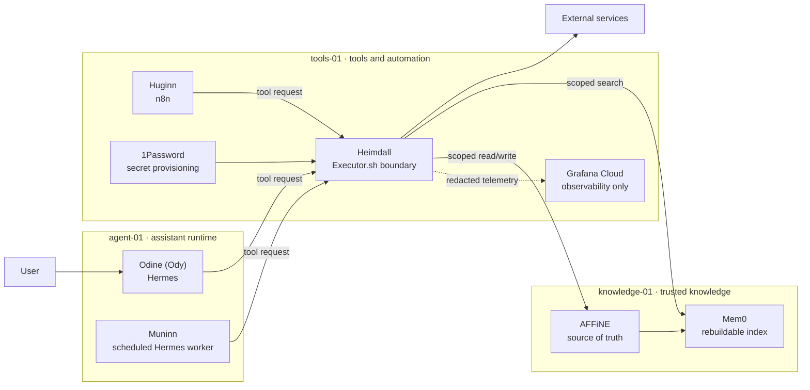

# Asgard

Asgard is a reference architecture for a self-hosted personal AI that presents
one assistant while separating knowledge, background work, automation, and tool
execution into distinct security domains.

The assistant is **Odine**, or **Ody** for short. Ody is the only conversational
identity the user needs to know. The other names describe internal capabilities,
not a collection of chatbots the user must coordinate.

> [!IMPORTANT]
> This repository describes a reference design and its intended controls. A
> configuration is not proof that a deployment is secure or that an end-to-end
> workflow has been verified. Deployments should record their own evidence,
> exceptions, and validation results separately.

## The pantheon

| Capability | Reference implementation | Responsibility |
| --- | --- | --- |
| **Odine (Ody)** | Hermes | Conversation, reasoning, orchestration, and the single user-facing experience |
| **Mimir** | AFFiNE + Mem0 | Canonical knowledge in AFFiNE, with Mem0 as a disposable and rebuildable semantic index |
| **Muninn** | Isolated scheduled Hermes worker | Reviews completed conversations, extracts durable knowledge candidates, and proposes traceable updates |
| **Huginn** | n8n | Collects external evidence and runs bounded, deterministic automations |
| **Heimdall** | Executor.sh + supporting controls | Mediates external tool actions, applies policy, selects scoped connections, and records action evidence |

Heimdall is a logical security boundary rather than a single product:

- **Executor.sh** is the target enforcement point for tool discovery and
  invocation.
- **1Password** is the secret-provisioning boundary. Agents should not receive
  vault credentials or raw connector secrets.
- **Grafana Cloud** provides redacted operational observability. It is not an
  authorization engine, policy decision point, or authoritative action audit.

## Architecture at a glance

The three-host layout is a reference topology:

- **`agent-01`** contains Ody's interactive Hermes runtime and an isolated
  Muninn worker.
- **`knowledge-01`** contains Mimir's canonical store and rebuildable index.
- **`tools-01`** contains Heimdall and Huginn, separating tool execution and
  untrusted collection from the knowledge plane.

Smaller installations may combine hosts, provided they preserve the same trust
boundaries and can demonstrate that the resulting controls are effective.

## Intended security model

The central invariant is:

> Agents may reason and request actions, but every external tool action is
> intended to pass through Heimdall.

This design aims to provide:

- a fixed, least-privilege tool catalogue for each authenticated workload;
- scoped downstream identities so mediation does not erase authorship;
- no raw third-party credentials in agent prompts, configuration, or logs;
- human approval for sensitive actions, bound to a specific request;
- provenance for knowledge changes and collected evidence;
- isolation of hostile web content from canonical knowledge and credentials;
- deterministic, idempotent background workflows; and
- redacted telemetry that supports diagnosis without becoming an authority.

These are design requirements, not automatic properties of the named products.
A real deployment must test for bypass paths, identity confusion, unsafe
defaults, approval replay, secret leakage, and failure recovery.

## Supporting platform

The reference deployment uses:

- **Traefik** for HTTP routing and TLS;
- **Tailscale** for private and administrative connectivity;
- **Pangolin** for deliberately published, authenticated user routes; and
- **Komodo** for container deployment and application operations.

DNS publication, network reachability, and application authorization are
separate decisions. Publishing a route must not implicitly grant access to its
underlying service.

## Knowledge flow

AFFiNE is authoritative. Mem0 accelerates retrieval but can be erased and rebuilt
from accepted AFFiNE content. If the two disagree, AFFiNE wins.

Muninn reviews completed conversations from a durable checkpoint, creates
provenance-bearing candidates, and writes drafts or approved changes through
Heimdall. Huginn gathers external evidence but does not promote it directly into
canonical knowledge.

## Documentation

- [Architecture](docs/architecture.md)
- [Getting started](docs/getting-started.md)
- [Data flows](docs/data-flows.md)
- [Integration contracts](docs/integration-contracts.md) — custom wiring,
  implementation boundaries, and capability gates
- [Security model](docs/security.md)
- [Operations](docs/operations.md)
- [Agent-assisted installation](docs/agent-assisted-install.md)
- [Contributing](CONTRIBUTING.md)
- [Security policy](SECURITY.md)

## License

The documentation and reference material in this repository are licensed under
[CC BY-NC 4.0](LICENSE): attribution is required, and use is limited to
non-commercial purposes. Future standalone software may carry its own license.

## Project status

Asgard is being developed as a reusable architecture and deployment guide.
Features should be labelled as **reference design**, **implemented**, or
**verified**. Only deployment-specific evidence can justify the final label.
