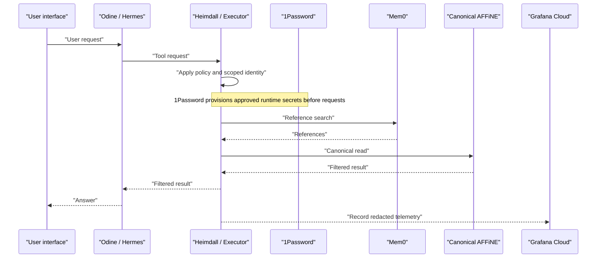
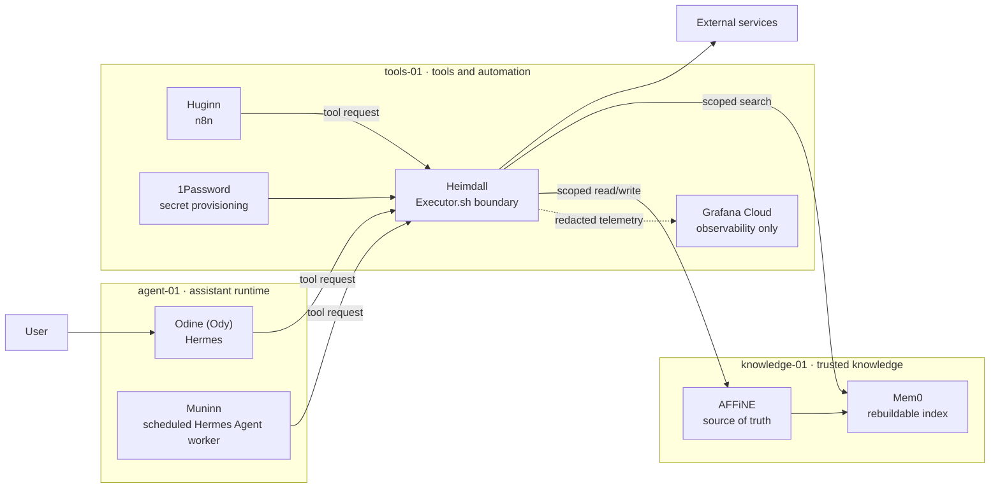

<!-- markdownlint-disable MD033 MD041 -->
<section class="pantheon-hero">
  
OPEN AGENT ARCHITECTURE

  <h1 class="pantheon-title">Pantheon Blueprint</h1>
  
An Open reference Architecture for Intelligent Agent Systems

  

    The Norse gods understood that wisdom needed many hands. Odin pursued
    knowledge, Mimir guarded memory, Huginn and Muninn ranged far and wide to
    bring back thought and insight, and Heimdall defended the gateways to the
    realm. Each had a role, and together they formed a system greater than any
    one part. Pantheon Blueprint translates that pattern to modern AI agent
    systems, describing an ecosystem where specialised agents and the services
    that support them—memory, automation, identity, observability—all collaborate
    through clear interfaces rather than one monolithic brain. No deities were
    consulted or harmed in the making of this architecture, just a collection
    of services and some lively design discussions.
  

  

    <a class="pantheon-button pantheon-button--primary" href="docs/architecture/">Explore the architecture</a>
    <a class="pantheon-button pantheon-button--secondary" href="#roles">Meet the roles</a>
  

</section>
<!-- markdownlint-enable MD033 MD041 -->

!!! important

    This repository describes a reference design and its intended controls. A
    configuration is not proof that a deployment is secure or that an end-to-end
    workflow has been verified. Deployments should record their own evidence,
    exceptions, and validation results separately.

    Production deployments use a private desired-state repository managed and
    applied by Komodo. This public repository contains architecture, sanitized
    examples, and human and agent setup guidance only; it is not a live
    deployment source. Reconcile production drift in the private desired-state
    repository, not by editing configuration in the Komodo interface.

## Roles

This is the primary map; see [Tools, capabilities, and interaction boundaries](docs/tooling.md) for full product boundaries and interactions.

| Image | Name | Function | Tool |
| --- | --- | --- | --- |
|  | [Odine (Ody)](docs/gods/odine.md) | The single user-facing assistant for conversation, reasoning, and orchestration. | Hermes Agent + Hermes WebUI + Hermex |
|  | [Mimir](docs/gods/mimir.md) | Organizes canonical knowledge with PARA-like views, seven typed objects, and GBrain-style current views plus evidence timelines. | AFFiNE + controlled indexer + Mem0 |
|  | [Muninn](docs/gods/muninn.md) | Reviews completed conversations and prepares traceable knowledge candidates. | isolated Hermes Agent worker + transcript outbox |
|  | [Huginn](docs/gods/huginn.md) | Collects external evidence and runs bounded, deterministic automations. | n8n + restricted fetch/browser workers |
|  | [Heimdall](docs/gods/heimdall.md) | Mediates tool actions, applies policy, selects scoped connections, and records evidence. | Executor + Pantheon Blueprint policy/adapters + 1Password + Grafana Alloy/Cloud |

## How one request moves

## Architecture at a glance

The three-host layout is a reference topology:

- **`agent-01`** contains Ody's interactive Hermes runtime and an isolated
  Muninn worker.
- **`knowledge-01`** contains Mimir's canonical store and rebuildable index.
- **`tools-01`** contains Heimdall and Huginn, separating tool execution and
  untrusted collection from the knowledge plane.

Smaller installations may combine hosts, provided they preserve the same trust
boundaries and can demonstrate that the resulting controls are effective.

## Intended security model

The central invariant is:

> Agents may reason and request actions, but every external tool action is
> intended to pass through Heimdall.

This design aims to provide:

- a fixed, least-privilege tool catalogue for each authenticated workload;
- scoped downstream identities so mediation does not erase authorship;
- no raw third-party credentials in agent prompts, configuration, or logs;
- human approval for sensitive actions, bound to a specific request;
- provenance for knowledge changes and collected evidence;
- isolation of hostile web content from canonical knowledge and credentials;
- deterministic, idempotent background workflows; and
- redacted telemetry that supports diagnosis without becoming an authority.

These are design requirements, not automatic properties of the named products.
A real deployment must test for bypass paths, identity confusion, unsafe
defaults, approval replay, secret leakage, and failure recovery.

## Supporting platform

The reference deployment uses:

- **Traefik** for HTTP routing and TLS;
- **Tailscale** for private and administrative connectivity;
- **Pangolin** for deliberately published, authenticated user routes; and
- **Komodo** for container deployment and application operations.

DNS publication, network reachability, and application authorization are
separate decisions. Publishing a route must not implicitly grant access to its
underlying service.

## Knowledge flow

AFFiNE is authoritative. Mem0 accelerates retrieval but can be erased and rebuilt
from accepted AFFiNE content. If the two disagree, AFFiNE wins.

Muninn reviews completed conversations from a durable checkpoint, creates
provenance-bearing candidates, and writes drafts or approved changes through
Heimdall. Huginn gathers external evidence but does not promote it directly into
canonical knowledge.

## Choose your path

- **Understand:** [architecture](docs/architecture.md),
  [data flows](docs/data-flows.md), and [roles](docs/tooling.md).
- **Deploy:** [getting started](docs/getting-started.md),
  [integration contracts](docs/integration-contracts.md),
  [operations](docs/operations.md), and [backups](docs/backups.md).
- **Assure:** [assurance](docs/assurance.md) and [security](docs/security.md).

## License

The documentation and reference material in this repository are licensed under
[CC BY-NC 4.0](LICENSE): attribution is required, and use is limited to
non-commercial purposes. Future standalone software may carry its own license.

## Project status

Pantheon Blueprint is being developed as a reusable architecture and deployment guide.
Features should be labelled as **reference design**, **implemented**, or
**verified**. Only deployment-specific evidence can justify the final label.
