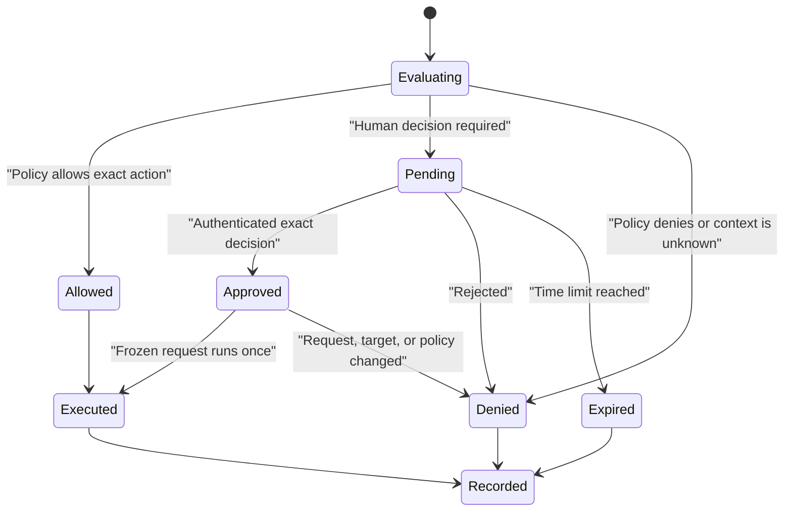
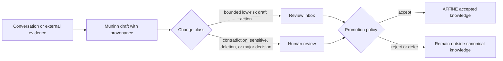
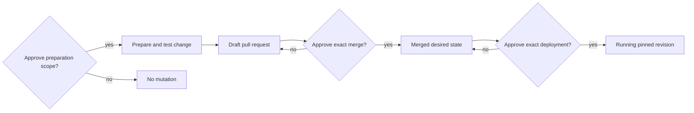

# Approvals

Approvals are for decisions with meaningful side effects. They should be rare,
clear, and tied to one exact action.

Pantheon Blueprint does not treat every tool call as equally risky:

- routine permitted reads should run without interruption;
- policy violations are denied, not offered for approval;
- sensitive actions pause and ask the owner; and
- prohibited actions remain unavailable even if requested in conversation.

This page is the quick guide. The complete maintenance contract is in
[Scoped maintenance sessions](maintenance-sessions.md).

## The decision table

| Request | Default decision | Why |
| --- | --- | --- |
| Answer from the current conversation | Run | No external side effect |
| Read permitted knowledge or redacted health data | Run | Bounded, reversible read under a fixed identity |
| Search approved public sources | Run when policy allows | Read-only collection remains untrusted evidence |
| Create a traceable knowledge draft | Run only under the configured curation policy | Drafts are proposed, not canonical |
| Promote a contradiction or sensitive change into accepted knowledge | Human review | Changes what the system treats as true |
| Perform an ordinary scoped tool write | Policy decides: allow or ask | Depends on target, data class, arguments, and reversibility |
| Start a bounded maintenance preparation session | Human approval | Grants temporary mutation capability |
| Merge a pull request | Separate human approval | Changes reviewed desired state |
| Deploy a merged revision | Separate human approval | Changes the running system |
| Rotate a secret or change network exposure | Separate human approval | Changes trust or access boundaries |
| Delete canonical data, backup history, or audit evidence | Prohibited maintenance action | Recovery and accountability could be lost |
| Request another role's credentials or connector | Deny | Violates identity separation |

“Run” still means Heimdall checks the caller, policy, arguments, and target.
It does not mean unrestricted access.

## What an approval contains

A valid approval binds all material parts of the action:

```text
requester and approver
workload and originating channel
task and semantic action
target and material arguments or diff
request digest and policy revision
expiry and allowed use count
rollback or recovery information when relevant
```

The prompt shows the owner what will happen in plain language. It never shows a
secret value. If a material field changes, the old approval no longer applies.

## Approval flow



The request is frozen while approval is pending. The owner approves that
request, not a newly generated version of it.

## Where the owner approves

Hermes WebUI, Hermex, and Signal may present the same durable approval record.
They are delivery surfaces, not separate approval authorities.

The channel must authenticate the owner and bind the response to the exact
pending record. With more than one request pending, the owner must choose an
unambiguous reference. `/approve` must never mean “approve the newest thing.”

Chat text, emoji, reactions, proximity to an earlier request, and model memory
do not count as approval.

## Knowledge approval

Knowledge uses review rather than tool authority alone:



A workload permission to create a draft is not permission to publish accepted
knowledge. Deleting canonical content is not an unattended curation action.

## Maintenance, merge, and deployment

These approvals are intentionally separate:

1. **Preparation session:** allows a disposable worker to inspect an exact
   scope, edit allowed paths, run named tests, and open a draft pull request.
2. **Merge approval:** binds the repository, pull request, exact head and base
   commits, required checks, and resulting desired-state revision.
3. **Deployment approval:** binds the merged revision, pinned artifacts,
   target, verified backup or recovery point, health checks, and rollback.



An approved maintenance session cannot silently grow to include merge,
deployment, secrets, network changes, another repository, or another service.

## Secret and network changes

A secret approval names the secret reference, operation class, receiving
service, impact, and revocation or rollback plan. The secret value stays out of
the approval record, prompt, model context, and logs.

A network approval names the exact route or policy object, source and
destination class, protocol or ports, exposure effect, expiry for temporary
access, and reversal plan.

Neither approval grants general vault, firewall, DNS, identity-provider, or
deployment administration.

## Failure and recovery

The safe result is always no side effect when:

- the caller or approver cannot be authenticated;
- the approval is missing, ambiguous, denied, expired, already used, or
  revoked;
- the request, target, arguments, digest, policy, or recovery point changed;
- the approval store or authoritative action record is unavailable; or
- a restart leaves the outcome uncertain.

After an ambiguous timeout, Heimdall checks the stored decision, idempotency
key, and downstream result before retrying. It does not ask the model to guess
whether the action happened.

Revocation should be immediate and should not itself require approval. The
owner must always retain a simple kill switch for pending and active authority.

## Minimum tests

Before enabling approvals, prove:

1. allow, reject, expiry, replay, duplicate, and conflicting-response paths;
2. multiple-pending selection without “latest request” ambiguity;
3. changed arguments, target, digest, and policy fail closed;
4. restart recovery resumes or cancels the exact original request safely;
5. WebUI, Hermex, and Signal decisions affect the same durable record;
6. no secret or executable argument appears in approval references;
7. downstream action and authorship match the approved request; and
8. merge and deployment cannot borrow maintenance-session authority.

Record the results using [Readiness and assurance](assurance.md). Until these
tests pass for the pinned deployment, approval-dependent capabilities remain
disabled or operator-run.
