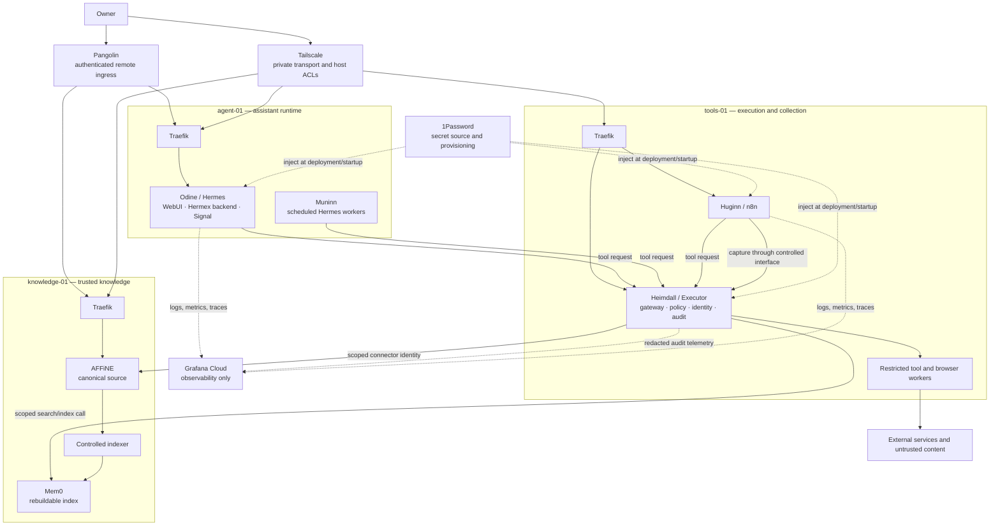
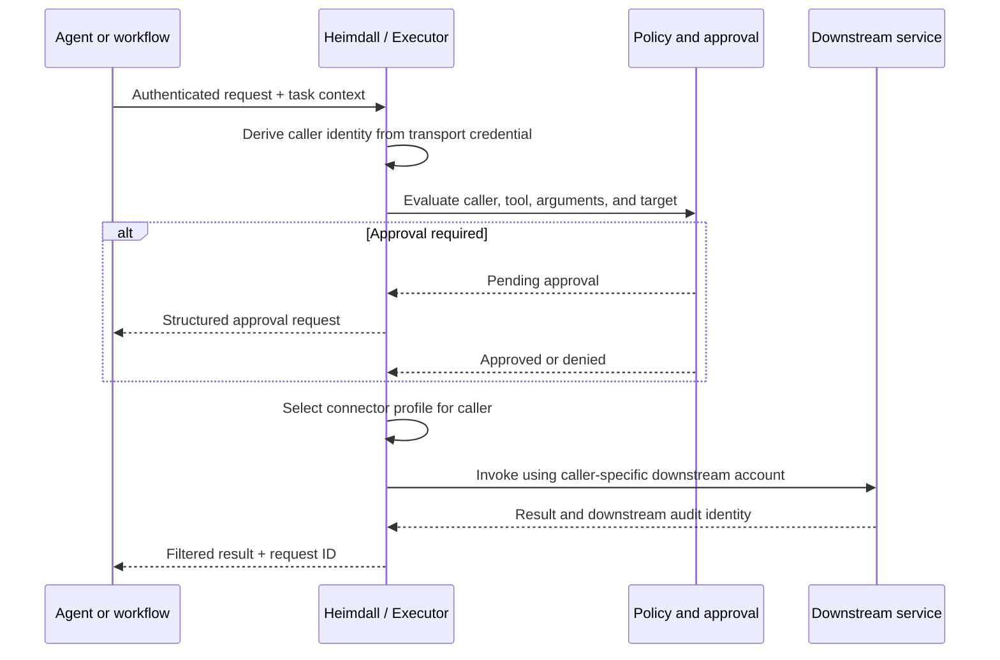

# Architecture

Asgard is a reference architecture for a personal AI assistant that presents one
consistent identity to its owner while keeping knowledge, automation, and tool
execution behind explicit trust boundaries.

This document describes the intended design. It is not a claim that every
control is enforced by every upstream product release. Use the validation gates
in this document before granting the system access to sensitive data or
destructive tools.

## Design goals

- Present one user-facing assistant across web, mobile, messaging, and knowledge
  interfaces.
- Keep durable knowledge in a human-readable source of truth.
- Make semantic indexes disposable and rebuildable.
- Preserve the identity of the requesting agent when a shared gateway calls a
  downstream service.
- Prevent agents and untrusted content collectors from obtaining raw
  credentials.
- Route tool discovery and invocation through one policy and audit point.
- Separate internet-facing collection from trusted knowledge storage.
- Keep deployment practical on three Docker hosts.
- Prefer pinned, reviewable releases and recoverable operations.
- Make security claims only after a corresponding test has passed.

## Names, roles, and products

The Norse names identify stable architectural roles. Products are replaceable
implementations of those roles.

See [Tools, capabilities, and interaction boundaries](tooling.md) for the
complete capability-to-product map and the remote, administrative, and internal
tool request paths.

| Role | Responsibility | Initial implementation |
| --- | --- | --- |
| **Odine (Ody)** | Sole user-facing assistant, conversation, reasoning, and orchestration | Hermes Agent, Hermes WebUI, Hermex, and a Signal transport |
| **Mimir** | Canonical knowledge and retrieval | AFFiNE as the source of truth; Mem0 as a rebuildable semantic index |
| **Muninn** | Review completed conversations, reconcile them with existing knowledge, and prepare curated updates | Scheduled, non-interactive Hermes workers using an isolated profile |
| **Huginn** | Collect external material, monitor sources, deduplicate captures, and hand evidence inward | n8n workflows and restricted browser/fetch tools |
| **Heimdall** | Mediate tool discovery and invocation, select downstream identities, request approval, and record actions | Executor as the tool gateway |

Three supporting systems are deliberately not treated as agents:

- **1Password** is the source and provisioning boundary for secrets. Agents
  should not receive a general-purpose 1Password tool or browse vaults.
- **Grafana Cloud** receives observability data. It does not authorize actions
  and must not be described as part of the enforcement path.
- **Komodo** manages deployments. It may run outside these three hosts and is
  not part of the assistant's runtime decision path.

AFFiNE can also be a user interface for Ody. Its AI editing integration can send
requests to the Hermes-compatible proxy, subject to the same user and tool
policy as other Ody interfaces. This path must be tested for identity,
conversation isolation, and recursive AFFiNE writes before tools are enabled.

## Reference deployment

The reference deployment uses three Docker hosts. A host is a trust boundary
and failure-containment unit, not a requirement that every component has its
own virtual machine.

| Host | Trust zone | Typical services |
| --- | --- | --- |
| `agent-01` | Assistant runtime | Hermes Agent, Hermes WebUI, Hermes proxy/API, messaging gateway, Signal bridge, Muninn schedules |
| `knowledge-01` | Trusted knowledge | AFFiNE, AFFiNE data services, Mem0, vector/database services, controlled indexing worker |
| `tools-01` | Tool execution and untrusted collection | Executor, n8n, browser workers, connector processes, approval adapter |

Example public names should use a domain you control, such as:

```text
chat.ody.asgard.example.com
admin.ody.asgard.example.com
mimir.asgard.example.com
mem0.mimir.asgard.example.com
heimdall.asgard.example.com
huginn.asgard.example.com
```

The exact names are configuration. Internal APIs should normally have private
DNS records or resolve only over Tailscale. Do not publish a service merely
because it has a DNS name.

## Deployment and trust boundaries



The dashed lines are supporting flows, not ordinary agent tool calls.

## Access planes

### Traefik

Use the existing per-host Traefik pattern to terminate TLS and route only to
explicitly labelled containers. Avoid exposing a Docker socket over the network;
if Traefik needs Docker discovery, constrain its local socket access with an
appropriate proxy.

### Pangolin

Use Pangolin for authenticated, human-facing remote access such as the Ody chat
interface, the AFFiNE interface, and an approval page. Exposing administrative
interfaces through Pangolin should be an explicit choice, not the default.

### Tailscale

Use Tailscale for host-to-host traffic, private APIs, administration, and
recovery access. Host ACLs reduce reachable paths, but they do not identify
individual containers. Heimdall therefore still needs application-level caller
authentication.

### Suggested exposure

| Surface | Default exposure |
| --- | --- |
| Ody chat/WebUI | Pangolin and/or Tailscale |
| AFFiNE UI | Pangolin and/or Tailscale |
| Hermes administration | Tailscale only |
| Executor API | Tailscale/private network only |
| Mem0 API | Private network only; preferably reachable only through Heimdall and the indexer |
| Muninn worker endpoints | Private network only, or no listening socket |
| n8n editor | Tailscale only |
| Selected inbound webhooks | Narrow Pangolin routes with independent authentication |
| Databases and container engines | Never exposed through Pangolin |

## Heimdall as the tool choke point

The intended rule is:

> Agents may reason and request actions. Heimdall is the only general path for
> discovering and invoking tools.

This is enforceable only when the network and runtime also prevent bypass:

1. Agent containers receive no downstream API, database, or OAuth credentials.
2. Agent egress is denied by default except to approved inference endpoints,
   Heimdall, and narrowly defined runtime dependencies.
3. Tools not authorized for a caller are omitted from discovery as well as
   denied at invocation.
4. Arguments, target resources, data classification, and approval state are
   evaluated before execution.
5. Each request is correlated with its user, interface, conversation, agent,
   workflow, and parent task.
6. Results are classified and filtered before being returned.
7. Audit events are tamper-evident and redact secrets and sensitive content.

Do not describe Executor alone as a complete sandbox. A connector or browser
worker with host mounts, a container-engine socket, or unrestricted network
access can escape the intended policy boundary. High-risk or user-supplied
executables should run in disposable, strongly isolated workers; a container is
not always a sufficient boundary.

Hermes may require narrow local capabilities for skill creation and its own
managed update process. Treat these as documented exceptions, scoped to
dedicated directories and commands, rather than as general shell or filesystem
access. Until that isolation is verified, the statement “all tools go through
Heimdall” remains a design goal rather than a completed control.

## Caller and downstream identity

A shared gateway must not make every AFFiNE edit appear to come from Heimdall.
Each calling role has its own workload identity, and Heimdall maps that identity
to a distinct downstream connector profile.



For example, Ody, Muninn, and Huginn may each have a distinct AFFiNE account.
Heimdall should select the corresponding MCP configuration or credential set
from the authenticated caller identity. It must not trust an email address,
agent name, or connector profile supplied only in model-generated arguments.

Required validation before enabling writes:

- Executor can maintain separate connector sessions or MCP configurations per
  caller.
- A request cannot select another caller's connector profile.
- AFFiNE's audit/history view records the intended downstream account.
- Session refresh and OAuth renewal do not collapse identities into one account.
- Revoking one agent account does not break or authorize another.

If the installed versions cannot meet these tests, use separate gateway
instances or connector processes per agent until a safe multiplexing mechanism
is available.

## Mimir authority model

AFFiNE is the canonical, human-editable record. Mem0 improves retrieval but has
no independent authority to overwrite AFFiNE.

```mermaid
flowchart LR
    Sources["Conversations and approved sources"]
    Candidate["Muninn candidate and provenance"]
    Inbox["AFFiNE review inbox"]
    Canon["AFFiNE canonical page"]
    Indexer["Deterministic indexer"]
    Search["Mem0 semantic index"]
    Ody["Ody retrieval"]

    Sources --> Candidate
    Candidate --> Inbox
    Inbox -->|"accept or policy-approved promotion"| Canon
    Canon --> Indexer
    Indexer -->|"replace page revision chunks"| Search
    Search -->|"references and relevance"| Ody
    Ody -->|"fetch canonical content"| Canon
```



### Logical knowledge structure

The canonical AFFiNE layer separates three independent axes: PARA work context
(`Project`, `Area`, `Resource`, `Archive`); typed knowledge records (decisions,
people, meetings, commitments, preferences, procedures, sources, and similar
records); and governance lifecycle (`candidate`, `review`, `canonical`,
`superseded`, `tombstoned`). PARA Archive is an inactive work context, not
deletion or a lifecycle status. Detailed schemas remain in the [Mimir knowledge
model](mimir-knowledge-model.md).

Key invariants:

- When AFFiNE and Mem0 disagree, AFFiNE wins.
- Mem0 entries carry a stable AFFiNE page ID, source revision, content hash,
  classification, status, and indexing timestamp.
- Retrieval from Mem0 returns references; Ody reads canonical AFFiNE content
  before making important claims.
- Mem0 can be deleted and rebuilt from AFFiNE and retained source archives.
- Huginn stores raw evidence or stages candidates; it does not silently promote
  external content into canonical pages.
- Muninn proposes or applies only the classes of changes allowed by policy.
- Record type, PARA context, and lifecycle status are independent and must not
  be inferred from folder or view location alone.
- Deletion and supersession are explicit human or retention-policy decisions,
  never an inference made solely by a model.

## Docker network model

Docker network names are examples. The important property is which containers
can communicate, not the spelling.

### `agent-01`

| Network | Members and purpose |
| --- | --- |
| `agent_ingress` | Traefik and user-facing Hermes services |
| `agent_runtime` | Hermes runtime, WebUI backend, messaging adapters |
| `agent_egress` | Narrow route to Heimdall and approved inference endpoints |
| `muninn_runtime` | Scheduled workers with their own profile and Heimdall identity |

Muninn can share the host and Hermes release with Ody without sharing its
profile, conversation store, service identity, or connector configuration.

### `knowledge-01`

| Network | Members and purpose |
| --- | --- |
| `knowledge_ingress` | Traefik and AFFiNE frontend/API |
| `affine_backend` | AFFiNE, its database, cache, and blob service |
| `mem0_backend` | Mem0 and its vector/database service |
| `indexing` | Controlled AFFiNE-to-Mem0 indexer |

Do not attach Muninn or general tool workers directly to database networks.

### `tools-01`

| Network | Members and purpose |
| --- | --- |
| `heimdall_ingress` | Traefik, Executor, policy, and approval components |
| `connector_runtime` | Executor and narrowly scoped connector processes |
| `huginn_backend` | n8n and its database |
| `untrusted_fetch` | Disposable browser/fetch workers with internet egress and no management-network route |
| `capture_staging` | Minimal handoff between collection and controlled storage |

Avoid mounting the Docker socket into agent, n8n, or browser containers. If an
orchestrator must start disposable workers, place a constrained launcher in
front of the container engine and allow only predefined images, mounts, limits,
and networks.

## Secret handling

1Password is used to provision a minimum set of secrets into a service at
startup or deployment time.

- Create separate service-account scopes for the hosts or services that require
  them.
- Grant access to explicit vaults and items; avoid an organization-wide reader.
- Render secrets into an in-memory or tightly permissioned runtime environment
  where possible.
- Do not commit rendered environment files, service-account tokens, OAuth
  refresh tokens, or connector state.
- Do not expose `op` as an unrestricted agent tool.
- Rotate a secret without changing application configuration by keeping stable
  secret references.
- Ensure logs, process listings, deployment previews, and support bundles do
  not reveal injected values.

An application compromise may still read secrets already injected into that
application. 1Password narrows distribution and improves rotation; it does not
make a compromised process safe.

## Observability

Grafana Cloud may receive:

- service availability and resource metrics;
- structured, redacted application logs;
- traces correlated by non-secret request and task IDs;
- Heimdall decisions and approval latency;
- indexing checkpoints and drift indicators;
- backup, update, and restore-test outcomes.

Do not send raw prompts, full tool arguments, OAuth headers, document contents,
or secret-bearing environment values by default. Retention and access policy in
Grafana Cloud should match the sensitivity of the remaining metadata.

Observability can show that a control failed. It is not the control itself.

## Capability and validation matrix

Track capabilities as tests, not assumptions. Suggested initial states are
conservative.

| Capability | Required evidence before marking ready |
| --- | --- |
| WebUI and messaging reach the same Ody policy | Cross-interface test shows consistent identity, tools, and conversation isolation |
| AFFiNE AI uses the Hermes proxy safely | Authenticated requests preserve user context and cannot bypass normal tool policy |
| All general tool calls use Heimdall | Egress test proves direct downstream calls fail from every agent and workflow container |
| Per-agent AFFiNE attribution | End-to-end writes from Ody, Muninn, and Huginn appear under their intended AFFiNE accounts |
| Approval works across WebUI and Signal | Pending request can be viewed, approved once, denied, expired, and correlated on both interfaces |
| Mem0 is rebuildable | Empty-index restoration recreates searchable entries solely from canonical sources |
| Muninn is non-interactive and isolated | Scheduled run uses its own profile, checkpoint, and connector identity |
| Browser tools are contained | Worker cannot reach private networks, host mounts, container engine, or unrelated credentials |
| Secrets stay out of agent context | Inspection confirms secret values are absent from prompts, tool schemas, logs, and error payloads |
| Audit is useful and safe | A complete action can be traced without exposing credentials or sensitive content |
| Recovery is real | A restore exercise succeeds on clean infrastructure using documented backups |

Product versions, APIs, OAuth behavior, and MCP support change. Pin releases,
link each capability to a repeatable acceptance test, and re-run affected tests
before promotion.

## Security principles

1. **One assistant, multiple internal roles.** The owner talks to Ody; internal
   service names exist for configuration and audit.
2. **Default deny.** Network paths, tools, identities, and data classes are
   granted explicitly.
3. **No credential delegation to models.** Models request capabilities; trusted
   services hold credentials.
4. **Canonical knowledge is human-readable.** AFFiNE remains authoritative and
   recoverable independently of the model and index.
5. **External content is hostile input.** Collection and browser execution live
   outside the trusted knowledge zone.
6. **Identity survives mediation.** Shared infrastructure does not erase which
   agent and user caused an action.
7. **Approval is a state machine.** Approvals are scoped, expiring, one-use, and
   tied to the exact semantic action.
8. **Backups are append-oriented.** Automated systems create new backup objects;
   retention or deletion requires a separate, explicit policy.
9. **Updates are pinned and reversible.** Automation proposes and deploys known
   versions with health checks and rollback data.
10. **Claims follow tests.** A diagram is not proof that a boundary exists.
