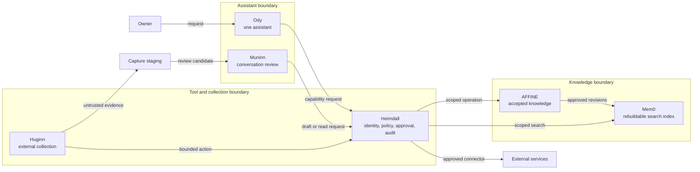
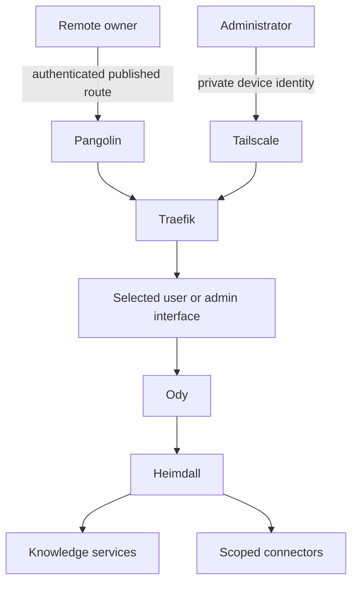
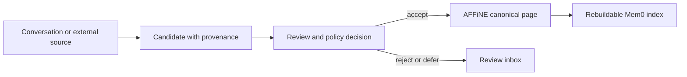
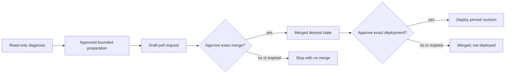

# Architecture

Pantheon Blueprint is a reference design for one personal AI assistant with
separate knowledge, collection, review, and tool-execution boundaries.

The short version is:

1. **Ody talks to the owner.** The internal roles do not become separate
   assistants the owner has to coordinate.
2. **AFFiNE holds accepted knowledge.** Search indexes, transcripts, captures,
   and telemetry are supporting data, not sources of truth.
3. **Heimdall controls actions.** Agents ask for capabilities; they do not hold
   general credentials or choose arbitrary downstream accounts.
4. **Sensitive changes pause for approval.** Approval is bound to one exact,
   expiring action. Merge and deployment are separate decisions.

This page describes **Pantheon Blueprint policy**, not proof that a deployment
implements it. Use [Readiness and assurance](assurance.md) to distinguish a
reference design from implemented and verified behavior.

## The five roles

The role names are stable responsibilities. The products are replaceable.

| Role | Plain-language responsibility | Reference implementation |
| --- | --- | --- |
| **Odine (Ody)** | Talks with the owner, reasons about requests, and coordinates work | Hermes Agent with WebUI, Hermex, or a messaging channel |
| **Mimir** | Keeps accepted knowledge and makes it searchable | AFFiNE as the source of truth; Mem0 as a rebuildable index |
| **Muninn** | Reviews completed conversations and prepares traceable knowledge drafts | Isolated scheduled Hermes worker |
| **Huginn** | Collects external evidence and runs predictable workflows | n8n with restricted fetch or browser workers |
| **Heimdall** | Checks identity and policy, selects a scoped connection, pauses for approval when needed, and records actions | Executor plus Blueprint policy and adapters |

Supporting services are not agents:

- **1Password** provisions secrets to approved runtimes. It is not a tool for
  browsing secrets.
- **Grafana** receives redacted operational telemetry. It cannot approve work.
- **Komodo** applies reviewed deployment state. It is outside the assistant's
  normal runtime decision path.

See [Tools and platform](tooling.md) for the detailed capability-to-product
map.

## The system at a glance



The important boundaries are logical. A small installation may combine roles
on fewer machines, but it must preserve identity separation, least privilege,
data authority, and failure isolation.

## Where it runs

The reference topology uses three Docker hosts:

| Host | Trust zone | Typical contents |
| --- | --- | --- |
| `agent-01` | Assistant runtime | Ody and an isolated Muninn worker |
| `knowledge-01` | Trusted knowledge | AFFiNE, Mem0, and their data services |
| `tools-01` | Tool execution and untrusted collection | Heimdall, Huginn, connectors, and restricted workers |

Traefik handles declared HTTP routes. Tailscale carries private and
administrative traffic. Pangolin publishes only deliberately selected
human-facing routes. DNS, reachability, authentication, application
authorization, and tool approval remain separate controls.



A published route does not grant application access. Private network access
does not replace login. Application login does not grant an agent permission
to invoke a downstream tool.

## Mimir authority model

Not all stored data has equal authority:

| Data | Authority | Rule |
| --- | --- | --- |
| Accepted AFFiNE pages | Canonical knowledge | Wins when another representation disagrees |
| Mem0 records | Derived search index | May be deleted and rebuilt from AFFiNE |
| Muninn drafts | Proposed knowledge | Requires the configured review or promotion policy |
| Huginn captures | Untrusted evidence | Must not promote itself into accepted knowledge |
| Conversation transcripts | Source material | Minimize, redact, and hand off through an append-only boundary |
| Grafana telemetry | Operational observation | Must not become approval or canonical audit authority |

The knowledge path is therefore:



## Action authority

Heimdall is the intended gateway for agent and workflow actions. It derives
the caller from an authenticated workload identity, exposes only the caller's
tool catalogue, selects the caller's fixed downstream connection, validates
the request, and records the result.

The caller may request a capability such as “read this page” or “open a draft
pull request.” It must not provide a secret reference, arbitrary connector, or
another role's identity.

```text
authenticated workload
    -> permitted capability
    -> fixed connection and downstream identity
    -> policy decision
    -> exact action or approval pause
    -> filtered result and audit evidence
```

Unknown identity, policy, target, approval state, or action outcome fails
closed. Agents must not fall back to direct connectors when Heimdall is
unavailable.

## Approval boundaries

Most safe reads should run without interrupting the owner. Sensitive or
high-impact changes pause for a human decision. The approval is native to the
control path, tied to the exact request, expires, and can be used only as
defined by policy.

Preparing a change, merging it, and deploying it are three distinct steps:



See [Approvals](approvals.md) for the simple decision table and
[Scoped maintenance sessions](maintenance-sessions.md) for the full contract.

## Failure rules

- A search failure does not change canonical knowledge.
- A collection failure does not erase the last accepted capture.
- A draft failure does not advance its checkpoint.
- An ambiguous write is reconciled before retry.
- A missing, altered, expired, or replayed approval invokes nothing.
- A failed canary, backup verification, or health check blocks deployment.
- Rollback restores a compatible release; restore replaces state from a
  verified recovery set. They are not interchangeable.

## Read next

- [Data flows](data-flows.md) shows the main request, knowledge, collection,
  approval, and deployment paths.
- [Approvals](approvals.md) explains when the system runs, pauses, or refuses.
- [Security](security.md) defines the threat model and negative tests.
- [Integration contracts](integration-contracts.md) contains the detailed
  wiring requirements.
- [Readiness and assurance](assurance.md) explains what must be tested before a
  deployment can call a capability verified.
