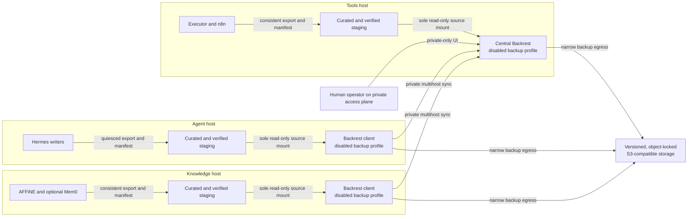

# Backups

> [!IMPORTANT]
> This page is a **reference design**, not deployment evidence. It defines a
> disabled-by-default Backrest foundation and the gates a deployment must pass.
> Keep the Compose `backup` profile disabled until the acceptance evidence and
> an isolated restore drill have been reviewed by a human operator.

## Claim labels

- **Upstream fact:** behavior described by official product documentation.
- **Asgard policy:** a requirement of this reference architecture.
- **Validation required:** behavior a deployment must demonstrate for its exact
  versions, provider, identities, and configuration.
- **Optional:** data that may be rebuilt instead of backed up.

## Reference topology

The three-host reference design places one Backrest client on the agent host,
one Backrest client on the knowledge host, and the central Backrest instance on
the tools host. The central instance receives multihost operation history and,
if approved, distributes a shared repository definition. The UI and multihost
sync route are private-only.



**Upstream fact:** Backrest supports a server/client multihost model with
one-time pairing tokens, operation-history synchronization, and shared
repositories. Its reverse-proxy guidance says only the sync path needs to be
exposed to clients and recommends keeping the UI and administrative endpoints
on a trusted network. See
[Backrest multihost sync](https://garethgeorge.github.io/backrest/docs/multihost).

**Asgard policy:** private routing is necessary but not sufficient. Authenticate
the UI, restrict its route to the administrative access plane, and expose only
the sync path required by the pinned Backrest release. Do not publish any
Backrest endpoint to the public internet.

## Container foundation

The current reference pin is Backrest v1.14.1:

```text
ghcr.io/garethgeorge/backrest@sha256:b852979754281026230cc69fb11428e6d57c9a97784ab4a444ffc7934c53a215
```

The container invokes its bundled restic binary at `/bin/restic`. A deployment
must record the resolved platform image ID and confirm the expected Backrest and
restic versions before activation.

**Asgard policy:**

- Keep every Backrest service behind an explicit, disabled `backup` Compose
  profile until all gates pass.
- Use the pinned upstream image; do not build a custom backup image.
- Do not install or invoke a separate host restic binary.
- Do not mount the Docker socket or grant privileged mode.
- Mount only curated backup staging read-only.
- Persist Backrest configuration, data, cache, and temporary state outside both
  application data and backup staging.
- Apply ordinary container hardening: an unprivileged runtime where supported,
  dropped capabilities, `no-new-privileges`, a read-only root filesystem,
  bounded resources, and a local health check.

**Validation required:** render the disabled profile and inspect the effective
image, mounts, ports, networks, privileges, environment names, and resource
limits without printing secret values. A Compose file is not proof that the
running container matches it.

## Staging is the only backup source

Backrest must never mount a raw application tree. Raw trees can contain
1Password bootstrap tokens, service-account tokens, rendered environments,
database files that are inconsistent while live, and unrelated temporary data.
Read-only access would still allow those values to be copied into the backup.

The sole source mount on each host is a curated path shaped like:

```text
/data/asgard-backup-staging/<host>
```

Nothing under a raw application root such as `/data/asgard/<host>` is mounted
into Backrest. The staging producer, not Backrest, knows how to quiesce or
export each application safely.

Every stage must contain:

- a unique recovery-point identifier;
- application and schema versions;
- creation time and configured local timezone;
- the exact source components included;
- file sizes and cryptographic checksums;
- references to required secrets or keys, never their values;
- the staging procedure result; and
- a completion marker written only after all checks pass.

**Asgard policy:** the backup plan fails closed when staging is absent,
incomplete, stale, concurrently changing, missing its completion marker, or
fails checksum and consistency validation. It must never fall back to a raw
application path or the previous partially replaced stage. Build a new stage in
an isolated directory, verify it, and promote it atomically.

## Application-consistent staging

### Hermes

Define a quiescence or checkpoint procedure for mutable Hermes conversation,
session, profile, approved-skill, schedule, and worker state. Wait for active
writes to finish, export the selected state, calculate its manifest, and resume
writers only after the stage is complete. Exclude bootstrap material, runtime
tokens, scratch data, and secret-bearing rendered configuration.

### AFFiNE

Stage the AFFiNE database and its matching blob or upload data as one recovery
point. Use the pinned release's documented online backup mechanism or quiesce
writes while producing a database export and matching blob view. Record both in
one manifest. A live database-directory copy paired with independently changing
blobs is not application-consistent.

### n8n

Stage the n8n database together with the persistent workflow state and retained
binary data needed by the deployment. Include a reference to the matching n8n
encryption key in the manifest, but never copy the key into staging. A database
without its matching state and key reference is not a demonstrated recovery
point.

### Executor

Stage the required Executor data, policy, connector metadata, and audit state
without exporting raw connector secrets. Include a reference to the exact
matching application key or recovery material held in the secret system. The
restore test must prove that the staged data and separately recovered key belong
to the same recovery point.

### Mem0

**Optional:** Mem0 is a rebuildable index, not canonical knowledge. A deployment
may stage its configuration and schema while omitting index data, provided an
empty Mem0 instance has been successfully rebuilt from the corresponding
AFFiNE recovery point. If Mem0 data is backed up for convenience, stage it
consistently and retain the rebuild test as the authoritative recovery path.

## Narrow recovery egress exception

Normal agent and workflow actions pass through Heimdall. Backup and recovery
traffic is a narrow infrastructure exception because recovery cannot depend on
Heimdall, the tools plane, or the application networks already being healthy.

**Asgard policy:**

- Give Backrest a dedicated egress network that is not an application network.
- Permit only the approved object-storage endpoint, private multihost route,
  name resolution, and time synchronization required by the design.
- Do not attach application containers, agents, or general tool workers to this
  network.
- Do not turn backup egress into a general HTTP client or agent capability.
- Record and alert on unexpected destinations and connection attempts.

The exception narrows a recovery dependency; it does not bypass storage
authentication, TLS validation, workload isolation, or change approval.

## Append-oriented S3 repository

Restic repositories are used in an append-oriented mode: backup automation may
write new repository objects, but routine automation does not remove historical
backup data.

**Upstream fact:** OVHcloud documents that Object Lock uses versioning, must be
enabled when the bucket is created, and cannot be added later to a bucket that
was created without it. Review the provider's current
[Object Lock documentation](https://help.ovhcloud.com/csm/en-au-public-cloud-storage-s3-managing-object-lock?id=kb_article_view&sysparm_article=KB0034736)
for the selected region and service.

**Asgard policy:**

- Enable versioning and Object Lock when creating the dedicated backup bucket.
- Configure no lifecycle rule that expires current versions, prior versions, or
  delete markers.
- Give the backup writer only the object operations required for backup and
  transient lock handling. Do not grant version deletion, retention bypass,
  lifecycle administration, Object Lock administration, or bucket
  administration.
- Use a separate verifier identity with only the list/read operations required
  for integrity checks and restore readback.
- Keep bucket administration separate from both writer and verifier.
- Configure Backrest repository retention as **None**.
- Do not schedule or run restic `forget` or `prune`.
- Treat future deletion or retention automation as a separate,
  human-approved governance project with its own evidence.

### Restic transient locks

Do not blindly apply default retention to restic's transient `locks/`
namespace. Restic must remove transient lock objects during normal operation.
An indiscriminate default lock can leave stale locks that the writer cannot
clear and make the repository unusable.

**Validation required:** test the provider-specific Object Lock and access
design with the exact restic version. Prove that the writer can create and
remove only the transient locks it needs while it cannot delete repository data
versions, weaken retention, or change lifecycle policy. Do not activate
scheduled backups until normal completion, interrupted-run recovery, and stale
lock cleanup all pass.

## Secrets and pairing

Use separate 1Password items and least-privilege provisioning paths for:

1. the object-storage writer identity;
2. the independent verifier identity; and
3. the restic repository encryption material.

Do not place values from those items in this repository, Compose files, staging
trees, manifests, screenshots, evidence, or shell history. Back up only stable
secret references and the independently protected 1Password recovery
procedure. The Backrest runtime must not receive a general-purpose 1Password
browser or a bootstrap service-account token it does not need.

**Upstream fact:** Backrest pairs a client to a server with a generated token.
The server selects token lifetime, maximum uses, and permissions; after pairing,
the client uses its registered identity rather than retaining the pairing
token. See the
[Backrest multihost setup](https://garethgeorge.github.io/backrest/docs/multihost).

**Asgard policy:** assign a unique, permanent instance ID to each instance.
Generate short-lived, single-use tokens with minimum permissions, pair each
client once to the central instance, confirm the expected identity, and then
discard the tokens. Never place pairing tokens in Git or deployment evidence.

## Plans and verification

Follow the official
[Backrest getting-started guide](https://garethgeorge.github.io/backrest/introduction/getting-started)
for the pinned release's repository and plan concepts. Keep repository
configuration deployment-specific and outside this public repository.

A daily plan at **01:00 in the configured local timezone** is an example, not a
universal requirement. Record the IANA timezone, daylight-saving behavior,
overlap policy, and interaction with application maintenance. Stagger plans if
the three hosts or staging jobs would otherwise contend for resources.

Successful upload is not successful verification. An independent verification
job must:

1. use the separate verifier identity;
2. use an explicitly pinned restic version;
3. verify that binary's exact version and checksum before use;
4. read repository data back from object storage;
5. verify repository integrity and selected file checksums; and
6. record redacted results against an immutable recovery-point identifier.

Do not treat the Backrest dashboard, an object count, or provider success
response as independent verification.

## Restore drills

An isolated restore drill is mandatory before the `backup` profile can be
enabled for scheduled use and after material changes to Backrest, restic,
staging, application schemas, credentials, or the storage provider.

The drill must:

1. start with clean volumes and an isolated network;
2. select one immutable recovery point;
3. use the separately controlled read or verifier path;
4. verify remote data, manifests, versions, and checksums before restore;
5. recover required key material through the approved 1Password recovery path;
6. restore pinned application versions without production secrets;
7. validate AFFiNE database-to-blob consistency;
8. validate Hermes, n8n, and Executor state with safe synthetic transactions;
9. rebuild Mem0 from restored AFFiNE data when it is treated as rebuildable;
10. prevent production email, messaging, webhooks, tools, and DNS from being
    reached; and
11. record duration, manual steps, missing dependencies, and the final result.

Destroying the isolated environment is a separate, explicitly approved cleanup
action. A drill that can overwrite production or call production integrations
has failed its isolation gate.

## Activation gates and evidence

Keep the disabled profile closed until a human operator has reviewed evidence
for all of these gates:

- [ ] The exact image digest, platform image ID, Backrest version, bundled
      restic version, and restic checksum are recorded.
- [ ] Rendered configuration proves no Docker socket, privileged mode, custom
      image, host binary, raw application mount, or public route exists.
- [ ] Backrest sees only read-only, atomically promoted staging and separate
      writable Backrest state.
- [ ] Missing, stale, partial, changing, and checksum-invalid staging all fail
      closed.
- [ ] Hermes, AFFiNE, n8n, and Executor consistency procedures pass; the Mem0
      backup-or-rebuild decision is recorded and tested.
- [ ] Private UI and sync routing, authentication, and least reachability pass.
- [ ] The direct backup-egress exception reaches only approved dependencies.
- [ ] Object Lock-at-creation, versioning, lifecycle absence, and identity
      separation are demonstrated for the selected storage service.
- [ ] Restic normal completion, interruption recovery, and transient lock
      cleanup pass without granting backup-data deletion.
- [ ] Writer, verifier, repository-encryption, and bucket-administration
      authority remain separated.
- [ ] Backrest retention is None and no forget or prune schedule exists.
- [ ] One-time multihost pairing and central operation reporting pass.
- [ ] The example local schedule, if adopted, uses the intended timezone and
      does not collide with staging or maintenance.
- [ ] Exact-version, checksum, integrity, and readback verification pass.
- [ ] An isolated restore drill passes with application-level checks.
- [ ] A human records explicit approval before enabling the `backup` profile.

## Reference design versus deployment evidence

This page defines topology, policy, failure behavior, and acceptance criteria.
It does not prove that any deployment has:

- created or configured an object-storage bucket;
- provisioned credentials or repository encryption;
- rendered or deployed a Compose stack;
- created application exports or schedules;
- paired Backrest instances;
- run a backup, verification job, or restore; or
- enforced the described networks, mounts, permissions, or Object Lock rules.

Store deployment-specific desired state and redacted evidence in the
deployment's private control plane. Evidence should name exact versions, test
dates, operators, results, and exceptions without copying secret values into
Git. Until that evidence exists and receives explicit human approval, the
foundation remains **planned, gated, and disabled**.
