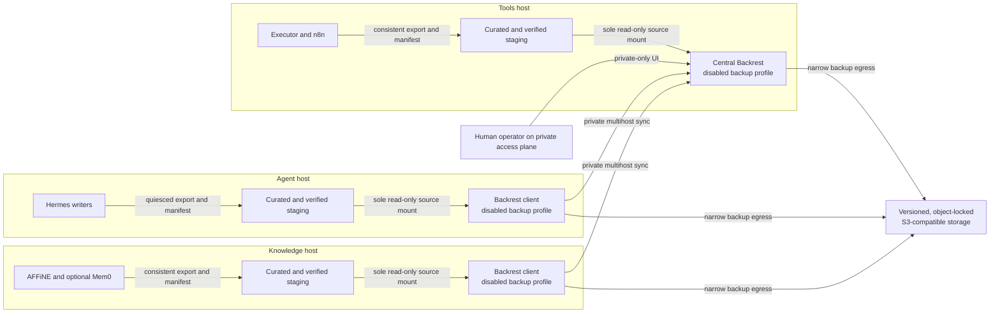

# Backups

!!! important

    This page is a **reference design**, not deployment evidence. It defines a
    disabled-by-default Backrest foundation and the gates a deployment must pass.
    Keep the Compose `backup` profile disabled until the acceptance evidence and
    an isolated restore drill have been reviewed by a human operator.

## Claim labels

- **Upstream fact:** behavior described by official product documentation.
- **Pantheon Blueprint policy:** a requirement of this reference architecture.
- **Validation required:** behavior a deployment must demonstrate for its exact
  versions, provider, identities, and configuration.
- **Optional:** data that may be rebuilt instead of backed up.

## Reference topology

The three-host reference design places one Backrest client on the agent host,
one Backrest client on the knowledge host, and the central Backrest instance on
the tools host. The central instance receives multihost operation history and,
if approved, distributes a shared repository definition. The UI and multihost
sync route are private-only.



**Upstream fact:** Backrest supports a server/client multihost model with
one-time pairing tokens, operation-history synchronization, and shared
repositories. Its reverse-proxy guidance says only the sync path needs to be
exposed to clients and recommends keeping the UI and administrative endpoints
on a trusted network. See
[Backrest multihost sync](https://garethgeorge.github.io/backrest/docs/multihost).

**Pantheon Blueprint policy:** private routing is necessary but not sufficient. Authenticate
the UI, restrict its route to the administrative access plane, and expose only
the sync path required by the pinned Backrest release. Do not publish any
Backrest endpoint to the public internet.

## Container foundation

The current reference pin is Backrest v1.14.1:

```text
ghcr.io/garethgeorge/backrest@sha256:b852979754281026230cc69fb11428e6d57c9a97784ab4a444ffc7934c53a215
```

The container invokes its bundled restic binary at `/bin/restic`. A deployment
must record the resolved platform image ID and confirm the expected Backrest and
restic versions before activation.

**Pantheon Blueprint policy:**

- Keep every Backrest service behind an explicit, disabled `backup` Compose
  profile until all gates pass.
- Use the pinned upstream image; do not build a custom backup image.
- Do not install or invoke a separate host restic binary.
- Do not mount the Docker socket or grant privileged mode.
- Mount only curated backup staging read-only.
- Persist Backrest configuration, data, cache, and temporary state outside both
  application data and backup staging.
- Apply ordinary container hardening: an unprivileged runtime where supported,
  dropped capabilities, `no-new-privileges`, a read-only root filesystem,
  bounded resources, and a local health check.

**Validation required:** render the disabled profile and inspect the effective
image, mounts, ports, networks, privileges, environment names, and resource
limits without printing secret values. A Compose file is not proof that the
running container matches it.

## Staging is the only backup source

Backrest must never mount a raw application tree. Raw trees can contain
1Password bootstrap tokens, service-account tokens, rendered environments,
database files that are inconsistent while live, and unrelated temporary data.
Read-only access would still allow those values to be copied into the backup.

The stable staging parent on each host is shaped like:

```text
/data/pantheon-backup-staging/<HOST_ROLE>
```

Mount that parent read-only in Backrest at `/staging/<HOST_ROLE>` and configure
the host plan to read `/staging/<HOST_ROLE>/current`. `current` must be a real
directory, not a symlink.

Do not bind-mount only the host's `current` directory into a long-running
container. A container runtime can retain the directory resolved when the
container was created, so an atomic host-side rename can leave the mount
pointing at the old generation. Mounting the stable parent lets each backup
path lookup resolve the newly promoted `current`. A symlink is also unsuitable:
depending on restic path and filesystem behavior, the link itself can be
archived instead of the intended tree.

Nothing under a raw application root such as
`/data/pantheon/<HOST_ROLE>` is mounted into Backrest. The staging producer, not
Backrest, knows how to quiesce or export each application safely.

Every stage must contain:

- a unique recovery-point identifier;
- application and schema versions;
- creation time and configured local timezone;
- the exact source components included;
- file sizes and cryptographic checksums;
- references to required secrets or keys, never their values;
- the staging procedure result; and
- a completion marker written only after all checks pass.

**Pantheon Blueprint policy:** the backup plan fails closed when staging is absent,
incomplete, stale, concurrently changing, missing its completion marker, or
fails checksum and consistency validation. It must never fall back to a raw
application path or a previous generation.

### Disabled exporter and host orchestrator

Each host has two disabled, one-shot building blocks:

1. an application exporter that writes one candidate generation; and
2. a generic, root-owned systemd orchestrator that controls quiescence and
   invokes that exporter.

They are templates, not evidence of installed units. Their deployment
configuration contains placeholders only, for example:

```ini
PANTHEON_HOST_ROLE=<HOST_ROLE>
PANTHEON_COMPOSE_PROJECT=<COMPOSE_PROJECT>
PANTHEON_COMPOSE_FILE=<ABSOLUTE_COMPOSE_FILE>
PANTHEON_STAGE_ROOT=<ABSOLUTE_STAGING_PARENT>
PANTHEON_WRITER_ALLOWLIST=<ORDERED_COMPOSE_SERVICE_ALLOWLIST>
PANTHEON_MAX_STAGE_AGE=<APPROVED_DURATION>
```

Store the resolved environment in a root-owned, mode-restricted file outside
this public repository. It must contain service identifiers and paths, not
secret values. The units and timers remain disabled until every activation gate
passes.

For every run, the orchestrator must:

1. acquire a host-scoped lock and reject overlap;
2. record which allowlisted writer services are actually running;
3. stop only that recorded set, in the declared order, and verify quiescence;
4. leave PostgreSQL online for logical dumps;
5. create a fresh regular-file host marker containing exactly the single line
   `host=<HOST_ROLE>` only after quiescence succeeds;
6. invoke the one-shot exporter and require all validation to pass;
7. remove the host marker in an unconditional cleanup path; and
8. restart, in reverse order, only the writers recorded as originally running.

The restart cleanup runs after exporter failure, validation failure, or
interruption. A service that was stopped before the run must remain stopped.
Cleanup failure is a failed run and requires operator attention; it must never
turn an incomplete candidate into `current`.

The exporter must reject a missing, stale, non-regular, incorrectly owned, or
non-exact host marker before it reads application state.

### Immutable generation publication

The exporter builds a unique generation beneath
`<STAGING_PARENT>/.incoming/<RECOVERY_POINT_ID>`. Before publication it must:

- create every expected payload;
- reject unexpected file types and paths;
- write a deterministic `MANIFEST` with versions, sizes, and secret references;
- write a deterministic `CHECKSUMS` file covering every recovery payload;
- validate PostgreSQL archives with `pg_restore --list`;
- re-read and verify all listed checksums; and
- write a regular-file `COMPLETE` marker last.

After those checks, validate the existing `current` generation if one exists,
rename it to immutable `history/<OLD_RECOVERY_POINT_ID>`, and rename the
verified incoming directory to `current`. If the second rename fails, restore
the old directory to `current` and fail the run. Never publish by copying over
an existing `current`, and never allow routine exporter, backup, or verification
automation to delete history. Retention or deletion requires a separate,
human-approved procedure.

## Application-consistent staging

The matrix is an allowlist. Anything not listed is excluded until a reviewed
restore requirement and test add it.

| Host | Included recovery payload | Explicit exclusions |
| --- | --- | --- |
| Agent | Selected regular-file Hermes and Muninn profile, conversation, session, checkpoint, schedule, and approved-skill state. | Bootstrap material, runtime tokens, caches, logs, scratch data, rendered secret configuration, and symlinks, hard links, devices, sockets, or other special files. |
| Knowledge | PostgreSQL 16 custom-format AFFiNE archive plus a deterministic archive of the matching blob/upload view; approved non-secret version and configuration metadata. | Live PostgreSQL files, live configuration, private keys, rendered secrets, temporary data, and Mem0 index data. |
| Tools | PostgreSQL 16 custom-format n8n archive; quiesced Executor SQLite `data.db` together with its `-wal` and `-shm` companions when present; non-secret version metadata; references to the matching n8n and Executor keys. | Live PostgreSQL files, raw application trees, secret values, connector credentials, logs, caches, n8n local configuration, and local n8n execution binary data. |

**Upstream fact:** PostgreSQL 16 documents that `pg_dump` creates a consistent
logical backup while the database remains in use, and that custom-format
archives are consumed by `pg_restore`. See
[PostgreSQL 16 `pg_dump`](https://www.postgresql.org/docs/16/app-pgdump.html).
Use a client compatible with the deployed server, custom archive format, and
the approved ownership and ACL policy. Validate stderr, exit status, and the
archive table of contents. PostgreSQL stays online; only application writers
are quiesced.

**Pantheon Blueprint policy:** the AFFiNE database archive and blob archive are one
recovery point and must share one identifier and manifest. Quiescing AFFiNE
writers while creating both payloads is the consistency boundary. This pairing
is a Pantheon Blueprint restore policy, not an upstream AFFiNE guarantee.

**Upstream fact:** n8n uses its encryption key for stored credentials; see
[n8n custom encryption-key configuration](https://docs.n8n.io/hosting/configuration/configuration-examples/encryption-key/).
The manifest records the approved secret-system reference and version for the
matching key, never the value.

**Pantheon Blueprint policy:** local n8n binary execution data is non-authoritative and is
omitted. n8n documents external storage as a separate store for binary data
produced by workflow executions; see
[n8n external binary storage](https://docs.n8n.io/hosting/scaling/external-storage/).
If an approved deployment later requires that data for recovery, incorporate
the external store explicitly and prove its consistency and restore behavior
before changing this allowlist.

**Pantheon Blueprint policy:** Executor's SQLite database and any present WAL and shared
memory files are one quiesced set. The manifest records only the approved
secret-system reference and version for the matching application key. Never
copy either key value into staging.

**Optional:** Mem0 is a rebuildable index, not canonical knowledge. Omit Mem0
data, private keys, and secret-bearing configuration. A deployment must prove
that an empty Mem0 instance can be rebuilt from the corresponding restored
AFFiNE recovery point before relying on that policy.

## Narrow recovery egress exception

Normal agent and workflow actions pass through Heimdall. Backup and recovery
traffic is a narrow infrastructure exception because recovery cannot depend on
Heimdall, the tools plane, or the application networks already being healthy.

**Pantheon Blueprint policy:**

- Give Backrest a dedicated egress network that is not an application network.
- Permit only the approved object-storage endpoint, private multihost route,
  name resolution, and time synchronization required by the design.
- Do not attach application containers, agents, or general tool workers to this
  network.
- Do not turn backup egress into a general HTTP client or agent capability.
- Record and alert on unexpected destinations and connection attempts.

The exception narrows a recovery dependency; it does not bypass storage
authentication, TLS validation, workload isolation, or change approval.

## Append-oriented S3 repository

Restic repositories are used in an append-oriented mode: backup automation may
write new repository objects, but routine automation does not remove historical
backup data.

**Upstream fact:** OVHcloud documents that Object Lock uses versioning, must be
enabled when the bucket is created, and cannot be added later to a bucket that
was created without it. Review the provider's current
[Object Lock documentation](https://help.ovhcloud.com/csm/en-au-public-cloud-storage-s3-managing-object-lock?id=kb_article_view&sysparm_article=KB0034736)
for the selected region and service.

**Pantheon Blueprint policy:**

- Enable versioning and Object Lock when creating the dedicated backup bucket.
- Configure no lifecycle rule that expires current versions, prior versions, or
  delete markers.
- Give the backup writer only the object operations required for backup and
  transient lock handling. Do not grant version deletion, retention bypass,
  lifecycle administration, Object Lock administration, or bucket
  administration.
- Use a separate verifier identity with only the list/read operations required
  for integrity checks and restore readback.
- Keep bucket administration separate from both writer and verifier.
- Configure Backrest repository retention as **None**.
- Do not schedule or run restic `forget` or `prune`.
- Treat future deletion or retention automation as a separate,
  human-approved governance project with its own evidence.

### Restic transient locks

Do not blindly apply default retention to restic's transient `locks/`
namespace. Restic must remove transient lock objects during normal operation.
An indiscriminate default lock can leave stale locks that the writer cannot
clear and make the repository unusable.

**Validation required:** test the provider-specific Object Lock and access
design with the exact restic version. Prove that the writer can create and
remove only the transient locks it needs while it cannot delete repository data
versions, weaken retention, or change lifecycle policy. Do not activate
scheduled backups until normal completion, interrupted-run recovery, and stale
lock cleanup all pass.

## Secrets and pairing

Use separate 1Password items and least-privilege provisioning paths for:

1. the object-storage writer identity;
2. the independent verifier identity; and
3. the restic repository encryption material.

Do not place values from those items in this repository, Compose files, staging
trees, manifests, screenshots, evidence, or shell history. Back up only stable
secret references and the independently protected 1Password recovery
procedure. The Backrest runtime must not receive a general-purpose 1Password
browser or a bootstrap service-account token it does not need.

**Upstream fact:** Backrest pairs a client to a server with a generated token.
The server selects token lifetime, maximum uses, and permissions; after pairing,
the client uses its registered identity rather than retaining the pairing
token. See the
[Backrest multihost setup](https://garethgeorge.github.io/backrest/docs/multihost).

**Pantheon Blueprint policy:** assign a unique, permanent instance ID to each instance.
Generate short-lived, single-use tokens with minimum permissions, pair each
client once to the central instance, confirm the expected identity, and then
discard the tokens. Never place pairing tokens in Git or deployment evidence.

## Schedule, pre-snapshot gate, and verification

Follow the official
[Backrest getting-started guide](https://garethgeorge.github.io/backrest/introduction/getting-started)
for the pinned release's repository and plan concepts. Keep repository
configuration deployment-specific and outside this public repository.

The reference cadence is host staging at **00:15 local time** and the Backrest
plan at **01:00 local time**. A deployment may select another IANA timezone or
cadence, but must record the selection, daylight-saving behavior, maximum stage
age, overlap policy, and maintenance interaction. Stagger hosts if staging,
verification, or upload would otherwise contend for resources.

Attach a Backrest command hook to `CONDITION_SNAPSHOT_START`. The hook must
finish successfully before the snapshot and use `ON_ERROR_FATAL`, or
`ON_ERROR_CANCEL` when intentionally suppressing downstream error hooks.
Backrest documents both the event ordering and failure behaviors in
[Hooks](https://garethgeorge.github.io/backrest/docs/hooks) and provides command
patterns in its
[hook examples](https://garethgeorge.github.io/backrest/cookbooks/command-hook-examples).

The hook independently fails closed unless, for every configured host source:

- `current` resolves to a real directory beneath the stable staging parent;
- `COMPLETE`, `MANIFEST`, and `CHECKSUMS` are regular files and the manifest
  names the same recovery point;
- the manifest creation time is within the configured freshness window;
- the exact expected payload set exists and no unapproved path is present; and
- every recorded size and cryptographic checksum revalidates.

The plan has no raw-path fallback, stale-generation fallback, or
continue-on-hook-error setting.

Successful upload is not successful verification. An independent verification
job must:

1. use the separate verifier identity;
2. use an explicitly pinned restic version;
3. verify that binary's exact version and checksum before use;
4. read repository data back from object storage;
5. verify repository integrity and selected file checksums; and
6. record redacted results against an immutable recovery-point identifier.

Do not treat the Backrest dashboard, an object count, or provider success
response as independent verification.

## Isolated restore sequence

An isolated restore drill is mandatory before the `backup` profile can be
enabled for scheduled use and after material changes to Backrest, restic,
staging, application schemas, credentials, or the storage provider.

Use this order:

1. Open a change record naming the immutable recovery-point identifier,
   expected application versions, operator, and success criteria.
2. Create a clean restore host, clean volumes, and an isolated network with no
   route or DNS resolution to production services.
3. Disable outbound email, messaging, webhooks, workflow triggers, agent tools,
   and other side effects at both the network and application layers.
4. Obtain the verifier identity and repository passphrase through their
   separately controlled recovery paths; do not copy them into evidence.
5. Pin and verify the approved restic binary, then run repository integrity and
   remote readback checks before restoring files.
6. Restore only the selected recovery point into a new scratch directory.
7. Require one regular `COMPLETE` marker, revalidate the manifest, paths,
   versions, sizes, and checksums, and reject unexpected files or special file
   types.
8. Provision clean, pinned PostgreSQL 16-compatible servers and empty databases;
   do not restore live database directories.
9. Inspect each untrusted custom archive before execution, then restore the
   AFFiNE and n8n archives with the approved ownership and ACL mapping.
10. Restore AFFiNE's blob archive only with the database archive carrying the
    same recovery-point identifier. Reject any mismatched pair.
11. Recover the n8n key identified by the manifest through the secret system,
    inject it only into the isolated runtime, and confirm stored credentials can
    be decrypted without contacting their providers.
12. Restore the quiesced Executor SQLite set together. Recover the separately
    referenced Executor key and confirm database integrity before application
    startup.
13. Restore only the allowlisted Hermes and Muninn regular files, preserving no
    unapproved ownership, links, or device metadata.
14. Start pinned application versions with synthetic credentials and blocked
    integrations. Validate schemas, representative reads, workflow loading,
    Executor policy and audit state, and safe synthetic transactions.
15. Rebuild Mem0 from the restored AFFiNE recovery point and validate retrieval
    if Mem0 is treated as rebuildable.
16. Record timings, commands or runbook steps, manual interventions, redacted
    validation results, missing dependencies, and the final pass or fail.
17. Keep the environment isolated for review. Destruction is a separate,
    explicitly approved cleanup action.

A drill that can overwrite production, reuse production destinations, or call
production integrations has failed its isolation gate.

## Activation gates and evidence

The shared maturity labels, gate semantics, and evidence-record format live in
[Readiness and assurance](assurance.md). This page owns the backup, verification,
and isolated-restore checks below.

Keep the disabled profile closed until a human operator has reviewed evidence
for all of these gates:

- [ ] The exact image digest, platform image ID, Backrest version, bundled
      restic version, and restic checksum are recorded.
- [ ] Rendered configuration proves no Docker socket, privileged mode, custom
      image, host binary, raw application mount, or public route exists.
- [ ] Backrest sees only read-only, atomically promoted staging and separate
      writable Backrest state.
- [ ] The stable staging parent is mounted read-only, every plan reads a real
      `/staging/<HOST_ROLE>/current` directory, and generation replacement is
      visible without recreating the container.
- [ ] The one-shot exporters, systemd orchestrators, timers, and Compose
      `backup` profile remain disabled until approval.
- [ ] Quiescence captures and stops only originally running allowlisted writers;
      cleanup removes the exact host marker and restarts only that set in
      reverse order after both success and failure.
- [ ] PostgreSQL remains online for validated PostgreSQL 16 custom-format
      logical dumps.
- [ ] Missing, stale, partial, changing, and checksum-invalid staging all fail
      closed at publication and in the Backrest pre-snapshot hook.
- [ ] Incoming publication, immutable history, rollback on rename failure, and
      the prohibition on automated staging-history deletion are demonstrated.
- [ ] Hermes, AFFiNE, n8n, and Executor consistency procedures pass; the Mem0
      backup-or-rebuild decision is recorded and tested.
- [ ] Private UI and sync routing, authentication, and least reachability pass.
- [ ] The direct backup-egress exception reaches only approved dependencies.
- [ ] Object Lock-at-creation, versioning, lifecycle absence, and identity
      separation are demonstrated for the selected storage service.
- [ ] Restic normal completion, interruption recovery, and transient lock
      cleanup pass without granting backup-data deletion.
- [ ] Writer, verifier, repository-encryption, and bucket-administration
      authority remain separated.
- [ ] Backrest retention is None and no forget or prune schedule exists.
- [ ] One-time multihost pairing and central operation reporting pass.
- [ ] The 00:15 staging and 01:00 backup schedule, or an approved replacement,
      uses the intended IANA timezone and does not collide with maintenance.
- [ ] The snapshot-start hook uses a fatal or cancel failure policy and rejects
      non-directory, incomplete, stale, unexpected, or checksum-invalid stages.
- [ ] Exact-version, checksum, integrity, and readback verification pass.
- [ ] An isolated restore drill passes with application-level checks.
- [ ] A human records explicit approval before enabling the `backup` profile.

## Reference design versus deployment evidence

This page defines topology, policy, failure behavior, and acceptance criteria.
It does not prove that any deployment has:

- created or configured an object-storage bucket;
- provisioned credentials or repository encryption;
- rendered or deployed a Compose stack;
- installed exporters, orchestrators, markers, hooks, or schedules;
- created application exports or immutable staging generations;
- paired Backrest instances;
- run a backup, verification job, or restore; or
- enforced the described networks, mounts, permissions, or Object Lock rules.

Store deployment-specific desired state and redacted evidence in the
deployment's private control plane. Evidence should name exact versions, test
dates, operators, results, and exceptions without copying secret values into
Git. Until that evidence exists and receives explicit human approval, the
foundation remains **planned, gated, and disabled**.
