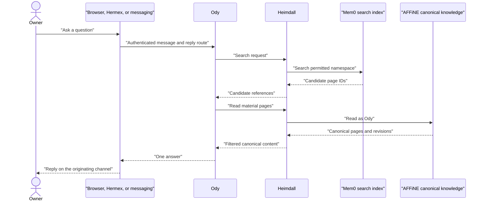
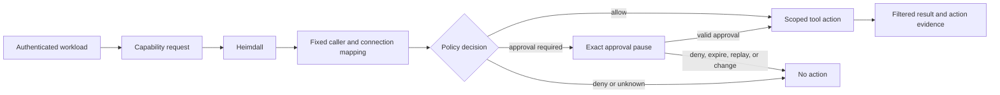
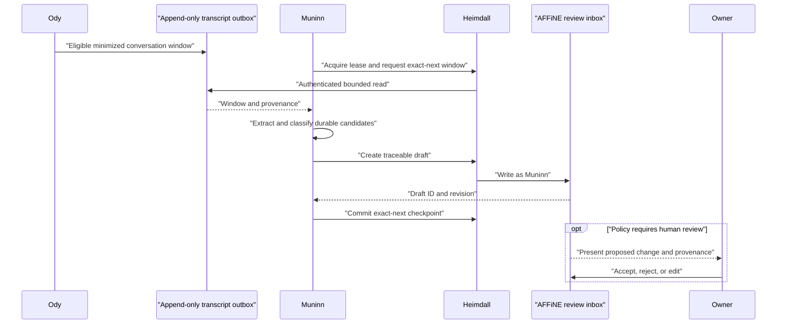
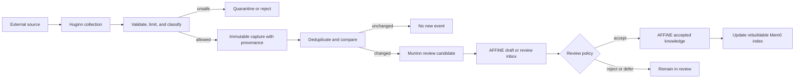
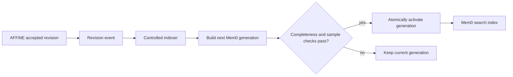
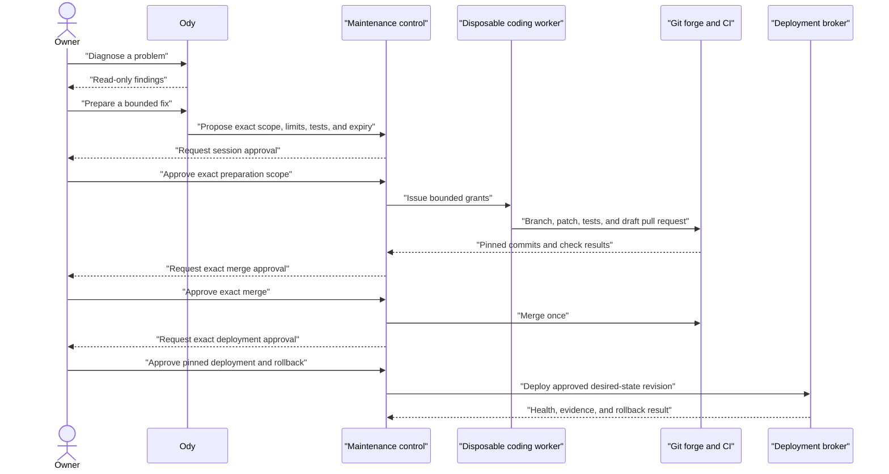
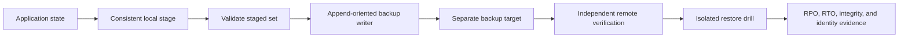

# Data flows

This page shows how requests, knowledge, evidence, approvals, and deployments
move through Pantheon Blueprint.

Every flow follows the same rules:

- Ody is the only user-facing assistant.
- Agent and workflow actions pass through Heimdall.
- Workload identity selects the allowed tools and downstream account.
- AFFiNE is accepted knowledge; Mem0 is only a rebuildable search index.
- External content starts as untrusted evidence.
- Sensitive actions pause for one exact approval.
- Checkpoints move only after the corresponding result is durably stored.
- Telemetry observes the flow but never authorizes it.

These are **Pantheon Blueprint policy** and **validation requirements**, not a
claim that a deployment already passes them.

## User question and knowledge retrieval

The owner can talk to Ody through a browser, Hermex, Signal, or another
approved channel. The channel authenticates the owner and preserves the reply
route. It does not give the model channel credentials.

Mem0 helps Ody find likely pages. Ody reads the corresponding AFFiNE pages
before treating the content as accepted knowledge. If Mem0 and AFFiNE disagree,
AFFiNE wins.

Routine permitted reads should not ask the owner for approval. A policy denial
or missing identity stops the request; it does not cause a fallback to a direct
connection.

## Tool action

Ody, Muninn, and Huginn each have their own workload identity. Heimdall maps
that identity to a fixed tool catalogue and fixed downstream connections.

The model may choose a permitted capability and provide its bounded business
arguments. It must not choose credentials, another role's connector, a broader
repository, or an unapproved deployment target.

An approval prompt shows the meaningful effect: action, target, material
arguments or diff, expiry, and whether it is once-only. A conversational “yes”
is not approval. See [Approvals](approvals.md).

## Conversation to knowledge

Muninn reviews completed conversation windows outside the interactive reply
path. It receives a minimized, redacted, append-only handoff rather than direct
access to Ody's mutable runtime state.

Muninn classifies each candidate as a duplicate, supporting evidence, new
knowledge, an update, a contradiction, temporary information, or sensitive
material. Initial output goes to a review inbox or draft area.

Low-risk policy may allow carefully bounded draft creation or append-only
annotation. Contradictions, sensitive material, deletions, and material changes
to accepted decisions require review. Muninn must not silently replace or
delete canonical pages.

If draft persistence fails, the checkpoint stays unchanged. Replay uses stable
source and candidate IDs so it does not create duplicate drafts.

## Huginn external collection and Muninn curation

Huginn collects; Muninn interprets; AFFiNE accepts. Keeping these stages
separate prevents hostile content from promoting itself into trusted knowledge.

A reviewed workflow may fetch a fixed anonymous public source directly.
Authenticated connectors, browser actions, and agent-requested operations still
pass through Heimdall with Huginn's fixed identity.

The captured page can contain instructions, scripts, credentials, or misleading
claims. None of that content may change collection policy, tool selection,
approval state, or canonical knowledge authority.

## Accepted knowledge to search

AFFiNE-to-Mem0 synchronization is one-way. The indexer consumes accepted
revisions and records which canonical revision each index entry represents.

Mem0 never writes accepted knowledge back into AFFiNE. Rebuild starts from
AFFiNE, not from the old index. A failed or incomplete generation is not
activated.

## Prepare, merge, and deploy

Maintenance uses separate authority from normal conversation. Read-only
diagnosis needs no maintenance session. Preparing a bounded change requires an
approved session. Merge and deployment then require separate exact approvals.

The preparation session does not imply permission to merge. Merge does not
imply permission to deploy. A changed commit, target, image, policy revision,
backup, or rollback point invalidates the corresponding approval.

Deployment stops when the required backup cannot be verified, the canary
fails, the maintenance lease is lost, or health and semantic checks disagree.
See [Scoped maintenance sessions](maintenance-sessions.md) for the complete
contract.

## Backup and restore

Backups move application-consistent staged data to a separate failure domain.
The backup writer should append new objects but should not be able to erase
history.

An uploaded object is not a verified backup. Production cutover after a
restore requires a human decision because it replaces live state. See
[Backups and restore](backups.md).

## Quick failure table

| Failure | Required result |
| --- | --- |
| Heimdall unavailable | Agent action stops; no direct-connector fallback |
| Approval missing, altered, expired, or replayed | No tool invocation |
| External capture malformed or unsafe | Reject or quarantine; canonical knowledge unchanged |
| AFFiNE draft write fails | Checkpoint unchanged; bounded retry or operator review |
| Mem0 rebuild fails | Current generation stays active; AFFiNE remains authoritative |
| Tool outcome is ambiguous | Reconcile by idempotency key before retry |
| Backup or canary verification fails | Deployment blocked |
| Health is uncertain after deployment | Stop rollout and use the approved rollback or recovery path |

## Validation

A deployment should test each flow with synthetic data and record both the
success and failure paths. At minimum, prove caller separation, connector
selection, approval replay resistance, canonical authorship, idempotent replay,
checkpoint ordering, quarantine behavior, index rebuild, backup verification,
and recovery after restart.

Use [Readiness and assurance](assurance.md) for evidence records and promotion
gates, and [Integration contracts](integration-contracts.md) for detailed
component requirements.
