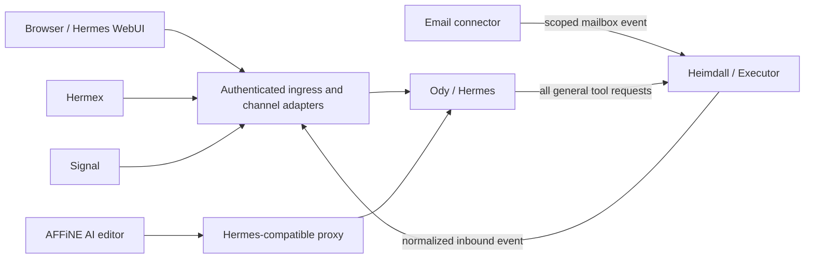
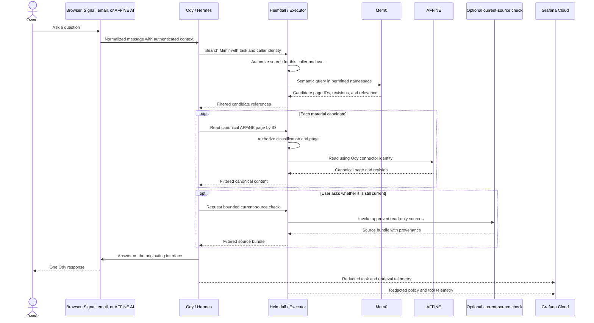
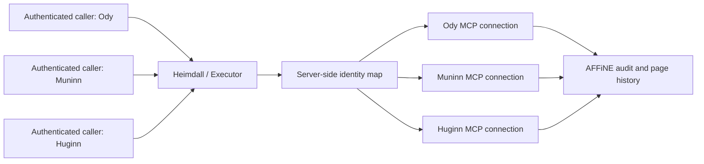
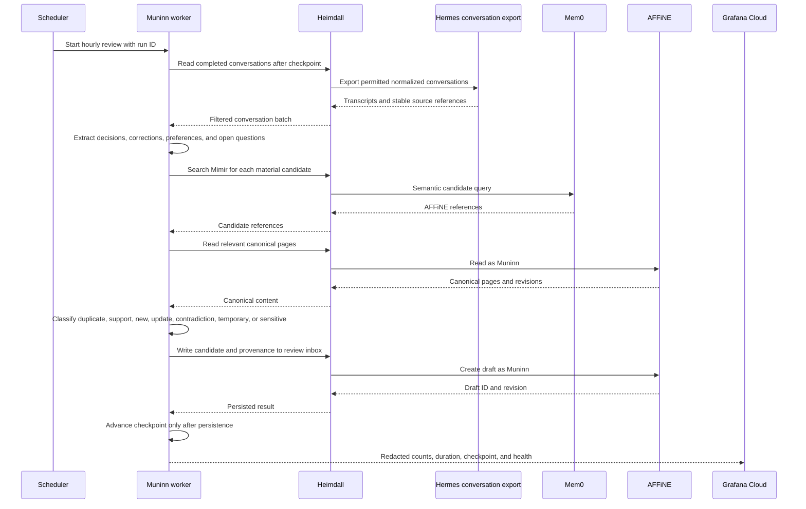
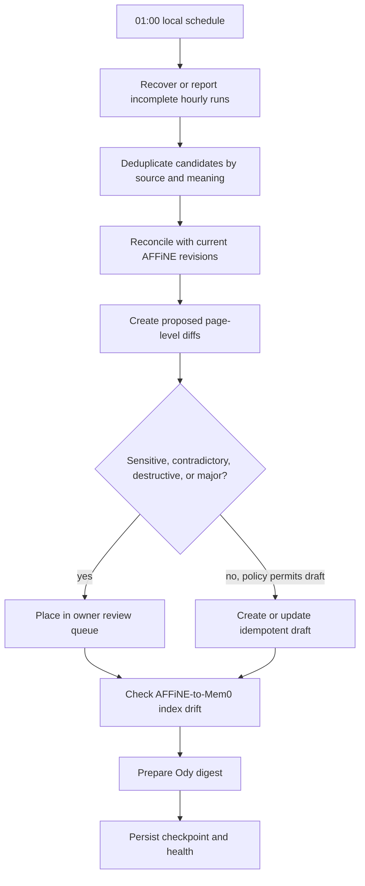
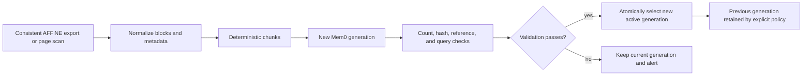
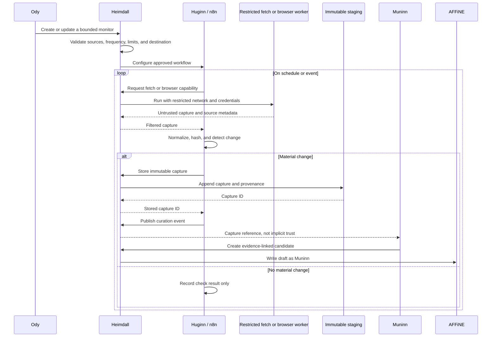
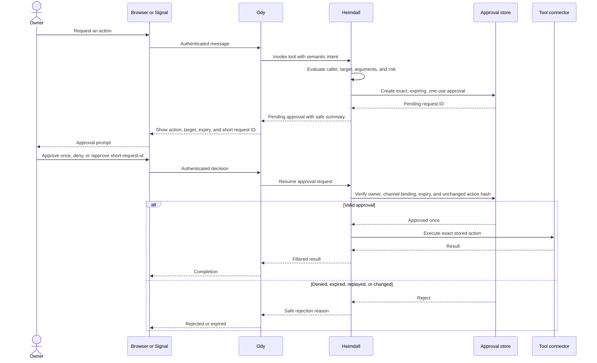
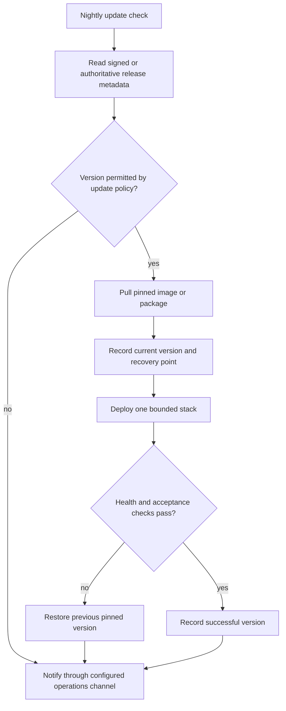
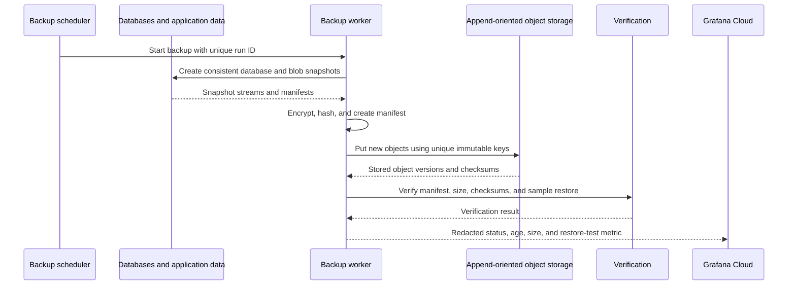

# Data flows

This chapter describes how information and actions should move through Asgard.
The flows are security requirements and implementation targets, not evidence
that a particular upstream release already implements them.

The examples use generic identities and addresses. Schedules are examples and
must be configured for the deployment's local time zone.

## Flow invariants

Every flow in this document preserves the following rules:

- Ody is the only user-facing assistant.
- General tool discovery and execution pass through Heimdall.
- Agents receive capabilities and results, never raw downstream secrets.
- Heimdall derives the caller from an authenticated workload identity.
- A model-generated argument cannot select another agent's credentials.
- AFFiNE is Mimir's canonical source of truth.
- Mem0 is a disposable, rebuildable search index.
- When AFFiNE and Mem0 disagree, AFFiNE wins.
- External content remains untrusted until it has been reviewed and curated.
- Huginn stages evidence; it does not silently promote evidence to canonical
  knowledge.
- Muninn does not silently overwrite or delete canonical knowledge.
- Approval applies to one exact action and expires.
- Grafana Cloud observes redacted events but never authorizes an action.

## User interfaces to Ody

The owner may reach the same Ody runtime through several interfaces:

| Interface | Ingress path | Important requirement |
| --- | --- | --- |
| Browser | Hermes WebUI through authenticated ingress | Preserve the authenticated user and browser conversation |
| Hermex | Hermes WebUI-compatible backend | Apply the same policy as the browser interface |
| Signal | Signal adapter into the Hermes messaging gateway | Bind the permitted Signal sender to the owner identity |
| Email | Scoped mailbox connector or authenticated inbound handler | Mail credentials remain behind Heimdall |
| AFFiNE AI | AFFiNE AI editor calls the Hermes-compatible proxy | Preserve user context and prevent a tool-policy bypass |

Email is an Ody interface, not permission for Hermes to hold unrestricted mail
credentials. Inbound polling, message reads, attachments, replies, and sends
should use scoped connectors mediated by Heimdall. If a provider can deliver an
authenticated webhook, the ingress handler should still normalize and
authenticate the event before it reaches Hermes.

AFFiNE AI is also an Ody interface. It may be given the same tools Ody can use
elsewhere, including the controlled AFFiNE connector, only after recursion,
identity, and authorization tests pass. An edit request originating inside
AFFiNE must not become an unbounded self-edit loop.



### Common request envelope

Channel adapters should normalize an inbound message without discarding its
origin:

```yaml
user_id: authenticated-owner-id
channel: webui | hermex | signal | email | affine-ai
channel_conversation_id: opaque-channel-value
asgard_conversation_id: opaque-internal-value
message_id: opaque-channel-value
received_at: timestamp
attachments:
  - reference-to-quarantined-content
reply_route: opaque-channel-route
data_classification: private
```

Opaque IDs are safer than putting email addresses, phone numbers, or message
contents into logs and traces. The channel adapter, not the model, owns
`user_id` and `reply_route`.

## User question and knowledge retrieval

Example question:

> What did we decide about tool approvals, and is that decision still current?



### Detailed steps

1. The channel adapter authenticates or maps the sender and creates a common
   request envelope.
2. Hermes loads the correct Ody profile and conversation without placing
   channel credentials in model context.
3. Ody decides whether the request can be answered from the conversation alone
   or requires Mimir retrieval.
4. Ody asks Heimdall for the `search_mimir` capability.
5. Heimdall verifies the Ody workload identity, owner identity, requested
   namespace, and data classification.
6. Mem0 returns candidate references and relevance metadata. Its text is useful
   for ranking, not canonical authority.
7. Ody asks Heimdall to fetch the material AFFiNE pages by stable ID.
8. Heimdall reads AFFiNE with the downstream identity assigned to Ody.
9. Ody answers from canonical content. If a current external check was
   requested, Ody distinguishes historical decisions from new evidence.
10. The answer is delivered through the original reply route.
11. Hermes records the completed conversation and emits a reviewable completion
    event for Muninn.
12. Grafana Cloud receives identifiers, timings, counts, health, and redacted
    decisions. It receives no authority to allow or deny the flow.

The answer should not expose internal component names unless they help the
owner understand a failure or the owner explicitly asks for diagnostics.

## Per-agent downstream identity selection

Ody, Muninn, and Huginn should have separate workload identities and separate
accounts where the downstream system supports attribution. A shared Heimdall
endpoint must preserve that distinction.

This is a required Asgard capability. It is not a statement that every Executor
version already guarantees safe multi-identity connector selection.



The mapping must be server-side:

```text
authenticated workload identity
    → permitted tool
    → fixed connector or MCP profile
    → downstream account
```

It must not be:

```text
agent-supplied email or profile name
    → arbitrary connector
```

Before enabling AFFiNE writes, verify all of the following:

1. Each workload receives only its permitted connector profile.
2. Changing request arguments cannot select another profile.
3. OAuth refresh and connection recreation preserve profile separation.
4. AFFiNE records the expected user for each write.
5. Revoking one downstream identity affects only that identity.
6. Audit events correlate gateway caller, selected connection, and downstream
   account without logging credentials.

If the current Executor release cannot provide this isolation, deploy separate
Executor connector processes or instances per agent behind a small trusted
router. Do not fall back to one shared AFFiNE identity and call attribution
complete.

## Muninn hourly conversation review

An hourly schedule keeps the knowledge inbox current without putting curation
in the interactive request path. The following is an example schedule:

```cron
0 * * * *
```

The deployment scheduler must interpret it in the configured local time zone,
not an accidental container default.



### Hourly rules

- Read completed conversations after a durable checkpoint.
- Use stable conversation and message references for provenance.
- Treat attachments and quoted external content as untrusted.
- Extract only durable candidates: explicit decisions, corrections, enduring
  preferences, commitments, unresolved questions, and architecture changes.
- Compare candidates with Mem0, then read matching canonical AFFiNE pages.
- Classify each candidate rather than blindly appending it.
- Write new material to a review inbox or draft area with its provenance.
- Do not silently replace a canonical page.
- Do not infer a deletion because a newer conversation omitted an old fact.
- Advance the checkpoint only after drafts and run state have been persisted.
- Make reruns idempotent by deriving candidate IDs from source references and
  content hashes.

Low-risk automation may create or annotate drafts. Promotion into canonical
knowledge should follow an explicit policy, and contradictions, sensitive
material, deletions, and major decision changes should require review.

## Muninn nightly consolidation

The nightly pass is deeper than the hourly extraction. An example local
schedule is:

```cron
0 1 * * *
```

At 01:00 in the configured deployment time zone, Muninn should:

1. Verify that no hourly batches remain partially persisted.
2. Reconcile duplicate candidates created across conversations and interfaces.
3. Group related candidates into proposed page-level diffs.
4. Recheck contradictions against canonical AFFiNE revisions.
5. Flag stale, unresolved, or review-due items without deleting them.
6. Validate that accepted AFFiNE revisions are represented in the active Mem0
   generation.
7. Produce a concise digest for Ody if owner attention is required.
8. Record run health, counts, drift, and checkpoints for observability.



“Consolidation” does not mean deleting history. Supersession should be recorded
as a canonical relationship, and retention or deletion should remain a separate
explicit operation.

## AFFiNE-to-Mem0 deterministic rebuild

Mem0 must be recoverable from canonical sources without relying on its previous
contents.



### Rebuild steps

1. Obtain a consistent AFFiNE page list and revision for the permitted
   workspace.
2. Export canonical content through a controlled AFFiNE interface.
3. Normalize content without changing its meaning.
4. Attach page ID, revision, classification, status, source references, and
   content hash.
5. Split content using a deterministic algorithm and stable chunk IDs such as:

   ```text
   affine:{workspace-id}:{page-id}:{revision}:{chunk-number}
   ```

6. Write chunks into a new index generation rather than mutating the active
   generation in place.
7. Check page and chunk counts, hashes, classifications, reference integrity,
   and representative search queries.
8. Atomically mark the validated generation active.
9. Keep the previous generation until an explicit retention decision removes
   it.
10. If validation fails, leave the current active generation untouched and
    alert through the configured operations channel.

Incremental indexing may use the same stable IDs and revision checks, but a full
rebuild must remain available and regularly tested. Index replacement is not a
canonical AFFiNE deletion.

## Huginn external collection and Muninn curation

Huginn is implemented as n8n workflows plus restricted fetch or browser workers.
Its job is to collect and normalize evidence, not decide what is true.



Each staged capture should include:

```yaml
capture_id: generated-opaque-id
source_url: normalized-source-url
captured_at: timestamp
workflow_id: stable-workflow-id
content_hash: sha256
media_type: text/html
retrieval_method: http | browser
classification: untrusted-external
prior_capture_id: optional-opaque-id
```

Browser workers such as Camofox or an agent-browser implementation should have:

- no route to private service networks;
- no container-engine socket;
- no unrelated host mounts;
- no general 1Password access;
- only the credentials explicitly provisioned for the selected connector;
- bounded CPU, memory, runtime, downloads, and output;
- disposable state unless a narrowly scoped profile is required.

Muninn evaluates staged evidence against canonical pages. It may create a draft,
link evidence, or flag a decision for review. It cannot turn a webpage into
canonical knowledge merely because the page was collected successfully.

## Approval pause and resume

An approval is a durable pause in a tool invocation, not a conversational guess.
The desired user experience supports both browser and Signal.

The Signal command:

```text
/approve <short-request-id>
```

is a desired interface, not yet a verified Hermes/Executor capability. The final
syntax may differ after integration testing.



Approval records should bind:

- authenticated owner;
- originating agent and workload identity;
- semantic action and risk class;
- exact tool, target, and normalized-argument hash;
- originating task and conversation;
- creation and expiry timestamps;
- one-use state;
- the allowed approval interfaces.

The browser may use an approval page or an inline WebUI control. Signal should
show a concise summary and request ID. Approving from one interface should
resume the same stored invocation and update the other interface, not cause Ody
to reconstruct a similar call from memory.

Validation must cover approval, denial, expiry, replay, modified arguments,
duplicate channel delivery, service restart during a pause, and a response
arriving through a different permitted interface.

## Update flow

Updates should use pinned releases, health gates, and rollback information.
“Update nightly” means checking and safely promoting known versions, not pulling
an unreviewed branch tip into production.



Komodo may perform deployment orchestration. Agents may ask for an update, but
the deployed version, allowed channel, health checks, and rollback procedure
remain policy-controlled. A self-update capability must not grant Ody an
unrestricted shell, container-engine socket, or permission to edit arbitrary
deployment definitions.

## Backup flow

Backups should create new objects in S3-compatible storage. The automated backup
identity should not have permission to delete old backup objects.



The backup flow should cover at least:

- AFFiNE database and blob/object content as a consistent recoverable set;
- Mem0 for convenience, while preserving the ability to rebuild it;
- Hermes profiles, approved skills, schedules, and conversation archives;
- Muninn checkpoints and candidate provenance;
- n8n workflow definitions and its database;
- Heimdall policy, connector metadata, and audit records without exporting raw
  secrets;
- deployment configuration and pinned-version manifests.

1Password remains the secret source; backup jobs should reference recoverable
secret items rather than copying vault contents into the backup set.

Use unique time- and run-addressed object keys, bucket versioning or object lock
where available, independent encryption, and periodic clean-room restore tests.
Retention and deletion, if ever required, should use a separate explicitly
authorized identity and policy. Backup creation automation must never decide
that an old backup is safe to delete.

## End-to-end acceptance paths

Before treating the system as ready, demonstrate these complete paths:

1. Ask the same knowledge question from the browser and Signal; receive answers
   based on the same canonical AFFiNE revision.
2. Send an email to Ody; verify the scoped connector ingests it without exposing
   mailbox credentials to Hermes.
3. Use AFFiNE AI to ask Ody for a controlled AFFiNE read; verify that it follows
   normal Heimdall policy and does not recurse.
4. Make attributable test edits as Ody and Muninn, plus a Huginn write confined
   to a noncanonical staging object. Verify downstream identity separation and
   prove that Huginn is denied canonical-page writes.
5. Trigger a high-risk no-op test from the browser, approve it through Signal,
   and confirm one-use resume behavior.
6. Run hourly Muninn extraction twice over the same batch; verify idempotent
   drafts and checkpoint behavior.
7. Run the 01:00 consolidation manually; verify contradictions are surfaced and
   nothing canonical is silently deleted.
8. Delete a disposable Mem0 environment, rebuild it from AFFiNE, and compare
   representative queries.
9. Collect a hostile test page through Huginn; verify it cannot reach private
   networks or promote itself to canonical knowledge.
10. Deploy a safe pinned-version test, force a failed health check, and verify
    rollback.
11. Restore AFFiNE, source archives, and configuration into a clean environment
    from append-oriented backups.
12. Confirm Grafana Cloud contains enough redacted telemetry to diagnose each
    test but cannot approve, resume, or execute any action.
