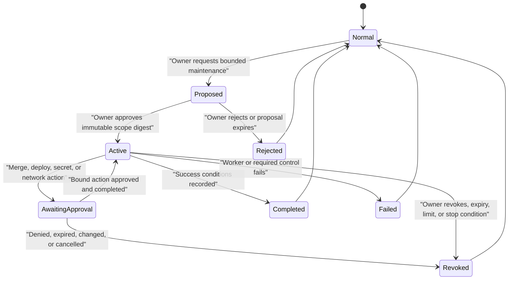
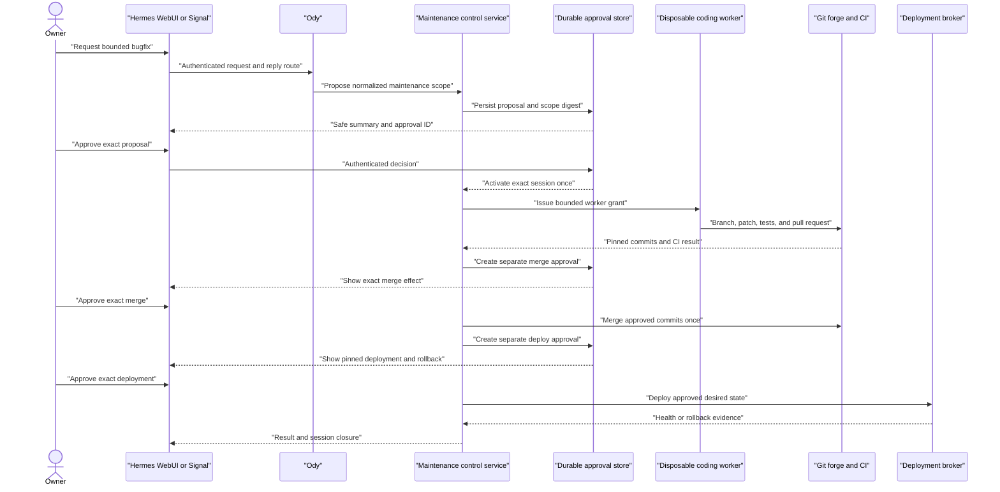

# Scoped maintenance sessions

Pantheon Blueprint lets the owner continue using Ody while diagnosing and
repairing the system, without giving the assistant standing permission to
change it. This document defines the authority boundary for that workflow.

!!! important

    **Pantheon Blueprint policy:** maintenance authority is explicit, scoped,
    expiring, revocable, and recorded outside model memory.

    **Validation required:** a deployment must implement and test the session,
    approval, worker, audit, and deployment controls described here before
    enabling assistant-initiated maintenance.

    Hermes, Executor, a deployment controller, and a Git forge may provide
    useful building blocks. None is assumed to implement this complete contract
    alone. Until the contract passes, Ody remains read-only for diagnosis and
    maintenance changes remain operator-run.

## Why maintenance is a separate authority

A request such as “find out why retrieval is failing” authorizes investigation,
not mutation. Even “fix retrieval” does not implicitly authorize merging code,
deploying production, changing a secret, altering the network, or deleting
data. Each boundary has a different effect and rollback requirement.

The control plane, not the model, owns the current operating mode. Prompt text,
conversation history, a page in the knowledge base, or a tool result cannot
activate or widen maintenance authority.

## Operating modes

| Mode | Intended capability | Mutation authority |
| --- | --- | --- |
| **Normal** | Answer questions, inspect permitted health, read redacted logs, compare desired state, and prepare a diagnosis | None |
| **Maintenance** | Within one owner-approved session, use a bounded coding workflow to prepare and test changes in an isolated checkout | Only the session's fixed repository, service, branch, path, and action allowlists |
| **Recovery** | Restore availability from a known state by restarting a named service or redeploying the same pinned desired-state revision | No source, version, configuration, secret, policy, or network change |

Normal mode is the default before, after, and outside every session. Recovery is
not a shortcut into maintenance. If recovery would require a different image,
commit, configuration, migration, or credential, it becomes a separately
approved maintenance or incident action.

## Authority model

The owner creates a maintenance session by approving a complete proposal. A
trusted maintenance service normalizes the proposal, calculates its digest,
stores it durably, and issues only the capabilities represented by that stored
record.

```yaml
schema: pantheon.maintenance-session.v1
session_id: "<opaque-session-id>"
owner_id: "<derived-owner-id>"
requested_by: "<derived-owner-id>"
purpose: "<bounded-maintenance-purpose>"
scope:
  repositories:
    - "<PRIVATE_CONFIG_REPO>"
  services:
    - "<ALLOWED_SERVICE>"
  branches:
    - "<SESSION_BRANCH>"
  paths:
    - "<ALLOWED_PATH>"
  actions:
    - "read-diagnostics"
    - "create-branch"
    - "write-session-branch"
    - "run-approved-tests"
    - "open-pull-request"
limits:
  maximum_actions: "<bounded-action-count>"
  maximum_worker_runs: "<bounded-worker-run-count>"
  maximum_runtime_seconds: "<bounded-runtime-seconds>"
created_at: "<rfc3339-timestamp>"
expires_at: "<rfc3339-timestamp>"
policy_version: "<policy-version>"
scope_digest: "<sha256>"
state: "pending"
```

The normalized scope and `scope_digest` are immutable after approval. Expanding
a repository, service, path, action, runtime, or expiry creates a new proposal
and requires a new approval. Reducing scope may revoke the old session and
create a smaller one; it must not mutate the approved record in place.

### Required scope

Every proposal identifies:

- the concrete problem and expected outcome;
- allowed repositories and the base revision;
- an isolated session branch;
- affected services and permitted paths;
- permitted diagnostic, editing, test, and publication actions;
- test, success, stop, and rollback conditions;
- maximum duration, action count, and worker-run count;
- expected data classifications;
- whether untrusted inputs will be processed; and
- the evidence and notification destinations.

Wildcards, arbitrary shell, arbitrary repositories, administrator APIs, and
model-selected deployment targets are not valid maintenance scope.

### Lifecycle



Activation, expiry, revocation, completion, and failure are durable server-side
states. A session must not remain active because Ody recalls it as active.

## Capability grants

An active session does not expose one broad maintenance tool. The maintenance
service issues one-time or tightly bounded grants for registered semantic
actions, for example:

```text
read_redacted_diagnostics
create_session_branch
edit_allowed_paths
run_named_test_suite
open_pull_request
read_ci_status
request_merge_approval
request_deployment_approval
read_deployment_status
```

Each grant binds the session ID and digest, workload, action, normalized target,
expiry, use count, policy version, and idempotency key. Heimdall validates the
grant again at invocation. An expired, consumed, revoked, mismatched, or
unrecognized grant fails before any downstream call.

The assistant must never receive:

- a general Git forge administrator token;
- a host shell, SSH agent, or container-engine socket;
- deployment-controller administrator credentials;
- a general 1Password browser or service-account token;
- an unrestricted filesystem or HTTP client; or
- a way to select a repository, connection, stack, image, network, or secret
  outside server-side mappings.

## Actions that need a separate approval

Session approval covers only preparation work explicitly listed in the scope.
The following actions require a new, native, one-use approval bound to the exact
stored action:

| Action | Approval must show |
| --- | --- |
| Merge | Repository, pull request, head and base commits, required checks, and resulting desired-state revision |
| Deploy | Desired-state commit, pinned images or packages, target service, backup or recovery point, health suite, and rollback target |
| Secret operation | Secret reference, operation class, receiving service, rotation impact, and rollback or revocation plan; never the secret value |
| Network or exposure change | Exact route or policy object, source and destination class, ports or protocol, exposure effect, expiry when temporary, and reversal |

Changed commits, arguments, targets, policy versions, or recovery points
invalidate the approval. “Approve all remaining steps,” a conversational
“yes,” or the maintenance-session approval itself is insufficient.

Destructive data operations, backup deletion, disabling or rewriting audit,
removing the owner kill switch, weakening authentication, and granting the
assistant broader authority are prohibited maintenance actions. They require a
separate human-operated governance or incident procedure, if they are allowed
at all.

## One durable approval, multiple delivery surfaces

Hermes WebUI and Signal are delivery and decision surfaces for the same durable
approval record. They are not separate approval systems.



A Signal command may resolve an approval by a short non-secret identifier. The
service must still authenticate the sender, fetch the stored record, verify its
digest and expiry, and consume the exact action once. WebUI must show the same
state. Ody must not reconstruct a pending action from conversation text when an
approval service restarts or loses state.

## Disposable coding worker

**Optional/future capability:** maintenance editing should run in a disposable
coding worker, not inside the long-lived Ody runtime. A container may be
adequate for ordinary reviewed source changes; hostile code execution or
high-value authenticated sessions may require a disposable microVM.

The worker receives:

- a clean checkout at the approved base commit;
- one session branch;
- write access only to approved paths;
- short-lived Git credentials limited to that branch;
- named test commands selected by policy;
- bounded CPU, memory, disk, process count, network, and runtime; and
- no route to production, private service networks, secret stores, deployment
  control, or unrelated repositories.

It returns a patch, commit identifiers, test output references, and a pull
request. It is destroyed when the run ends. Persistent caches, credentials, and
working directories are not reused across unrelated sessions.

## Change and deployment flow

1. Ody performs read-only diagnosis and presents evidence, uncertainty, and a
   bounded proposed scope.
2. The owner approves the immutable maintenance-session digest.
3. A disposable worker checks out the approved base revision and creates the
   fixed session branch.
4. The worker changes only allowlisted paths and runs only registered tests.
5. A pull request records the diff, purpose, tests, security impact, and
   rollback considerations.
6. CI runs against pinned toolchains and dependencies. Moving branch tips and
   unreviewed `latest` artifacts are not deployment inputs.
7. Merge requires a separate approval bound to the reviewed head and base
   commits.
8. The private desired-state repository resolves deployable artifacts to
   immutable versions or digests.
9. Deployment requires a separate approval bound to the desired-state commit,
   target, recovery point, health suite, and rollback target.
10. A narrow deployment broker asks the deployment controller to apply only the
    server-mapped target.
11. Health, interface, security, and rollback checks run.
12. The session records success, rollback, or stop evidence, revokes unused
    grants, and returns to Normal mode.

A failed check does not authorize an improvised production edit. The worker may
prepare a corrected pull request while the original session remains valid and
within its limits. A changed scope requires a new session.

## Recovery and narrow self-healing

Automatic recovery is permitted only for a previously tested symptom and
remediation pair:

- restart one named failed service using its current configuration; or
- redeploy the exact same pinned desired-state commit and artifact digests.

It must first verify maintenance and deployment locks, preserve redacted
diagnostics, consume a bounded retry budget, and run a user-level health check.
It stops and alerts when the symptom persists, the running state has drifted,
the pinned artifact is unavailable, or the action would require a migration.

Self-healing must not:

- discover or install an update;
- edit source, configuration, policy, routes, or secret references;
- rotate or retrieve credentials;
- replace an artifact with a newer or different digest;
- repair a database or delete data;
- disable audit or alerts; or
- repeatedly restart without a fixed retry and time budget.

## Failure-closed rules

Return to Normal mode and deny mutation when:

- no durable active session exists;
- the owner, workload, session, or scope digest does not match;
- the session expired, completed, failed, or was revoked;
- a limit or stop condition was reached;
- requested scope is ambiguous or contains an unsupported wildcard;
- an approval, audit, identity, policy, Git, CI, or deployment dependency is
  unavailable;
- the base revision, pull-request commit, artifact digest, or desired-state
  commit changed;
- required evidence cannot be written;
- production drift is unexplained; or
- the worker requests an undeclared network, filesystem, secret, or action
  capability.

Failure does not widen authority, fall back to a direct tool, or leave a
general-purpose credential with Ody.

## Audit and rollback evidence

Every session should produce protected, correlated records for:

- proposal, normalized scope, digest, owner approval, expiry, and state
  transitions;
- every grant issuance, invocation, denial, use count, and revocation;
- base revision, branch, commits, pull request, review, and CI results;
- separate merge, deployment, secret, and network approvals;
- pinned artifacts, desired-state revision, recovery point, health suite, and
  rollback result;
- redacted diagnostic and test references;
- deployment-controller and downstream action identifiers; and
- unused-grant revocation and final session outcome.

Grafana Cloud may receive a redacted operational copy. It is not the durable
authority and cannot activate a session, approve an action, or suppress a
failure.

Before deployment, record whether rollback is an image/configuration rollback
or requires a data restore. Preserve the failed artifact and evidence. Do not
delete prior images, backups, logs, or audit records as part of an automated
cleanup.

## Acceptance tests

Keep maintenance writes disabled until all applicable tests pass for the pinned
versions and deployment configuration.

### Mode and scope

- [ ] Normal mode exposes diagnostic reads but no source, deployment, secret,
      network, or data mutation.
- [ ] A model message, retrieved document, skill, or tool result cannot activate
      maintenance mode.
- [ ] Session activation requires the authenticated owner to approve the stored
      normalized scope digest.
- [ ] Repository, service, branch, path, action, expiry, and limit expansion
      invalidates the session and requires a new approval.
- [ ] Expiry, revocation, completion, failure, and exhausted limits remove all
      maintenance grants.
- [ ] Restarting any participating service preserves the durable session state
      or safely revokes it; it never recreates authority from conversation
      memory.

### Worker and Git

- [ ] The worker cannot write outside the allowlisted paths or push outside the
      session branch.
- [ ] The worker cannot reach production, private networks, deployment control,
      1Password, unrelated repositories, or a container-engine socket.
- [ ] Unknown commands, unpinned dependencies, undeclared network access, and
      excessive resource or runtime requests fail closed.
- [ ] A retry is idempotent or produces an explicit new reviewed commit without
      duplicating an external action.
- [ ] Worker destruction removes checkout data, caches, and short-lived
      credentials.

### Approval and channels

- [ ] Merge, deploy, secret, and network changes each require their own one-use
      approval after session activation.
- [ ] Changing a commit, target, argument, policy, recovery point, or artifact
      digest invalidates the corresponding approval.
- [ ] WebUI and Signal display and resolve the same durable pending record.
- [ ] Duplicate, delayed, replayed, cross-user, expired, and denied decisions
      cannot execute.
- [ ] Loss of the approval store or delivery bridge causes denial without
      reconstruction from conversation history.

### Deployment, recovery, and evidence

- [ ] Only approved commits and immutable artifact versions or digests reach the
      deployment broker.
- [ ] The broker rejects arbitrary repository, branch, image, stack, service,
      host, and command input.
- [ ] A forced health failure stops promotion and performs the recorded rollback
      or enters an explicit human recovery state.
- [ ] Recovery automation can restart or redeploy the same pinned state but
      rejects a different digest, configuration, migration, or secret.
- [ ] A persistent failure exhausts a bounded retry budget and alerts through a
      route independent of Ody.
- [ ] Audit loss, unexplained drift, expired authority, and evidence-write
      failure block mutation.
- [ ] The evidence chain correlates session, grants, pull request, CI, approvals,
      deployment, health, and rollback without containing secrets or private
      content.

Record results using [Readiness and assurance](assurance.md). A passed test
supports only the recorded scope, versions, identities, policy, and date.

## Relationship to other contracts

- [Security](security.md) defines mandatory tool mediation, approval binding,
  local-workspace limits, deployment isolation, and incident controls.
- [Integration contracts](integration-contracts.md) defines durable approvals,
  the Ody update broker, and append-oriented audit.
- [Operations](operations.md) defines desired-state ownership, staged
  deployment, rollback, monitoring, and recovery.
- [Data flows](data-flows.md) defines user-facing approval, update, and recovery
  sequences.
- [Readiness and assurance](assurance.md) defines maturity labels and evidence
  gates.
