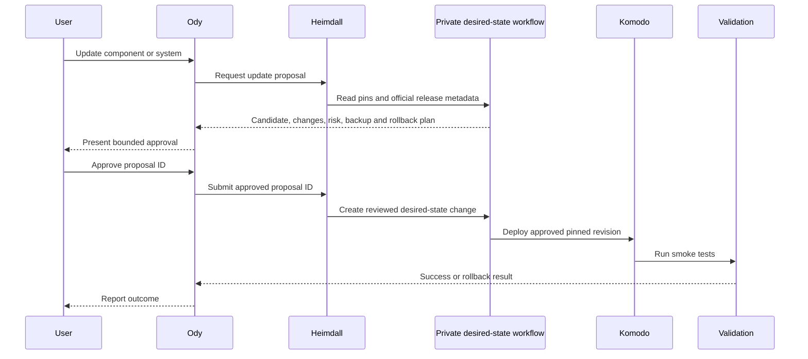

# Operations

This runbook describes how to operate a Pantheon Blueprint deployment after
its first successful installation. It is intentionally conservative: recovery
evidence matters more than a green dashboard, and an observed restart is not
the same as self-healing.

Values such as `<PRIVATE_CONFIG_REPO>`, `<LOCAL_TIMEZONE>`,
`<BACKUP_BUCKET>`, and `<VERSION>` are placeholders. Never commit live secrets,
private addresses, account identifiers, or environment-specific credentials to
the public repository.

## Operating principles

1. Git records desired state; running containers are not the source of truth.
2. The public Pantheon Blueprint repository supplies reference documentation
   and reusable, secret-free templates.
3. A private overlay repository records the deployment's inventory, version
   pins, service configuration, and secret references.
4. Komodo applies reviewed desired state; it should not become an undocumented
   second configuration store.
5. Every stateful change has a pre-change backup and a tested rollback path.
6. Backups are append-oriented and recoverable without the live application.
7. Backup creation credentials cannot delete prior backups.
8. Agents may request an update, but they do not receive a host shell, Docker
   socket, Komodo administrator credential, or 1Password vault browser.
9. Monitoring data is diagnostic evidence, not an authorization decision or
   authoritative action audit.
10. A self-healing claim is valid only for a named failure, version set, and
    successful test.

## Desired-state ownership

### Public reference repository

The public repository should contain:

- architecture, security, data-flow, installation, and operations documents;
- generic Compose and service templates when they are stable enough to share;
- placeholder environment files containing no real values;
- validation procedures;
- example policies; and
- contribution and disclosure guidance.

It must not contain:

- live DNS names, addresses, email accounts, phone numbers, or user IDs;
- 1Password item or vault details that reveal private organization structure;
- tokens, passwords, private keys, OAuth secrets, recovery material, or
  rendered secret values;
- internal firewall rules copied without sanitization;
- backup bucket names or provider account identifiers; or
- logs, database samples, conversation content, or tool arguments from the
  private deployment.

### Private overlay repository

The private overlay is the desired-state authority for one deployment. It
should contain:

```text
inventory/
  hosts and roles
  public and private service names
  network intent
versions/
  pinned tags
  resolved image digests
  compatibility notes
stacks/
  deployment-specific Compose overlays
  Traefik labels
  health checks
config/
  non-secret application configuration
  1Password secret references
  Grafana Alloy configuration
policies/
  Heimdall catalogues and approval classes
  Tailscale and ingress intent
runbooks/
  deployment-specific recovery notes
  exceptions and validation records
evidence/
  redacted test results
  restore drill summaries
```

The private repository still must not contain decrypted secrets. A private Git
repository is not a secret manager.

### Prevent configuration drift

Choose and document one of these operating modes:

- **Git-only:** Komodo stacks are created from the private repository and
  production edits in the Komodo interface are prohibited.
- **Controlled emergency edit:** an operator may change a running stack during
  an incident, but must immediately export the change, review it, commit it to
  the private repository, and reconcile production from Git.

At least nightly, compare:

- committed Compose and rendered non-secret configuration;
- Komodo's recorded stack definition;
- running image digests;
- enabled routes;
- mounted paths;
- container privileges and socket mounts; and
- current workload identities.

Alert on drift. Do not automatically overwrite unexplained drift until an
operator has determined whether it is an intrusion, emergency fix, or failed
deployment.

## Boot and service ownership

Komodo Core runs outside the three Pantheon Blueprint hosts. Each host runs
Komodo Periphery, preferably as the system service described by Komodo's
[server connection documentation](https://komo.do/docs/setup/connect-servers).

### Host boot order

The intended order on `agent-01`, `knowledge-01`, and `tools-01` is:

1. local filesystems and persistent volumes;
2. network and time synchronization;
3. Tailscale;
4. Docker Engine;
5. Komodo Periphery;
6. Grafana Alloy;
7. application containers; and
8. post-boot validation.

If Traefik is deployed as a container, it returns with the application
containers. If it is a host service, define its dependency on network readiness
and its configuration files explicitly.

### Periphery under systemd

Use the current upstream installer or unit definition for the pinned Komodo
release. Do not copy a historical unit file without comparing it with the
installed version.

The unit should provide the equivalent of:

- startup after network readiness;
- automatic restart after an unexpected Periphery exit;
- bounded restart backoff;
- a root or dedicated service identity appropriate to its documented host
  operations;
- a configuration file outside the repository working tree;
- logs available to Alloy; and
- no embedded Core credential in the unit file itself.

Command-shaped verification pseudocode:

```text
service-manager verify periphery-unit
service-manager enable periphery-unit
service-manager start periphery-unit
service-manager status periphery-unit
komodo-core verify-server <HOST_ROLE>
```

Use the real service-manager and Komodo commands documented for the installed
releases.

### Boot validation

After every operating-system or deployment-plane change:

1. Reboot one host at a time.
2. Confirm Tailscale returns with the expected tagged identity.
3. Confirm Docker returns.
4. Confirm Periphery reconnects to the external Komodo Core.
5. Confirm required containers return.
6. Confirm dependencies become healthy in the expected order.
7. Run a harmless application transaction.
8. Confirm Alloy resumes export without exposing startup secrets.
9. Record recovery time and any manual step.

Do not call the deployment self-starting until this test has passed on all three
hosts.

## Health checks, restarts, and reconciliation

Docker documents
[container restart policies](https://docs.docker.com/engine/containers/start-containers-automatically/)
and Compose
[health checks](https://docs.docker.com/reference/compose-file/services/#healthcheck).
They solve different problems.

### What each mechanism does

| Mechanism | Detects or handles | Does not prove |
| --- | --- | --- |
| Process exit | Main container process stopped | Application correctness or dependency health |
| Restart policy | Restarts a stopped container under defined conditions | That an unhealthy but running process will restart |
| Health check | Runs a bounded readiness/liveness test | Automatic recovery from an unhealthy result |
| Compose dependency health | Can delay a dependent service until a dependency is healthy | Continuous reconciliation after startup |
| Komodo deployment | Applies a requested stack definition | Continuous Kubernetes-style reconciliation unless explicitly configured and tested |
| Grafana alert | Tells an operator or automation that a condition exists | That remediation happened or was safe |
| Recovery controller | Performs a defined remediation | Recovery from failures outside its tested scope |

A container can be `running` and unusable. A container can also be `unhealthy`
because a check is wrong while the service remains usable.

### Health-check requirements

Every long-running service should have a check that:

- has a strict timeout;
- does not require a broad credential;
- tests a meaningful local dependency;
- does not create or mutate user data;
- distinguishes startup delay from ongoing failure;
- cannot hang indefinitely;
- has a documented expected response; and
- emits enough context to diagnose a failure without exposing secrets.

For stateful services, use separate checks for process liveness and functional
readiness where the upstream application supports them.

### Restart policy

Use a restart policy appropriate to a daemon, but avoid infinite rapid restart
loops. Add backoff at the service manager, application, or remediation layer
where supported.

Do not use blind restart as the only response to:

- schema migration failure;
- disk exhaustion;
- corrupt database state;
- authentication or certificate failure;
- repeated connector denial;
- unexpected configuration drift; or
- suspected credential compromise.

Those conditions require diagnosis or a purpose-built recovery action.

### True reconciliation

If automatic remediation is added, define it as a finite state machine:

```text
observe symptom
confirm symptom over a bounded interval
collect redacted evidence
check maintenance and deployment locks
run one approved remediation
verify the user-level transaction
stop or escalate after the retry budget
```

The remediation identity should have only the permission required for that
action. For example, restarting one named Compose service does not justify
general Docker administration from an agent.

Test each claimed recovery separately:

| Failure | Example expected recovery |
| --- | --- |
| Container process exits | Docker restart policy returns it |
| Host reboots | Docker, Periphery, and pinned stacks return |
| Dependency starts slowly | Readiness-aware startup prevents false success |
| Temporary external outage | Bounded retry, then alert; no duplicate write |
| Failed deployment | Komodo reports failure and operator rolls back |
| Full disk | Alert and controlled capacity response; not restart loop |
| Database corruption | Stop writes, restore or repair under incident procedure |
| Heimdall unavailable | Agents fail closed without direct connector fallback |

Record the exact test, versions, expected recovery time, result, and last test
date. “Docker restarts it” is not a general self-healing strategy.

## Release discovery and controlled promotion

Nightly automation discovers releases; it does not install them automatically.

### Example local schedule

Use an explicit IANA timezone, represented here by `<LOCAL_TIMEZONE>`. Do not
rely on an undocumented container default or UTC conversion.

```text
00:30 local  verify backup service and available capacity
01:00 local  discover new pinned-component releases
01:15 local  create or update one change proposal per component
02:00 local  run read-only drift and certificate checks
03:00 local  run index freshness and checkpoint checks
weekly       run extended dependency and restore-readiness checks
monthly      perform an isolated restore drill
```

Stagger expensive jobs. Muninn review schedules, n8n collections, database
maintenance, backups, and image pulls should not all start on the hour.

### Discovery job

The discovery job may:

1. read the current version inventory;
2. query official release feeds or registries;
3. resolve tags to immutable digests;
4. collect release notes and migration notices;
5. identify known compatibility constraints;
6. create a reviewable proposal; and
7. notify an operator.

It must not:

- rewrite production pins;
- run a migration;
- pull and activate arbitrary branch content;
- delete a rollback image;
- change a secret; or
- grant itself deployment credentials.

Generic pseudocode:

```text
for component in pinned_inventory:
    candidate = official_source.latest_supported_release(component)
    if candidate != component.current:
        proposal = compare(component.current, candidate)
        record(proposal, immutable_digest, release_notes, migrations)
        notify_operator(proposal_id)
```

### Ody-requested updates

The user can ask Ody to update the system, but Ody remains an orchestrator.



Ody receives neither a shell nor the Docker socket. Its Heimdall catalogue may
contain semantic actions such as:

- `check_for_updates`;
- `prepare_update_proposal`;
- `request_update_approval`;
- `deploy_approved_revision`; and
- `read_deployment_status`.

Each action accepts bounded identifiers, not arbitrary commands. The
deployment identity verifies that the approved commit, version, digest, and
target match before asking Komodo to deploy.

### Promotion gates

Before promotion:

- release source is official;
- version and digest are recorded;
- release notes and migrations are reviewed;
- compatibility with coupled components is checked;
- an immutable pre-change backup exists;
- the restore path is available;
- disk capacity is sufficient for old and new images;
- the current version remains available as a rollback target; and
- the maintenance window and notification route are active.

## Staged deployment

Deploy one failure domain at a time.

Recommended order for ordinary updates:

1. observability collectors and non-authoritative tooling;
2. tools-plane components that do not change connector semantics;
3. Mem0 and rebuildable indexing components;
4. AFFiNE supporting services, migration, and application as one
   release-matched procedure;
5. Hermes/Muninn workers while Ody remains available where possible;
6. user-facing Ody runtime and interfaces; and
7. connector permissions or write enablement last.

Change the order when an upstream migration guide requires it. Preserve
compatibility at every step.

### Deployment procedure

1. Announce or record the maintenance state.
2. Pause affected schedules and write-producing workflows.
3. Confirm the latest backup and upload completion marker.
4. Confirm no previous deployment or restore is running.
5. Pull the exact images and verify resolved digests.
6. Render the Compose configuration without printing secret values.
7. Run upstream preflight and migration checks.
8. Deploy the smallest affected stack through Komodo.
9. Wait for process, health, and application transaction checks.
10. Check logs, metrics, audit correlation, routes, and identities.
11. Resume schedules gradually.
12. Record the result and close the maintenance state.

### Rollback

Rollback is a planned deployment, not an improvised reverse edit.

Before every promotion, record:

- previous desired-state commit;
- previous image digests;
- previous configuration schema;
- whether the database migration is backward compatible;
- backup identifier and checksum;
- restore procedure;
- maximum tolerable data loss; and
- the decision point beyond which restore is required instead of image
  rollback.

If a migration is not backward compatible, rolling the image back without
restoring the database may make the outage worse. Follow the upstream migration
guide.

Generic rollback decision:

```text
if no_persistent_schema_change:
    deploy(previous_desired_state)
    verify()
else:
    stop_writes()
    restore(pre_change_backup)
    deploy(previous_desired_state)
    verify()
```

After rollback, keep the failed release evidence. Do not delete it as part of
the rollback workflow.

## Backup architecture

The backup system is independent of Grafana Cloud, Komodo, and the live
application databases. It targets S3-compatible object storage in a separate
failure and administrative domain.

### Required coverage

| Priority | Component | Required backup content |
| ---: | --- | --- |
| 1 | AFFiNE | Database, blob/upload storage, release/config metadata, consistency manifest |
| 2 | Hermes/Ody | Conversation/session state, approved memory/state, skills, profile configuration, identity references |
| 3 | Private overlay | Git history, version pins, non-secret configuration, policies, recovery notes |
| 4 | Heimdall | Tool catalogue, policy, connector-to-identity mapping, approval/audit data not held elsewhere |
| 5 | n8n/Huginn | Database, workflow definitions, encryption key reference, capture manifests, binary data if retained |
| 6 | Muninn | Checkpoints, candidate ledger, provenance, schedules, profile configuration |
| 7 | Source archive | Completed conversation exports and accepted external captures required for provenance |
| 8 | Mem0 | Configuration and schema; data backup optional because the index must be rebuildable |
| 9 | Host edge/config | Traefik, Alloy, system units, firewall intent, Periphery configuration references |

1Password remains its own secret system. Do not export vault contents into the
ordinary Pantheon Blueprint backup merely to make restore simpler. Back up the
references, required vault/account recovery procedure, and independent
emergency access material according to 1Password's guidance and your
organization policy.

### Application-consistent backup order

For a coordinated backup:

1. allocate a globally unique backup ID;
2. record versions, desired-state commit, and start time;
3. pause or checkpoint affected writers;
4. create application-consistent database dumps or snapshots;
5. capture the matching blob, upload, binary, and source-archive state;
6. capture non-secret configuration and identity references;
7. calculate checksums and sizes locally;
8. upload each object under the unique backup prefix;
9. verify object metadata and checksums remotely;
10. upload the signed or checksummed manifest last as the completion marker;
11. resume writers; and
12. emit a redacted success or failure event.

If the application cannot be quiesced, use its documented online backup
mechanism and record the consistency boundary. Copying a live database data
directory is not automatically a valid backup.

### Append-oriented object keys

Never reuse a key for a new backup. A suggested shape is:

```text
<DEPLOYMENT_ID>/<COMPONENT>/<YYYY>/<MM>/<DD>/<BACKUP_ID>/
  manifest.pending.json
  database.dump
  blobs.archive.part-0001
  configuration.archive
  checksums.txt
  manifest.complete.json
```

`<BACKUP_ID>` should be collision-resistant and include time plus a random or
monotonic component. A backup is complete only when
`manifest.complete.json` exists and every referenced object passes
verification.

Do not update a `latest` object as the only way to find backups. A generated
catalog may point to immutable backup IDs, but it is convenience data and can
be rebuilt by listing manifests.

### Versioning, Object Lock, and WORM

Amazon documents that
[S3 Object Lock](https://docs.aws.amazon.com/AmazonS3/latest/userguide/object-lock.html)
uses a write-once-read-many model and requires versioning. S3-compatible
providers may implement different subsets or semantics.

Before relying on a provider:

1. confirm versioning behavior;
2. confirm whether Object Lock must be enabled at bucket creation;
3. test governance and compliance retention behavior;
4. test how simple deletes, version-specific deletes, and delete markers work;
5. verify which credentials can bypass governance retention;
6. verify legal hold support if required;
7. test restore tooling against versioned and locked objects; and
8. record the provider-specific evidence.

Versioning alone does not prevent an identity with version-deletion permission
from removing history. Object Lock is not useful if the backup writer can
bypass it or disable the protection. “S3 compatible” is not evidence of WORM
semantics.

### No automated deletion

The default Pantheon Blueprint retention rule is:

> The system may create new backup objects, but it does not decide to delete old
> backup objects.

Therefore:

- do not configure lifecycle expiration in the initial deployment;
- do not grant the backup writer `DeleteObject`, version-deletion, retention
  bypass, or bucket-administration permissions;
- do not allow Ody, Muninn, Huginn, Heimdall connectors, Komodo, or routine
  maintenance jobs to delete backups;
- do not prune prior backup prefixes after a successful upload; and
- treat any future retention policy as a separate, human-approved governance
  project.

Storage growth must be monitored. “Never delete automatically” transfers the
problem from retention automation to capacity planning; it does not eliminate
it.

### Separate credentials

Use at least three identities:

| Identity | Permission |
| --- | --- |
| Backup writer | Create objects under new prefixes, list only what verification requires; no delete or retention bypass |
| Restore reader | Read selected backup objects; normally disabled or stored separately |
| Bucket administrator | Configure versioning, retention, and access; no routine application use |

If possible, use a fourth monitoring identity that can list metadata and
retention status but cannot read backup contents.

Store these credentials in separate 1Password items and scope service accounts
to the minimum items. Compromising the live backup writer must not grant backup
deletion or unrestricted restore access.

## Restore drills

A backup is unproven until it has been restored.

### Schedule

- monthly: restore one recent complete backup into an isolated environment;
- quarterly: restore the full critical path, including identity and routing
  substitutions;
- after a schema migration: restore both the pre-change and post-change backup;
- after backup-tool or storage-provider changes: run an immediate drill; and
- annually: perform a documented loss-of-site exercise.

### Isolated restore procedure

1. Create a clean, isolated network and fresh target volumes.
2. Select a backup by immutable backup ID, not by a mutable `latest` pointer.
3. Verify the completion manifest, object inventory, retention metadata, and
   checksums.
4. Obtain restore credentials through the emergency or approved path.
5. Restore configuration without production secrets.
6. Restore databases and matching blob/binary state.
7. start the pinned application versions recorded in the manifest;
8. substitute test DNS, OIDC, email, messaging, and external connector targets;
9. run application-level integrity checks;
10. rebuild Mem0 from restored AFFiNE content;
11. run canonical retrieval and provenance tests;
12. record duration, manual steps, missing dependencies, and result; and
13. destroy the isolated environment through a separately approved cleanup
   process.

Never let a restore drill send real email or Signal messages, execute production
tools, invoke production webhooks, or overwrite live DNS.

### Recovery objectives

Define for each component:

- recovery point objective (maximum acceptable data loss);
- recovery time objective (maximum acceptable outage);
- maximum tolerable outage;
- restore dependency;
- responsible operator; and
- last successful drill.

An RPO shorter than the backup interval requires replication, journal shipping,
or more frequent backups. Writing a smaller number in a runbook does not create
that capability.

## Monitoring and alerting

Grafana Alloy runs on each host and exports redacted metrics, logs, and traces to
Grafana Cloud. Start with Grafana's
[Alloy installation](https://grafana.com/docs/alloy/latest/set-up/install/) and
[Docker monitoring](https://grafana.com/docs/alloy/latest/monitor/monitor-docker-containers/)
documentation, then apply Pantheon Blueprint's data-minimization policy.

### Required signals

#### Hosts

- reachability and last telemetry time;
- CPU, load, memory, swap, disk, inode, and filesystem error state;
- clock synchronization;
- operating-system reboot required;
- Docker and Periphery service state; and
- Tailscale connection state.

#### Containers and services

- desired versus running container count;
- restart count and restart-loop detection;
- health-check state and age;
- image digest drift;
- request rate, latency, and error rate;
- database connections, size, checkpoint/replication health where applicable;
- queue depth and oldest item age;
- certificate expiry; and
- dependency reachability.

#### Pantheon Blueprint workflows

- Ody request success by interface;
- Heimdall decisions, approval latency, denial rate, and downstream result
  classification;
- uncorrelated or duplicate approval events;
- Muninn checkpoint age, reviewed conversation count, candidate count, and
  duplicate suppression;
- Huginn workflow status, capture count, deduplication, and staging failures;
- AFFiNE-to-Mem0 index lag and source revision mismatch;
- release discovery age and unapplied critical release proposals;
- configuration drift; and
- backup start, completion marker, remote verification, and restore-drill age.

### Redaction

Do not export by default:

- prompts, conversation bodies, knowledge-page contents, or external captures;
- tool arguments or results containing user data;
- headers, cookies, tokens, passwords, OAuth codes, or environment dumps;
- full email addresses, phone numbers, or downstream account identifiers; or
- database rows and file contents.

Prefer stable request IDs, classifications, counts, hashes, durations, and
bounded error codes.

### Alert routes

Use at least two independent operator routes, for example:

- a push-notification service for urgent events; and
- email for durable notification and lower urgency.

Do not make Ody the only alert route. If Ody or Heimdall is down, the operator
must still receive the alert.

Suggested urgency:

| Severity | Example | Route |
| --- | --- | --- |
| Critical | Backup deletion attempt, suspected secret exposure, canonical database unavailable, Object Lock disabled | Immediate push and email |
| High | Heimdall bypass path, failed backup, disk exhaustion imminent, repeated restart loop | Immediate push |
| Medium | Index lag, one failed scheduled workflow, certificate within warning window | Email or operations digest |
| Low | New release discovered, capacity trend, successful restore drill | Digest/dashboard |

Alert notifications should link to a redacted runbook and correlation ID, not
embed sensitive logs.

## Incident response

### General sequence

1. **Detect:** preserve the alert, request IDs, timestamps, versions, and
   affected identities.
2. **Triage:** determine whether confidentiality, integrity, availability, or
   backup recoverability is affected.
3. **Contain:** disable the smallest affected route, connector, workload
   identity, or service.
4. **Preserve:** copy relevant audit and system evidence to protected storage.
5. **Recover:** follow the tested rollback or restore procedure.
6. **Verify:** run user-level transactions and negative security tests.
7. **Notify:** report impact and current limitations through an independent
   route.
8. **Learn:** document cause, detection gap, recovery result, and permanent
   action.

Do not destroy containers, rotate every credential, or restore databases
automatically before preserving evidence and understanding the failure, unless
continued operation creates greater harm.

### Heimdall bypass or credential exposure

1. Stop or isolate the affected agent and connector.
2. Deny its egress at the network boundary.
3. Revoke the narrowest affected workload and downstream identities.
4. Preserve Heimdall, connector, application, and access logs.
5. Search for unauthorized downstream actions using service-native audit data.
6. Rotate exposed credentials through 1Password.
7. Verify that old credentials fail.
8. Restore service only after the bypass path is blocked and negative tests
   pass.

### Knowledge integrity incident

1. Pause Muninn, Huginn promotion, indexing, and canonical writes.
2. Preserve the affected AFFiNE revisions, Mem0 results, source captures, and
   correlated tool audit.
3. Determine the last trusted AFFiNE revision.
4. Correct or restore AFFiNE first.
5. Rebuild Mem0 from the trusted canonical content.
6. Resume read-only retrieval and validate results.
7. Re-enable writers one at a time.

Do not repair canonical knowledge by editing Mem0.

### Backup incident

1. Disable the suspected writer credential.
2. Preserve bucket access and retention evidence.
3. Confirm whether objects, versions, locks, or manifests changed.
4. Test an unaffected restore using the separate restore identity.
5. Create a fresh backup with a new writer identity when safe.
6. Treat unexplained retention or deletion changes as a security incident.

### Failed update

1. Pause additional deployments.
2. Keep the failed containers and logs long enough to diagnose.
3. Determine whether persistent schema changed.
4. Roll back desired state or restore the pre-change backup as planned.
5. Run the full affected smoke-test set.
6. Resume schedules only after idempotency and backlog behavior are understood.

## Routine maintenance

### Daily

- confirm the latest backup has a valid remote completion marker;
- review critical and high alerts;
- check host disk and inode headroom;
- check unhealthy/restarting containers;
- check Heimdall denial and approval anomalies;
- check Muninn checkpoint and index freshness; and
- review pending update proposals.

### Weekly

- review configuration and image drift;
- review failed n8n and Muninn executions;
- inspect Tailscale, Pangolin, and OIDC identity changes;
- verify certificate expiry horizons;
- test one harmless approval from every enabled Ody interface;
- inspect backup storage growth and retention state;
- review workload and service-account access; and
- confirm rollback targets are still available.

### Monthly

- perform and record an isolated restore drill;
- apply reviewed operating-system and application updates;
- review firewall, Tailscale ACL, Traefik, and Pangolin exposure;
- inspect secret rotation age and service-account scope;
- review capacity forecasts;
- test one documented self-recovery scenario per host;
- rebuild Mem0 from canonical content in a test environment; and
- review open exceptions and unvalidated integrations.

### Quarterly

- run a full critical-path restore;
- rotate selected non-human credentials;
- review emergency access and restore-reader custody;
- test failure of Heimdall, AFFiNE, and the external Komodo Core;
- review audit retention and redaction;
- verify S3 versioning/Object Lock behavior with the current provider; and
- update recovery objectives from measured results.

### Before and after every change

Before:

- identify scope and owner;
- record current versions and health;
- create and verify a pre-change backup;
- define success, rollback, and stop conditions;
- pause conflicting schedules; and
- notify through an independent route.

After:

- run smoke and negative tests;
- compare desired and running state;
- check new logs for secrets;
- resume schedules gradually;
- record versions, digests, timing, and evidence; and
- confirm alerting and backup still work.

## Capacity management

Track capacity by trust zone, not only by total free disk.

### `agent-01`

Monitor:

- conversation/session growth;
- attachment and workspace growth;
- Hermes/Muninn concurrency;
- skill and update staging space;
- model request latency and quota; and
- Signal or WebUI backlog.

### `knowledge-01`

Monitor:

- AFFiNE database and blob growth separately;
- database transaction logs and temporary space;
- Mem0 vector count, index size, and rebuild duration;
- index lag;
- backup staging space; and
- restore space sufficient for a parallel test copy.

### `tools-01`

Monitor:

- n8n database, execution history, binary data, and queue growth;
- external capture staging;
- browser-worker concurrency and ephemeral disk;
- Executor catalogue, audit, and approval backlog; and
- outbound API quotas and rate limits.

### Backup storage

Because routine deletion is prohibited, forecast:

```text
projected monthly growth =
    full backup size × full backups per month
  + incremental change volume
  + source/capture retention growth
  + manifest and audit overhead
```

Alert at multiple horizons, such as capacity projected to exhaust within 90,
60, and 30 days. Increasing storage is the normal response; deletion requires a
separate governance decision.

Keep enough local free space to:

- stage one complete backup;
- pull a new and retain the previous image set;
- perform database maintenance;
- write logs during an external telemetry outage; and
- recover from a failed migration.

## Disaster recovery priority

Recover in dependency order:

1. operator identity, emergency access, private desired-state repository, and
   1Password recovery;
2. network, DNS, Tailscale, host firewall, and trusted time;
3. Docker, Komodo Periphery, Traefik, and Grafana Alloy;
4. 1Password-based secret provisioning and Heimdall policy boundary;
5. AFFiNE database and matching blob/upload storage;
6. Hermes/Ody state and user-facing read-only interface;
7. canonical retrieval through Heimdall;
8. Mem0 rebuilt from AFFiNE;
9. approval workflows and controlled writes;
10. Muninn checkpoints and draft curation;
11. n8n/Huginn collection workflows; and
12. nonessential browser, messaging, and automation integrations.

Keep writes disabled until canonical data, caller identity, policy, audit, and
backup paths have been verified. A degraded read-only assistant is preferable
to a fully automated system with uncertain state.

## Operating evidence

Use the shared maturity labels, readiness gates, and evidence-record structure
defined in [Readiness and assurance](assurance.md). For each update, incident,
restore drill, or self-healing test, add the operating details this runbook
requires: desired-state commit, component versions and image digests, affected
hosts and services, backup and approval IDs, measured recovery time, manual
interventions, alert results, and rollback or restore outcome.

Store only redacted evidence in Git. Put sensitive evidence in a separately
protected incident or audit store.

## Official upstream references

- [Komodo: connect servers and Periphery](https://komo.do/docs/setup/connect-servers)
- [Komodo documentation](https://komo.do/docs/intro)
- [Docker restart policies](https://docs.docker.com/engine/containers/start-containers-automatically/)
- [Docker Compose health checks](https://docs.docker.com/reference/compose-file/services/#healthcheck)
- [Docker Compose startup order](https://docs.docker.com/compose/how-tos/startup-order/)
- [1Password CLI scripting and secret injection](https://developer.1password.com/docs/cli/secrets-scripts/)
- [Amazon S3 Versioning](https://docs.aws.amazon.com/AmazonS3/latest/userguide/Versioning.html)
- [Amazon S3 Object Lock](https://docs.aws.amazon.com/AmazonS3/latest/userguide/object-lock.html)
- [Grafana Alloy installation](https://grafana.com/docs/alloy/latest/set-up/install/)
- [Grafana Alloy Docker monitoring](https://grafana.com/docs/alloy/latest/monitor/monitor-docker-containers/)
- [Tailscale access-control documentation](https://tailscale.com/docs/features/access-control)
- [Pangolin documentation](https://docs.pangolin.net/)
- [Traefik documentation](https://doc.traefik.io/traefik/)

For the shared maturity model, readiness gates, and evidence semantics, see
[Readiness and assurance](assurance.md). For the initial deployment path, see
[Getting started](getting-started.md). For trust assumptions and negative
tests, see [Security model](security.md). For request, approval, indexing, and
review sequences, see [Data flows](data-flows.md).
