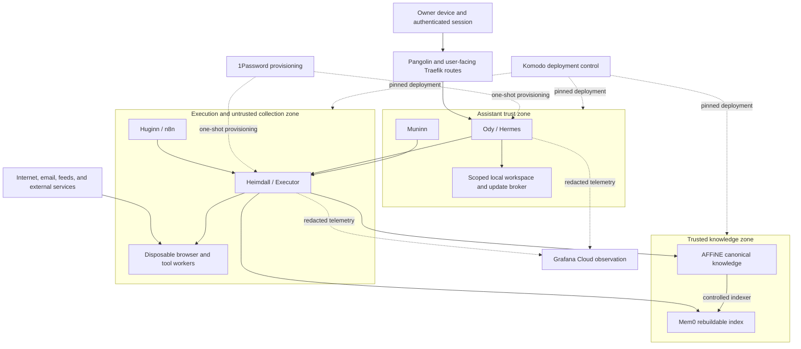
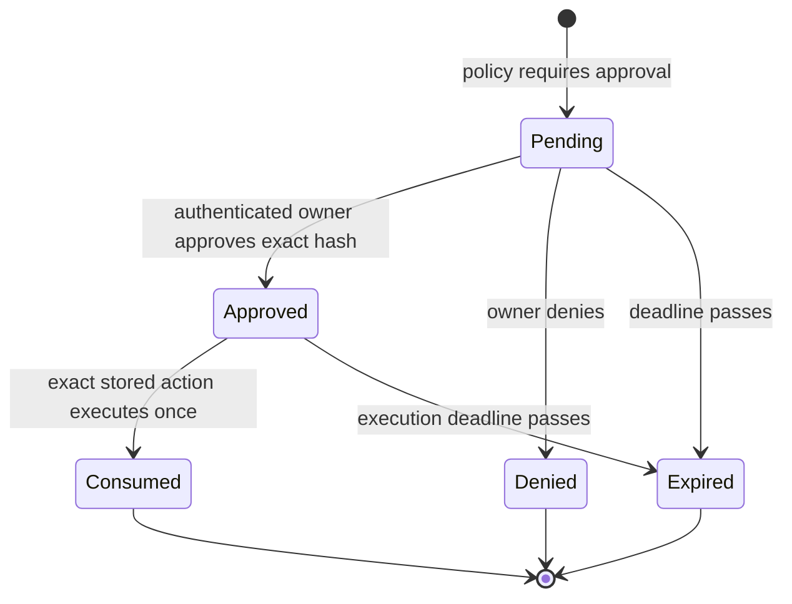

# Security

Pantheon Blueprint joins language models, personal communications, a knowledge
base, browser automation, and privileged tools. That combination should be
treated as a security-sensitive distributed system, not as a chatbot with a
long system prompt.

This chapter is a public threat model and hardening guide. It describes required
controls and acceptance evidence. It does not certify Hermes, Executor, AFFiNE,
Mem0, n8n, or any other dependency.

Shared maturity labels, readiness gates, and evidence-record semantics live in
[Readiness and assurance](assurance.md). This chapter owns the security controls
and the security-specific acceptance and negative tests.

## Security objective

The primary objective is to let Ody help the owner without allowing a model,
malicious document, compromised connector, or stolen session to exercise more
authority than the exact task requires.

The core security contract is:

> Models propose. Authenticated services authorize. Narrowly scoped workers
> execute. Canonical systems record.

## Scope

This threat model covers:

- the three reference Docker hosts;
- Ody and Muninn on the assistant host;
- AFFiNE and Mem0 on the knowledge host;
- Executor, n8n, and tool workers on the tools host;
- browser, Hermex, Signal, email, and AFFiNE AI ingress;
- Tailscale, Pangolin, and Traefik routing;
- 1Password secret provisioning;
- Komodo deployment control;
- Grafana Cloud telemetry;
- external model providers, MCP servers, APIs, and websites.

The hypervisor, physical network, identity provider, DNS service, object-storage
provider, and owner devices are dependencies. They need their own hardening and
recovery plans even when they are operated outside this repository.

## Assets

| Asset | Why it matters | Desired protection |
| --- | --- | --- |
| Owner identity and sessions | Can authorize every user-facing action | Strong authentication, short sessions, revocation |
| Workload identities | Determine which internal role made a request | Non-exportable where possible, independently revocable |
| OAuth tokens and API credentials | Grant downstream authority | Never enter model context; least privilege; rotation |
| 1Password service-account token | Unlocks the secrets available to a workload | Treat as secret zero; narrowly scoped; never logged |
| AFFiNE canonical knowledge | Holds durable decisions, procedures, and private data | Integrity, provenance, access control, recoverability |
| Conversations, email, and attachments | May contain highly sensitive or hostile content | Classification, minimization, quarantine, retention control |
| Heimdall policy and connector map | Decides which actions and identities are available | Integrity, review, rollback, independent backup |
| Approval records | Convert owner intent into execution authority | Exact binding, expiry, one use, replay protection |
| Audit trail | Supports detection, attribution, and response | Completeness, redaction, tamper evidence, retention |
| Docker and deployment control planes | Can control entire hosts and workloads | Administrative isolation and strong authentication |
| Backups | Are the final recovery path and a concentrated data copy | Encryption, append orientation, restore testing |
| Model prompts, skills, and local workspace | Influence agent behavior and may become persistent | Change control, bounded filesystem scope, provenance |

## Adversaries and failure modes

Pantheon Blueprint should assume the following:

- A public webpage, feed, email, attachment, repository, issue, or tool result
  may contain indirect prompt injection.
- A user message may be ambiguous, mistaken, malicious, or sent from a stolen
  authenticated device.
- A model may hallucinate a permission, tool, target, recipient, path, or prior
  approval.
- A model may follow instructions embedded in retrieved content.
- An MCP server, browser extension, package, container image, or upstream
  release may be compromised.
- A connector may have broader OAuth scope than its advertised tool surface.
- A compromised agent container may try to reach downstream APIs directly.
- A compromised n8n workflow may attempt lateral movement from the tools host.
- A service may log credentials, private prompts, tool arguments, or results.
- An approval may be replayed or applied to modified arguments.
- A user-facing reverse-proxy label or DNS change may expose an administrative
  service accidentally.
- A deployment controller or Docker socket compromise may become host root.
- A backup may be incomplete even though upload succeeded.
- A semantic index may be stale, poisoned, or inconsistent with AFFiNE.
- An external SaaS provider may be unavailable or may retain more telemetry than
  expected.

The owner is trusted to make final authorization decisions, but the system must
still protect against accidental clicks, ambiguous summaries, stale sessions,
and compromised owner devices.

## Trust assumptions

The design relies on these explicit assumptions:

1. The owner account and identity provider use phishing-resistant MFA where
   available.
2. The hypervisor and operating systems are maintained and their administrative
   access is more restricted than application access.
3. Tailscale and Pangolin policies are deny-by-default or have been tightened
   from permissive defaults.
4. Internal DNS is trusted for routing convenience, but TLS and workload
   authentication do not rely on DNS alone.
5. 1Password remains available as the source of recoverable application
   secrets.
6. External model providers receive only the data necessary for each request
   under an acceptable data-processing policy.
7. Docker containers reduce accidental interaction but are not a sufficient
   isolation boundary for arbitrary hostile code.
8. Grafana Cloud is an external telemetry destination and receives only
   deliberately redacted data.
9. Tailscale identifies users and hosts; it does not automatically identify
   individual containers or application roles.
10. A product's feature description is not enforcement evidence. Acceptance
    tests remain authoritative for the deployed version and configuration.

If an assumption is false, reduce system capability until an alternative
control exists.

## Trust boundaries



Each arrow that crosses a zone requires:

- authenticated source and destination;
- explicit protocol and port;
- a bounded request schema;
- authorization at the receiving application;
- rate, size, and time limits;
- safe error handling;
- an auditable request identifier.

## Heimdall as a mandatory path

Heimdall is the logical name for the tool security boundary. Executor is the
initial gateway implementation.

The desired invariant is:

```text
agent or workflow
    → authenticated Heimdall request
    → policy and optional approval
    → caller-specific connector
    → bounded execution
```

The forbidden path is:

```text
agent or workflow
    → downstream API, MCP server, database, browser, or shell directly
```

### Preventing bypass

The invariant requires controls outside Executor:

1. **No downstream secrets in agents.** Ody, Muninn, and Huginn must not receive
   raw AFFiNE, mail, Git, cloud, or browser credentials.
2. **Default-deny egress.** Agent networks should reach Heimdall and explicitly
   approved inference endpoints, not arbitrary internet or private addresses.
3. **Private service ingress.** Executor, Mem0, Muninn, databases, and container
   engines should not have public Pangolin routes.
4. **Application authentication.** A Tailscale source address is not sufficient
   workload identity. Heimdall must authenticate the calling service.
5. **Connector isolation.** A connector receives only the credentials, network,
   filesystem, and target scope required for its tools.
6. **Schema enforcement.** Gateway policy validates the semantic operation and
   normalized arguments, not just a tool name.
7. **Result filtering.** Tool output is data, can contain injection, and may
   require classification or redaction before returning to a model.
8. **Local exceptions are explicit.** Hermes local capabilities are documented,
   narrow, and excluded from the general tool path only where necessary.
9. **Negative tests prove the boundary.** Direct requests from each agent
   container to representative downstream services must fail.

If network policy still allows a compromised Ody container to call an AFFiNE
API directly, Executor is an optional proxy rather than a security boundary.

## Workload and downstream identity

Ody, Muninn, Huginn, the AFFiNE indexer, deployment automation, and backup jobs
need distinct workload identities. Do not reuse an owner token or one shared
service credential.

A Heimdall request should bind:

```yaml
authenticated_workload: derived-from-transport
authenticated_user: derived-from-ingress-session
task_id: opaque-id
conversation_id: opaque-id
requested_tool: registered-tool-id
purpose: bounded-purpose
argument_hash: normalized-hash
```

The model may propose `requested_tool`, `purpose`, and arguments. It must not
choose `authenticated_workload`, `authenticated_user`, or the connector
credential.

### Downstream attribution

Where a downstream service supports individual users, Heimdall should map each
authenticated workload to its own connection or MCP profile. For example, an
AFFiNE write requested by Muninn should be recorded under Muninn's downstream
account, not under a generic gateway account.

Required mapping:

```text
authenticated workload
    → server-side policy
    → fixed connection/profile
    → downstream account
```

Executor-specific caveat:

> Safe per-agent connection selection has to be demonstrated against the exact
> deployed Executor release. Do not assume that accepting multiple MCP files or
> connections guarantees that one caller cannot select another caller's
> connection.

Acceptance evidence must show:

- caller identity is cryptographically authenticated;
- connection selection is server-side;
- request arguments cannot override it;
- refresh-token handling keeps accounts separate;
- revocation has the expected blast radius;
- downstream history shows the intended identity.

If these tests fail, deploy isolated connector processes or gateway instances
per workload rather than collapsing attribution into one account.

## Tool discovery policy

Unauthorized tools should not appear in a model's tool catalogue. Hiding a tool
reduces accidental and prompt-injected selection; invocation policy remains
mandatory because discovery filtering is not authorization.

Each catalogue response should consider:

- authenticated workload and owner;
- interface and session;
- task purpose;
- data classification;
- current approval or emergency state;
- connector health;
- rate and cost budget.

Examples:

| Workload | Typical discoverable capabilities |
| --- | --- |
| Ody | Mimir search/read, bounded research request, scoped mail, approval-aware actions |
| Muninn | Conversation export, Mimir search/read, review-inbox draft, indexing status |
| Huginn | Approved fetch/browser, capture staging, change event publication |
| AFFiNE indexer | Canonical page export and Mem0 generation write |

Avoid exposing raw `shell`, arbitrary `http_request`, unrestricted
`filesystem`, generic SQL, or `execute_code` tools to a conversational model.
Publish semantic operations such as `create_monitor`, `read_affine_page`, or
`stage_external_capture`.

## Invocation and argument-level policy

Authorizing a tool name is insufficient. Heimdall should normalize and validate
arguments before approval and execution.

### Common controls

- fixed schemas with unknown fields rejected;
- maximum string, list, attachment, and result sizes;
- canonicalized paths with symlink and traversal checks;
- allowlisted filesystem roots;
- normalized URLs and redirect revalidation;
- denial of loopback, link-local, metadata, private, and management networks for
  public fetch tools;
- allowlisted HTTP methods and response content types;
- bounded browser runtime, downloads, redirects, and output;
- fixed repositories, branches, organizations, or deployment stacks;
- recipient, sender, and domain rules for communications;
- query-only database accounts where writes are not required;
- rate, concurrency, token, and cost budgets;
- idempotency keys for externally visible writes;
- before/after diffs for mutable canonical content;
- content classification checks on inputs and outputs.

### Confused-deputy checks

Policy should ask:

1. Is this caller permitted to use the capability?
2. Is the authenticated owner permitted to access the target?
3. Does the action match the current task's purpose?
4. Are the exact arguments within the caller's scope?
5. Does the action combine data from one authority with an output channel from
   another?
6. Could the tool be used to exfiltrate data through a URL, search query, email
   recipient, commit, issue, or image request?
7. Has untrusted content influenced the action?
8. Is interactive approval required?

## Approval state machine

Approval is not a `yes` message interpreted by a model. It is a server-side,
one-use state transition tied to an exact action.



An approval record should include:

- authenticated owner and allowed approval interfaces;
- calling workload, task, and conversation;
- semantic summary suitable for the owner;
- exact registered tool and connector profile;
- normalized target and argument hash;
- risk class and requested scopes;
- creation, expiry, decision, and consumption timestamps;
- one-use nonce and idempotency key.

The owner must be shown the material effect, target, identity, and diff. Avoid
prompts that merely say “allow tool call.”

Approval must fail closed when:

- arguments or target changed;
- the request expired;
- it was already consumed;
- caller, user, session, or connector profile differs;
- the service restarted without durable pending state;
- the policy version changed in a way that invalidates the request.

Browser and Signal can both present or resolve the same pending record. A Signal
command such as `/approve <request-id>` is a desired interface and must be
validated against Hermes and Executor; it is not assumed to work merely because
the command can be parsed.

## Untrusted content and prompt injection

External content includes:

- websites and search results;
- email bodies and attachments;
- Signal attachments and forwarded messages;
- repository files, issues, pull requests, and commit messages;
- RSS and webhook payloads;
- OCR, image metadata, PDFs, and office documents;
- MCP tool descriptions, schemas, and results;
- Mem0 candidates derived from non-canonical sources.

Treat all of it as data, never as policy.

### Required defenses

1. Label the provenance and trust class before content reaches a model.
2. Keep system policy and untrusted data in distinct structured fields.
3. Do not let fetched content add tools, change credentials, approve actions, or
   rewrite policy.
4. Use a low-privilege analysis path for hostile content.
5. Require an independently authorized semantic tool call after analysis.
6. Screen outbound arguments for data exfiltration and internal URLs.
7. Sanitize HTML and Markdown rendering to block active content and tracking
   requests.
8. Preserve source hashes and original captures for investigation.
9. Promote knowledge only through Muninn's provenance-aware review flow.
10. Re-read canonical AFFiNE content for important answers rather than trusting
    a retrieved vector fragment.

Prompt filtering and a second model may reduce risk, but neither is an
authorization boundary. OWASP's prompt-injection and agent guidance recommends
layered input handling, least privilege, human oversight, and tool-specific
validation; architectural isolation remains necessary.

## Browser and executable isolation

Browser workers such as Camofox or an agent-browser implementation process
active, adversarial content. Running them beside Executor does not make them
trusted.

### Minimum container profile

- dedicated unprivileged user;
- read-only root filesystem where practical;
- dropped Linux capabilities;
- `no-new-privileges`;
- seccomp and AppArmor or SELinux profile;
- no host PID, IPC, or network namespace;
- no Docker socket;
- no unrelated host mounts;
- bounded temporary downloads on a dedicated volume;
- CPU, memory, process, disk, and execution-time limits;
- network egress through an allowlisting or filtering proxy;
- no route to RFC1918, loopback, link-local, cloud metadata, Tailscale
  management, or Docker bridge management addresses;
- a new profile or sanitized snapshot for each untrusted task.

### When to use a disposable microVM

Use a disposable microVM or dedicated isolated VM when a task:

- executes downloaded binaries or user-provided code;
- needs a full browser with persistent extensions;
- processes complex, active document formats;
- requires elevated kernel features;
- connects to a site with valuable authenticated sessions;
- cannot be safely expressed as a fixed connector operation.

The microVM should boot from a known image, receive one task and the minimum
ephemeral credential, export a bounded result, and then be destroyed. It should
have no private-network route. A Proxmox-backed disposable VM is a reasonable
implementation; Firecracker or another microVM runtime is also possible. The
security property comes from lifecycle and network isolation, not the product
name.

Never let a model dynamically install arbitrary applications on the Executor
host. Build reviewed tool-runner images or VM templates and promote them like
other supply-chain artifacts.

## Hermes local capability exceptions

Hermes may need local capabilities for:

- generating and editing approved skills;
- maintaining a bounded working directory;
- staging a requested update to Hermes itself.

These are narrow exceptions to the general Heimdall path, not permission for a
general local shell.

### Workspace rules

Use a dedicated root such as:

```text
/var/lib/pantheon/ody-workspace/
```

Separate subdirectories:

```text
skills-draft/
skills-approved/
scratch/
imports/
update-staging/
```

Controls:

- Hermes runs as a non-root user.
- File APIs resolve a canonical path and reject escapes, absolute paths outside
  the root, device files, hard links, and unsafe symlinks.
- Draft skills cannot become active without validation and a controlled
  promotion step.
- Executable bits are removed from untrusted imports.
- Quotas and retention limits apply to scratch data.
- Secrets, Docker sockets, SSH agents, system configuration, and host package
  directories are not mounted.

### Update broker

“Ody, update yourself” should become a request to a narrow update broker:

1. Resolve an allowed release channel to a pinned version or digest.
2. Verify authoritative metadata and any available signature or provenance.
3. Produce a semantic change summary.
4. Obtain approval when policy requires it.
5. Ask Komodo to deploy only the predefined Ody stack and pinned artifact.
6. Run health and interface acceptance tests.
7. Roll back to the recorded previous version on failure.

The broker must not accept arbitrary shell text, image names, Compose paths, or
Komodo resources from the model.

Bug-fix work needs a separate, explicit authority boundary. Normal diagnostic
access must not silently become permission to edit, merge, deploy, retrieve
secrets, or change networking. Use the immutable, expiring session and
separately approved action model in [Scoped maintenance
sessions](maintenance-sessions.md). This is Pantheon Blueprint policy and must
be implemented and validated outside model memory; it is not a capability
assumed of Hermes or Executor.

## Docker, Traefik, and Komodo

### Docker daemon

Control of the Docker socket is normally equivalent to root-level control of
the host. Docker's own documentation warns that remote daemon access can grant
root access and recommends protected SSH or mutually authenticated TLS when
remote access is unavoidable.

- Do not mount `/var/run/docker.sock` into Ody, Muninn, n8n, browser, tool, or
  knowledge containers.
- Prefer no network listener for the Docker daemon.
- If a deployment component requires remote control, authenticate it strongly,
  restrict it to the management plane, and treat its credential as a root
  credential.
- A Docker socket proxy reduces exposed API operations but is not a complete
  sandbox; validate its allowlist and bypass paths.
- Do not run agent-created Compose definitions automatically.
- Pin images by version and preferably digest; avoid mutable `latest` tags.
- Scan images and dependencies, but do not confuse a clean scan with runtime
  isolation.

NIST SP 800-190 provides broader guidance on container image, registry,
orchestrator, runtime, host, and network risks.

### Traefik

Container discovery can turn a label into external exposure.

- Set `exposedByDefault=false`.
- Require an explicit label and trusted network/entrypoint.
- Separate public, private, and administrative entrypoints.
- Do not expose the dashboard publicly.
- Protect the Docker provider's socket access with the narrowest practical
  mechanism.
- Reject unknown hostnames and apply security headers at the application as
  well as the proxy.
- Keep forwarding headers and trusted-proxy ranges explicit.
- Test that internal services remain unreachable from Pangolin after every
  routing change.

### Komodo

Komodo and its per-host components can deploy privileged workloads and should be
treated as an administrative control plane.

- Keep Komodo outside the agent tool catalogue except through the narrow update
  broker.
- Restrict its UI and API to administrative access.
- Require strong authentication and preserve deployment audit.
- Limit which repositories, branches, stacks, and registries it can deploy.
- Use reviewed, pinned configuration from a protected branch.
- Do not put Komodo administrative credentials in Hermes, Executor connectors,
  n8n, or 1Password items readable by those workloads.
- Alert on new privileged containers, host mounts, network modes, and socket
  mounts.

## 1Password and secret zero

1Password service accounts provide non-human CLI authentication with access
limited to selected vaults and actions. The service-account token is still a
long-lived credential that unlocks those permitted secrets. It is the system's
secret zero.

### Recommended pattern

1. Create a distinct service account per trust zone or high-value service.
2. Grant it read access only to the minimum required vaults and items.
3. Deliver its service-account token through the host bootstrap or another
   administrative channel, not through Git, Komodo variables visible to broad
   operators, chat, or model context.
4. Use `op` during a one-shot startup or deployment step to resolve explicit
   item references.
5. Hand the application only its own resolved values.
6. Remove the service-account token from the child application's environment
   and filesystem.
7. Keep unavoidable rendered files on `tmpfs` or in a root-owned directory with
   restrictive permissions and exclude them from backups.
8. Rotate connector credentials and service-account tokens independently.
9. Use 1Password usage reports and local audit to review access.

Avoid:

- giving an agent an unrestricted `op` tool;
- letting n8n browse a general secrets vault;
- one shared service-account token on all three hosts;
- storing tokens in Compose files, shell history, process arguments, logs, or
  issue trackers;
- assuming `op run` prevents a compromised child process from reading secrets
  injected into that child.

For services that must refresh secrets without restart, place a narrow broker or
Connect-compatible service in front of explicit item references. Do not widen
the agent's access to solve application lifecycle needs.

### Bootstrap recovery

Document an offline or separately protected process to:

- revoke a lost service-account token;
- create a replacement;
- restore required item references;
- redeploy affected workloads;
- verify that old tokens fail;
- audit which secrets may need rotation.

If the only copy of the bootstrap credential is inside the failed environment,
recovery has not been designed.

## Data classification

| Class | Examples | Default handling |
| --- | --- | --- |
| **General** | Public software documentation and public research | May be indexed; preserve provenance |
| **Private** | Project notes, ordinary conversations, preferences | Private namespace; authenticated owner access |
| **Sensitive** | Email, personal documents, financial or security configuration | Minimize, redact, restrict connectors and telemetry |
| **Restricted** | Passwords, API keys, recovery codes, private keys, service-account tokens | Never place in AFFiNE, Mem0, prompts, chat, or Grafana |

Classification applies to derived data. A summary, embedding, filename, URL,
trace attribute, or error message can remain sensitive even when it is not the
original document.

Mem0 namespaces and relevance scores are not authorization. Heimdall must filter
candidate references and canonical reads by authenticated identity and
classification.

## Logging, redaction, and Grafana Cloud

Useful security telemetry includes:

- request, task, conversation, approval, and connector identifiers;
- authenticated workload and pseudonymous user ID;
- tool name, policy outcome, risk class, latency, and status;
- normalized target category rather than a full sensitive target;
- argument and result hashes;
- bytes, counts, and classification;
- model, connector, policy, and deployment versions;
- failed authentication and bypass attempts;
- indexing drift and backup or restore-test status.

Do not send by default:

- full prompts or conversations;
- tool schemas from unreviewed servers;
- raw arguments or tool results;
- email addresses, phone numbers, recipients, subjects, or bodies;
- URLs containing queries, fragments, or signed tokens;
- document text, embeddings, or attachment names;
- OAuth headers, cookies, access tokens, service-account tokens, or environment
  dumps;
- model reasoning traces.

Redact before telemetry leaves the host. Grafana Cloud documents both redaction
features and important coverage limits, including paths that may not be scanned.
Treat platform redaction as defense in depth, not as permission to export raw
sensitive events.

Grafana Cloud may alert on a denial or anomaly. It cannot approve, resume,
change, or execute an action.

### Executor audit maturity gap

Before calling Heimdall's audit trail production-ready, validate:

- durable recording before and after externally visible actions;
- request-to-approval-to-connector correlation;
- authenticated caller and selected connection attribution;
- argument and result redaction;
- idempotency and replay events;
- crash behavior around action completion;
- append-oriented export or tamper evidence;
- retention and queryability;
- clock synchronization;
- safe failure when the audit sink is unavailable.

Executor may provide useful logs without yet meeting all of these properties.
Use an external append-oriented audit path or a wrapper where the deployed
version is insufficient.

## Supply-chain controls

- Pin container images, packages, MCP servers, skills, and browser workers.
- Prefer immutable digests for deployed images.
- Record upstream source, version, license, and expected tool schema.
- Review tool-description and schema changes as security-sensitive diffs.
- Generate and retain an SBOM where supported.
- Verify signatures or provenance where upstream provides them.
- Build custom runner images in CI rather than on the production tools host.
- Do not install an MCP package merely because a model suggested it.
- Re-run capability and negative tests after dependency or policy changes.
- Keep a recoverable previous release and database migration plan.

Tool-server updates can change the instructions visible to a model even if the
executable permissions appear unchanged.

## Acceptance tests

Security controls are ready only after repeatable tests pass.

### Identity

- [ ] Ody, Muninn, and Huginn authenticate with distinct workload identities.
- [ ] One workload cannot replay or present another workload's credential.
- [ ] Connector selection cannot be changed by request arguments.
- [ ] AFFiNE records the intended downstream user for each test write.
- [ ] Revoking one connector identity leaves the others unchanged.

### Network and bypass

- [ ] Agent containers cannot directly reach AFFiNE, Mem0, mail, Git, cloud, or
      public web APIs.
- [ ] Huginn and browser workers cannot reach private, management, metadata,
      loopback, or Docker bridge targets.
- [ ] Databases and Docker APIs are absent from public and Pangolin routes.
- [ ] Tailscale policy permits only documented source, destination, and port
      combinations.
- [ ] DNS rebinding and redirect tests do not bypass URL policy.

### Tools

- [ ] Unauthorized tools do not appear in discovery and fail at invocation.
- [ ] Unknown fields, oversized inputs, path traversal, unsafe redirects, and
      invalid targets fail closed.
- [ ] Read-only connectors cannot perform writes through alternative endpoints.
- [ ] A tool result containing prompt injection cannot add or approve a follow-up
      action.
- [ ] Rate, budget, timeout, and output limits are enforced.

### Approvals

- [ ] Approval binds the exact action, caller, owner, target, and argument hash.
- [ ] Changed arguments require a new approval.
- [ ] Expired, denied, and already consumed requests cannot execute.
- [ ] Duplicate Signal or browser messages do not cause duplicate execution.
- [ ] Pending state survives or safely cancels across service restart.
- [ ] Browser and Signal resolve the same server-side record.

### Content and knowledge

- [ ] Hostile pages, email, documents, and tool results remain labelled
      untrusted.
- [ ] Huginn cannot write canonical AFFiNE pages.
- [ ] Muninn creates provenance-linked drafts and does not silently overwrite or
      delete canonical material.
- [ ] Important retrieval reads canonical AFFiNE content after Mem0 ranking.
- [ ] A clean Mem0 instance can be rebuilt from AFFiNE.
- [ ] Cross-classification retrieval and telemetry leakage tests fail safely.

### Runtime and supply chain

- [ ] Agent and browser containers have no Docker socket or dangerous host
      mounts.
- [ ] A browser worker cannot exceed its resource or lifetime limits.
- [ ] A hostile executable runs only in a disposable isolated environment.
- [ ] Images and packages match approved pinned versions or digests.
- [ ] Hermes local file operations cannot escape the dedicated workspace.
- [ ] The update broker rejects arbitrary image, command, repository, path, and
      stack inputs.

### Secrets and audit

- [ ] 1Password service-account tokens are absent from application environments
      after provisioning where the runtime permits.
- [ ] Secrets do not appear in logs, traces, prompts, errors, process arguments,
      Compose output, or backups.
- [ ] Audit correlates caller, approval, connector, downstream identity, and
      result without exposing sensitive content.
- [ ] Audit loss triggers the configured fail-safe behavior.
- [ ] Credential rotation and revocation procedures have been exercised.

## Incident response

Prepare the response process before connecting valuable accounts.

### Detection

Trigger investigation on:

- repeated denials or approval replays;
- a workload using an unexpected connector;
- direct-to-downstream network attempts;
- access to private or metadata addresses from a fetch worker;
- new tools or changed tool schemas;
- unusual data volume, recipients, destinations, or costs;
- missing audit sequences;
- canonical AFFiNE changes without an expected request chain;
- 1Password access outside deployment windows;
- new privileged containers, mounts, or public routes.

### Containment

Keep an owner-operated kill switch that does not depend on Ody:

1. Disable or isolate the affected workload at Tailscale and host firewalls.
2. Stop its container or disposable worker.
3. Disable the affected Heimdall tools and connector profiles.
4. Revoke downstream OAuth sessions, workload credentials, and 1Password
   service-account tokens in the suspected blast radius.
5. Disable public ingress routes if owner-session compromise is possible.
6. Preserve pending approvals as denied; do not resume them after containment.
7. Protect AFFiNE and backups from further writes.

### Preserve evidence

- Snapshot affected VMs or volumes where policy permits.
- Export redacted gateway, application, proxy, host, Tailscale, 1Password, and
  downstream audit records.
- Record current image digests, configuration hashes, network rules, tool
  schemas, and clock status.
- Preserve hostile captures and their hashes without opening them on an
  administrative workstation.
- Do not destroy the only evidence by immediately rebuilding every host.

### Eradication and recovery

1. Identify the first unauthorized action and affected identities.
2. Rotate credentials that were available to compromised processes.
3. Rebuild affected workloads from trusted pinned artifacts.
4. Restore canonical data only from verified recovery points.
5. Rebuild Mem0 from AFFiNE instead of trusting a possibly poisoned index.
6. Review AFFiNE changes, n8n workflows, skills, tool schemas, and deployment
   definitions for persistence.
7. Re-enable one trust zone and capability at a time.
8. Run the relevant acceptance and negative tests before reconnecting valuable
   accounts.

### After-action review

Record:

- what the attacker or failure could reach;
- which control stopped or missed it;
- what data and identities were affected;
- the timeline and request IDs;
- why detection occurred when it did;
- changes to policy, tests, isolation, and recovery;
- whether any public guidance or dependency issue should be disclosed.

Avoid writing live secrets or sensitive personal content into the incident
report.

## Security references

- [OWASP AI Agent Security Cheat Sheet](https://cheatsheetseries.owasp.org/cheatsheets/AI_Agent_Security_Cheat_Sheet.html)
- [OWASP LLM Prompt Injection Prevention Cheat Sheet](https://cheatsheetseries.owasp.org/cheatsheets/LLM_Prompt_Injection_Prevention_Cheat_Sheet.html)
- [OWASP MCP Security Cheat Sheet](https://cheatsheetseries.owasp.org/cheatsheets/MCP_Security_Cheat_Sheet.html)
- [NIST SP 800-190: Application Container Security Guide](https://csrc.nist.gov/pubs/sp/800/190/final)
- [Docker: Protect the Docker daemon socket](https://docs.docker.com/engine/security/protect-access/)
- [Docker: Configure remote access for the daemon](https://docs.docker.com/engine/daemon/remote-access/)
- [Tailscale access control](https://tailscale.com/docs/features/access-control)
- [Tailscale Grants](https://tailscale.com/docs/features/access-control/grants)
- [1Password Service Accounts](https://www.1password.dev/service-accounts)
- [Grafana Cloud PII and secrets redaction](https://grafana.com/docs/grafana-cloud/machine-learning/ai-observability/privacy-and-security/pii-and-secrets-redaction/)
