# Tools, capabilities, and interaction boundaries

Pantheon Blueprint names architectural capabilities separately from the
products selected to implement them. A capability describes a stable
responsibility and trust boundary. A product is the current reference choice
and can be replaced only if the replacement preserves the same authority,
failure behavior, and validation requirements.

This page is a map of responsibilities and interactions, not a setup guide. The
[architecture](architecture.md) defines the full design, the
[integration contracts](integration-contracts.md) define the custom wiring, and
the [security model](security.md) defines the required negative tests. Use
[readiness and assurance](assurance.md) to distinguish a reference choice from
an implemented or verified deployment.

!!! important

    Product selection is not evidence that a control is enforced. Every access
    path, identity mapping, policy decision, backup, and telemetry filter remains
    **validation required** in a real deployment. Record that evidence through
    the central [assurance model](assurance.md).

## Capability-to-product map

| Architectural capability or gap | Pantheon Blueprint choice | Function and boundary | Status |
| --- | --- | --- | --- |
| Conversational reasoning and orchestration (**Odine/Ody**) | [Hermes Agent](https://hermes-agent.nousresearch.com/docs/) | Runs the single user-facing assistant and requests external actions through Heimdall | Core |
| Local administration and basic browser chat | [Official Hermes dashboard](https://hermes-agent.nousresearch.com/docs/user-guide/features/web-dashboard) | Operates Hermes; keep it on the private administrative path rather than treating it as the normal published interface | Core, private |
| Rich browser interface | [Community Hermes WebUI](https://github.com/nesquena/hermes-webui) | Optional presentation and backend for Ody; it must preserve the same user, conversation, and tool policy as other interfaces | Optional |
| Native client | Hermex with the community Hermes WebUI backend | Optional presentation for the same Ody service; it is not a separate assistant or policy boundary | Optional, validate compatibility |
| Messaging interface | [Hermes Signal transport](https://hermes-agent.nousresearch.com/docs/user-guide/messaging/signal) | Maps an authorized Signal sender and conversation to Ody; it must not create a separate approval authority | Optional |
| Human-readable canonical knowledge (**Mimir**) | [AFFiNE self-hosting](https://affine.pro/self-host) | Holds accepted knowledge and review material; when another representation disagrees, AFFiNE wins | Core, authoritative |
| Semantic retrieval (**Mimir**) | [Mem0 open-source](https://docs.mem0.ai/open-source/overview) | Holds a disposable index derived from canonical content; it must not independently authorize writes to AFFiNE | Core, rebuildable |
| Conversation review and knowledge curation (**Muninn**) | Scheduled, isolated [Hermes](https://hermes-agent.nousresearch.com/docs/) worker | Reads durable checkpoints, proposes provenance-bearing changes, and uses its own profile and workload identity | Optional until validated |
| Deterministic collection and automation (**Huginn**) | Self-hosted [n8n](https://docs.n8n.io/hosting/) | Schedules bounded workflows, deduplicates captures, and submits controlled tool requests | Optional |
| Untrusted web retrieval | Restricted fetch and browser workers | Fetch or render hostile content away from credentials and canonical stores; workers receive only the minimum network and filesystem access | Supporting, validation required |
| Tool mediation (**Heimdall**) | [Executor](https://executor.sh/docs/) plus Pantheon Blueprint policy, approval, identity selection, and audit controls | Authenticates workload callers, limits discovery, evaluates requests, selects scoped connector identities, and returns filtered results | Core design boundary, validation required |
| **HTTP edge routing and TLS gap** | [Traefik](https://doc.traefik.io/traefik/) | Terminates or participates in the documented TLS design and routes only declared HTTP services on each host | Core |
| **Private overlay networking and administrator-connectivity gap** | [Tailscale](https://tailscale.com/docs/features/access-control) | Carries host-to-host, private API, administration, and recovery traffic under tailnet access rules | Core |
| **Deliberately published authenticated remote-access gap** | [Pangolin](https://docs.pangolin.net/manage/resources/understanding-resources) | Publishes only selected human-facing resources and adds a remote access authentication boundary | Optional unless remote publication is needed |
| Container runtime and local isolation primitives | [Docker Engine](https://docs.docker.com/engine/) | Runs pinned services on explicit networks and mounts; a container alone is not a complete security boundary | Core |
| Deployment operations | [Komodo](https://komo.do/docs/intro) | Applies reviewed container desired state and reports deployment results; it does not authorize agent tool actions | Core supporting system |
| Secret source and provisioning | [1Password CLI](https://developer.1password.com/docs/cli/) | Provisions minimum required secrets at deployment or startup; agents must not receive general vault access | Core supporting system |
| Telemetry collection | [Grafana Alloy](https://grafana.com/docs/alloy/latest/) | Collects and redacts selected host and service signals before export | Core supporting system |
| Operational observability | [Grafana Cloud](https://grafana.com/docs/grafana-cloud/) | Receives approved telemetry for dashboards and alerts; it is not the tool audit, policy engine, or source of truth | Core supporting service |
| Name publication and resolution | Deployment-selected public and private DNS providers | Maps approved names to the intended access plane; a DNS record grants no reachability or authority | External dependency |
| Human and workload authentication | Deployment-selected identity provider | Establishes human sessions and workload identities; applications and Heimdall still make their own authorization decisions | External dependency |
| Backup durability | Deployment-selected S3-compatible target in a separate failure domain | Receives append-oriented, versioned or locked backup objects; provider behavior must be tested before relying on immutability | External dependency |

The interface rows are alternatives around one Ody identity, not separate
assistants. The worker rows are non-interactive roles. Supporting systems do not
gain permission to act merely because they deploy, connect, observe, or store
another component.

## Seven distinct access and control concerns

Keep these concerns separate in design reviews and acceptance tests:

| Concern | Question it answers | What it does **not** establish |
| --- | --- | --- |
| **DNS** | What address or access endpoint does a name resolve to? | That the destination is reachable, trusted, or permitted |
| **Reachability** | Can this source open a network path to the destination? | Who the caller is or what the caller may do |
| **TLS and HTTP routing** | Is the HTTP connection protected as designed, and which declared service receives it? | That the user is authenticated or authorized |
| **Authentication** | Which human or workload identity made the request? | That the identity may use this route, data, or action |
| **Application authorization** | May that identity use this application operation or resource? | That an agent may invoke a downstream tool |
| **Tool policy** | May this authenticated workload discover and invoke this tool with these arguments, target, and approval state? | That the downstream application will independently authorize the selected account |
| **Observability** | What redacted evidence shows health, flow, and outcomes? | Permission, approval, canonical audit authority, or proof that enforcement worked |

**Pantheon Blueprint policy:** passing one layer never implies passing the next.
For example, Tailscale reachability does not replace application
authentication; Pangolin authentication does not replace application
authorization; Traefik routing does not grant tool permission; and Grafana
telemetry does not approve or audit an action.

## How the tools interact

```mermaid
flowchart LR
    subgraph People["Human access"]
        Remote["Remote user"]
        Admin["Private administrator"]
        DNS["Selected DNS provider"]
        IdP["Selected identity provider"]
    end

    subgraph Access["Access and HTTP edge"]
        Pangolin["Pangolin<br/>published authenticated access"]
        Tailscale["Tailscale<br/>private overlay"]
        Traefik["Traefik<br/>TLS and HTTP routing"]
    end

    subgraph Assistant["Assistant and knowledge"]
        UI["Ody web interface<br/>dashboard, WebUI, or Hermex"]
        Signal["Signal transport"]
        Hermes["Hermes / Ody"]
        Muninn["Scheduled Hermes / Muninn"]
        Affine["AFFiNE<br/>canonical knowledge"]
        Mem0["Mem0<br/>rebuildable index"]
    end

    subgraph Execution["Tools and collection"]
        N8N["n8n / Huginn"]
        Executor["Executor / Heimdall<br/>tool policy boundary"]
        Workers["Restricted fetch and browser workers"]
        External["External services and content"]
    end

    subgraph Operations["Supporting operations"]
        Docker["Docker"]
        Komodo["Komodo"]
        Secrets["1Password"]
        Alloy["Grafana Alloy"]
        Cloud["Grafana Cloud"]
        Backup["Selected S3-compatible target"]
    end

    Remote -->|"resolve published name"| DNS
    DNS -->|"published access endpoint"| Pangolin
    Remote -->|"human session"| IdP
    IdP -->|"authenticated remote identity"| Pangolin
    Pangolin -->|"selected HTTP resource"| Traefik
    Remote -->|"authorized sender message"| Signal

    Admin -->|"private device identity"| Tailscale
    Tailscale -->|"private administrative path"| Traefik
    Traefik -->|"declared route"| UI
    UI -->|"authenticated conversation"| Hermes
    Signal -->|"authenticated message"| Hermes

    Hermes -->|"authenticated tool request"| Executor
    Muninn -->|"isolated workload request"| Executor
    N8N -->|"workflow-scoped request"| Executor
    Executor -->|"caller-scoped knowledge operation"| Affine
    Executor -->|"scoped retrieval operation"| Mem0
    Executor -->|"bounded fetch or browser job"| Workers
    Workers -->|"untrusted request and response"| External
    Affine -->|"approved revisions for indexing"| Mem0

    Komodo -.->|"reviewed desired state"| Docker
    Docker -.->|"container runtime"| Hermes
    Secrets -.->|"minimum startup secrets"| Executor
    Alloy -.->|"redacted telemetry"| Cloud
    Affine -.->|"application-consistent backup set"| Backup
```

Dashed arrows are operational support flows rather than ordinary assistant tool
calls. The diagram omits product-specific configuration and does not claim that
any shown control has been verified.

## Request paths and boundary rules

### Deliberately published remote user path

1. Public DNS names only a deliberately published endpoint.
2. Pangolin limits the published resource and authenticates the remote access
   session through the selected identity provider.
3. Traefik applies the documented TLS and HTTP routing design for the declared
   application route.
4. The Ody interface and Hermes authenticate and authorize the application
   session.
5. Any external action becomes a caller-bound request to Heimdall; no user
   interface receives downstream credentials.

Boundary rules:

- Do not publish the Hermes dashboard, n8n editor, Executor API, Mem0 API,
  databases, Docker API, or deployment controls by default.
- A Pangolin route is not permission to use the application behind it.
- Document where TLS terminates and how identity reaches the application; do
  not infer either property from a DNS record.

### Private administrator path

1. Private DNS or an approved private name identifies the administrative
   endpoint.
2. The administrator reaches it over Tailscale under the intended device and
   user access rules.
3. Traefik routes only to an explicitly declared administrative service.
4. That service independently authenticates the administrator and enforces its
   own role permissions.

Boundary rules:

- Keep recovery access independent of the normal published user path.
- Tailnet membership and host reachability do not replace application login.
- Do not expose databases, container sockets, or broad secret access merely to
  simplify administration.

### Internal tool request path

1. Ody, Muninn, or Huginn authenticates to Heimdall with its own workload
   identity and supplies correlated task context.
2. Heimdall limits tool discovery and evaluates the caller, tool, arguments,
   target, data class, and approval state.
3. Heimdall selects a caller-scoped downstream identity; model-generated input
   must not choose another caller's credential or connector profile.
4. A restricted connector or worker performs the allowed operation, and the
   downstream application enforces its own authorization.
5. Heimdall filters the result and records authoritative action evidence;
   Alloy exports only approved, redacted operational telemetry.

Boundary rules:

- General agent and workflow traffic must not bypass Heimdall.
- Browser and fetch workers are disposable trust boundaries for hostile
  content, not holders of canonical knowledge or general credentials.
- 1Password supplies secrets to approved runtimes; it is not an agent tool.
- Grafana Cloud observes operations; it does not approve, authorize, or become
  the canonical audit record.
- Failure of Heimdall must fail closed: agents do not fall back to direct
  connectors.

## What must be supplied outside this repository

A deployment must explicitly select and validate:

- public and private DNS providers and record ownership;
- the human and workload identity provider, session behavior, MFA, and recovery;
- the exact TLS termination and forwarding design across Pangolin and Traefik;
- application roles and connector identities;
- Tailscale access rules and administrative recovery paths;
- Heimdall tool catalogue, approval policy, and bypass tests;
- the S3-compatible backup provider's versioning, retention, deletion, and
  restore behavior; and
- telemetry destinations, redaction rules, retention, and access.

These are deployment decisions, not defaults supplied or proven by this public
reference architecture.
