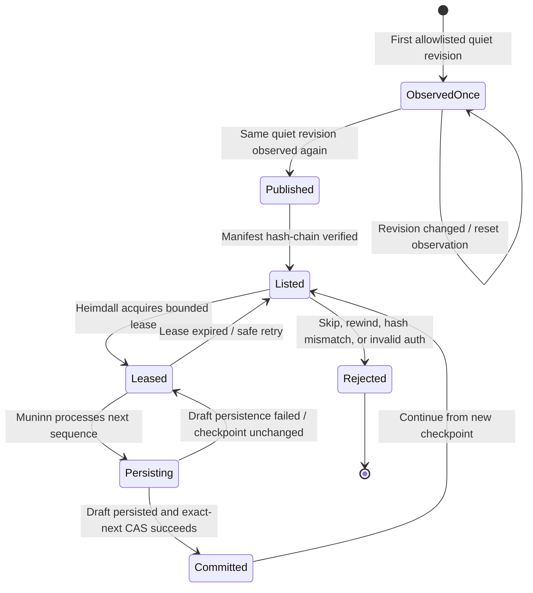

# Hermes-to-Muninn transcript outbox

> [!CAUTION]
> **Status: GATED FOUNDATION — NOT DEPLOYED PRODUCTION BEHAVIOR**
>
> This chapter defines a compatibility design and the evidence required before
> enabling it. Export schedules, the Heimdall-to-Muninn connection, and
> unattended processing remain disabled until every applicable gate below
> passes against the pinned deployment.

The transcript outbox gives Muninn a minimized, replayable view of stable Ody
conversations without granting Muninn access to Hermes state, its database, or
its local workspace. It is a narrow bridge between a version-pinned Hermes
runtime and the checkpointed curation contract in
[Integration contracts](integration-contracts.md).

This design does not make a long-lived conversation objectively complete.
Instead, it identifies a stable, quiescent transcript window, publishes that
window once, and lets Muninn process published windows in order.

## Claim classification

The labels below are used throughout this chapter.

- **Upstream fact:** Hermes documents sessions, session persistence, and an API
  server. See the official
  [Hermes sessions guide](https://hermes-agent.nousresearch.com/docs/user-guide/sessions),
  [session-storage documentation](https://hermes-agent.nousresearch.com/docs/developer-guide/session-storage),
  and [API server guide](https://hermes-agent.nousresearch.com/docs/user-guide/features/api-server/).
- **Version-specific observation:** the compatibility review for pinned Hermes
  `v0.19.0` found no suitable built-in contract for a redacted transcript
  export, a scoped read-only API token, a reliable completion event for
  long-lived Signal and WebUI sessions, a trusted WebUI user identity, or an
  incremental message cursor.
- **Asgard policy:** an architectural requirement imposed by Asgard even when
  an upstream component could be configured differently.
- **Validation required:** behavior that must be demonstrated with synthetic
  data and the exact pinned images and configuration before it is trusted.

The version-specific observations are not claims about every Hermes release.
An upgrade must repeat the compatibility review. A future upstream capability
may replace part or all of this adapter after equivalent privacy, identity,
ordering, and failure behavior is validated.

## Scope and non-goals

The outbox is responsible for:

- reading allowlisted sessions through the documented Hermes session API;
- deciding whether a transcript window is stable enough to export;
- reducing the window to the minimum content Muninn needs;
- publishing content-addressed objects and an ordered manifest chain;
- presenting those immutable records through an authenticated private handoff;
  and
- coordinating ordered processing with leases and compare-and-swap
  checkpoints.

It is not responsible for:

- deciding what becomes canonical knowledge;
- writing directly to AFFiNE or Mem0;
- exposing the Hermes database, state directory, or workspace;
- inferring that an entire long-lived conversation has permanently ended;
- exporting attachments, tool traces, reasoning, or system instructions; or
- replacing Heimdall authorization, network controls, backups, or audit.

Muninn still performs reconciliation and writes only provenance-bearing drafts
through Heimdall, as described in [Data flows](data-flows.md). AFFiNE remains
canonical.

## Compatibility adapter deployment

**Asgard policy:** do not build a derivative Hermes image for this foundation.
The manual exporter and private handoff run from the exact pinned Hermes image
digest used by the deployment, with small reviewed scripts mounted read-only.
This keeps the version boundary visible and avoids silently combining
unreviewed Hermes code with a custom image.

The two processes have different authority:

| Process | May access | Must not access |
| --- | --- | --- |
| Manual exporter | Documented Hermes session API on an isolated internal network; pseudonymization key at runtime; private outbox write location | Ody state directory, workspace, database file, downstream tools, public ingress |
| Private handoff | Outbox read-only; lease and checkpoint state needed for ordered delivery; one authenticated Heimdall caller | Hermes API or credentials, Ody state or workspace, outbox modification or deletion, public ingress |

**Validation required:** inspect the rendered container configuration and prove
that neither process receives an Ody state, workspace, or database mount. Prove
that the exporter can reach only the intended internal Hermes API and that the
handoff can be reached only from Heimdall.

```mermaid
flowchart LR
    subgraph Agent["Assistant trust zone"]
        Hermes["Ody / pinned Hermes v0.19.0"]
        Exporter["Manual exporter<br/>same pinned image"]
        Outbox["Private transcript outbox<br/>append-only objects and manifests"]
        Handoff["Private handoff<br/>same pinned image"]
        Hermes -->|"documented session API<br/>internal network only"| Exporter
        Exporter -->|"minimized immutable window"| Outbox
        Outbox -->|"read-only mount"| Handoff
    end

    subgraph Tools["Heimdall trust zone"]
        Heimdall["Heimdall"]
    end

    subgraph Curator["Muninn worker"]
        Muninn["Muninn<br/>schedules disabled"]
    end

    Handoff -->|"authenticated list, read,<br/>lease, and checkpoint contract"| Heimdall
    Heimdall -->|"authorized transcript window"| Muninn
    Muninn -->|"lease result and exact-next checkpoint"| Heimdall
    Heimdall -->|"authenticated commit operation"| Handoff
```

The handoff is a support path within the Heimdall boundary. It is not a direct
Muninn tool or a second general-purpose API.

## Transcript-window qualification

An exporter run considers only sessions whose source and owner are on a
deployment-controlled allowlist. Model output and session-supplied labels never
extend that allowlist.

A candidate window qualifies only when all of these conditions hold:

1. The source and derived owner match the fixed allowlist.
2. The window contains at least one user message and at least one final
   assistant message.
3. No tool call is pending, incomplete, or awaiting approval.
4. The session has remained unchanged for the configured quiet period.
5. The same source revision is observed in two separate qualifying
   observations.

The first qualifying observation records only a candidate revision. A later
observation publishes it only if the revision is identical and the quiet-period
condition still holds. Any intervening change resets the observation count.
This is the **twice-observed quiescent window** rule.

**Asgard policy:** ambiguity fails closed. Malformed messages, missing owner
attribution, an unknown source, an incomplete assistant turn, or an uncertain
tool state defer the window. They do not produce a partial export.

### WebUI identity limitation

**Version-specific observation:** in the reviewed `v0.19.0` path, the available
WebUI session data does not provide the trusted user identity needed for
unattended owner allowlisting.

**Asgard policy:** unattended WebUI export therefore remains disabled. A WebUI
canary may export only one explicitly selected synthetic or manually identified
test session. Passing that canary does not authorize unattended WebUI
processing. Signal or another source must also prove its own sender-to-owner
mapping; success on one interface is not evidence for another.

## Data minimization and pseudonymization

Before publication, the exporter constructs a new normalized record rather
than copying a raw session export.

It retains only:

- user text needed to understand the conversation;
- final-assistant text needed to understand the outcome;
- minimal ordering and timing fields;
- the source class;
- stable pseudonymous references; and
- integrity and schema metadata.

It omits:

- system messages and prompts;
- hidden reasoning or intermediate assistant work;
- tool requests, arguments, results, and approval payloads;
- runtime configuration and environment details;
- filesystem paths, session titles, and raw identifiers;
- attachments and embedded binary content; and
- unrelated channel or account metadata.

Owner, session, message, and source-revision references are generated with
keyed HMAC pseudonyms. A plain hash is not sufficient for predictable
identifiers. The key is provisioned at runtime, remains outside published
objects and logs, and is independently rotatable according to the deployment's
retention and re-indexing plan.

A secondary detector checks retained text for credential-bearing URLs and
similar high-confidence secret patterns. A match rejects the entire window.
The detector is a fail-closed defense in depth, not permission to export other
secret-bearing content.

**Validation required:** use synthetic fixtures containing query-string
credentials, user-info URLs, authorization fragments, tool traces, paths,
attachments, and raw identifiers. Publication must fail or the forbidden fields
must be absent as specified. Manually inspect the first exported object; a
successful parser run is not sufficient evidence.

## Append-only outbox

The outbox has two immutable record types:

1. **Content-addressed objects** contain normalized transcript windows. The
   object identifier is derived from the final serialized content, so a retry
   of identical input resolves to the same object.
2. **Ordered manifests** name one or more objects, carry a monotonically
   increasing sequence, and include the preceding manifest hash. This
   hash-chain makes removal, replacement, reordering, or insertion detectable
   by consumers that retain a trusted checkpoint.

Publication uses a same-directory atomic pattern:

1. Serialize to a private temporary file.
2. Flush file content and metadata.
3. Create the final name with a hard link that fails if the destination already
   exists.
4. Flush the containing directory.
5. Remove the temporary name.

This avoids overwrite-by-rename and permits an idempotent retry to verify an
already present content-addressed object.

**Validation required:** the temporary and final locations must be on the same
filesystem, and that filesystem must support the required hard-link and flush
semantics. Deployment must test crash points and concurrent publishers on the
actual storage. If those properties cannot be demonstrated, keep export
disabled and select a storage primitive with an equivalent create-if-absent
contract.

**Residual risk:** this is application-level append-only behavior, not
filesystem or storage immutability. A privileged host process or storage
administrator can still alter or remove records. Use restricted host access,
append-oriented backups, manifest verification, and independent recovery
evidence as described in [Operations](operations.md).

## Heimdall-only handoff contract

The private handoff exposes the following logical operations. These names
describe Asgard behavior, not literal routes supplied by Hermes:

| Operation | Purpose | Mutation authority |
| --- | --- | --- |
| Authenticated health | Confirm local readiness without returning transcript content | None |
| Manifest list | List manifest sequence and integrity metadata after a checkpoint | None |
| Window read | Read one object referenced by a verified manifest | None |
| Lease acquire or renew | Give one Muninn run bounded processing ownership | Lease state only |
| Checkpoint read | Return the committed sequence and manifest hash | None |
| Checkpoint compare-and-swap | Commit one successfully persisted next manifest | Checkpoint state only |

The handoff cannot alter or delete transcript objects or manifests. It rejects
unauthenticated callers, stale leases, unknown manifests, mismatched hashes,
oversized requests, and out-of-order checkpoint changes.

Only Heimdall may authenticate to this contract. Muninn requests transcript
operations through Heimdall with its own workload identity. A gateway bearer or
equivalent credential remains within the Heimdall connector boundary and never
enters a model prompt or Muninn configuration.

### Leases and exact-next compare-and-swap

A lease limits one manifest sequence to one active Muninn processing attempt for
a bounded time. Lease expiry permits safe recovery; it does not advance the
checkpoint.

Checkpoint compare-and-swap accepts only:

- sequence `1` when the committed sequence is `0`; or
- sequence `N + 1` when the committed sequence is `N`;
- the exact hash from that next manifest; and
- the active lease identity for that sequence.

A rewind, a skipped sequence, a changed manifest hash, a stale lease, or a
duplicate commit with inconsistent state returns a conflict. Muninn commits
only after its corresponding AFFiNE review draft and required provenance have
been persisted successfully.

This contract provides ordered at-least-once processing with idempotent
downstream writes. It does not provide exactly-once execution by itself.

## Network and transport boundary

The handoff has no public route. Only the Heimdall connector is allowed to reach
its listening port, over the deployment's private encrypted network and an
explicit host-firewall rule. The service must not bind to or be routed through a
user-facing ingress.

**Residual risk:** the foundation uses private HTTP at the application layer.
Private overlay encryption and host firewalling reduce exposure but do not make
HTTP equivalent to mutually authenticated TLS. Before production use, validate
packet paths, redirect behavior, listener bindings, authentication failure,
credential handling, and log redaction. Prefer application-layer authenticated
encryption when the implementation can support it without weakening caller
identity.

The client must apply bounded connect, read, request-size, and backlog limits.
Loss of handoff connectivity is a retryable availability failure, never a
reason to bypass Heimdall or read the outbox directly.

See [Security](security.md) for the wider mandatory-path and egress model.

## Enablement and canary gates

The foundation ships with exporter schedules disabled and the
Executor/Muninn connection disabled. Do not enable either merely because the
containers start successfully.

Complete and record public-safe evidence for these gates in order:

### 1. Static deployment gates

- The exact approved Hermes image digest is used by Ody, exporter, and handoff.
- Adapter scripts are reviewed and mounted read-only; no custom image is built.
- Exporter mounts exclude Ody state, workspace, and database storage.
- Handoff mounts the outbox read-only and has no Hermes credential or route.
- Outbox, temporary-publication, lease, and checkpoint locations have the
  intended owners and restrictive modes.
- The HMAC and handoff credentials are provisioned without appearing in
  rendered configuration, process arguments, logs, or telemetry.
- Network tests prove only the exporter reaches the internal session API and
  only Heimdall reaches the handoff.
- The private network and host firewall remain effective after restart.

### 2. Manual export canaries

- Use synthetic conversations with no private deployment data.
- Explicitly select one WebUI canary; confirm unattended WebUI enumeration is
  still rejected.
- Run a controlled allowlisted Signal canary separately.
- Confirm the first quiet observation does not publish.
- Confirm an unchanged second qualifying observation publishes one object and
  one next manifest.
- Run a third time and confirm it creates no duplicate object or manifest.
- Add one later Signal exchange and confirm only the new stable window is
  eligible.
- Confirm malformed, active, non-allowlisted, pending-tool, and credential-URL
  fixtures are deferred or rejected without partial output.
- Manually inspect normalized content, pseudonyms, file modes, object hashes,
  and manifest-chain continuity.

### 3. Handoff and checkpoint canaries

- Verify unauthenticated, invalid, expired, and replayed credentials fail.
- Verify health and manifest metadata do not disclose transcript text.
- Verify objects not named by a verified manifest cannot be read.
- Exercise lease acquisition, renewal, expiry, and competing callers.
- Verify a stale lease, skip, rewind, changed hash, and repeated inconsistent
  commit all conflict.
- Verify sequence `0` advances only to `1`, then only one sequence at a time.
- Restart handoff between lease and commit; confirm recovery does not alter
  objects, manifests, or the committed checkpoint.

### 4. Muninn canary

- Enable one dedicated Muninn workload identity for a manual run only.
- Process one synthetic next manifest through Heimdall.
- Create at most one provenance-bearing review draft; do not edit canonical
  AFFiNE content.
- Confirm the AFFiNE draft is attributed to the intended Muninn downstream
  identity.
- Simulate an AFFiNE failure and confirm the checkpoint does not advance.
- Retry the successful batch and confirm no duplicate draft appears.
- Confirm transcript text, HMAC inputs, credentials, and raw identifiers are
  absent from telemetry.

### 5. Recovery and promotion gates

- Back up the outbox, manifests, lease/checkpoint state, and required
  pseudonymization-key reference using append-oriented storage.
- Restore to an isolated location and verify every object hash, manifest link,
  and committed checkpoint.
- Test the actual filesystem's hard-link, same-filesystem, concurrency, and
  crash-recovery assumptions.
- Record version pins, schema versions, network evidence, negative tests,
  rollback steps, and residual-risk acceptance.
- Enable one bounded schedule only after review. Observe at least one complete
  cycle before considering any second schedule.

Any failed gate returns the design to disabled. Do not repair a failed batch by
manually skipping or rewinding the checkpoint.

## Operations and residual risks

Monitor only redacted metadata: exporter outcome counts, deferred-reason codes,
oldest unpublished age, manifest-chain verification, lease conflicts,
checkpoint age, backlog, duration, and bounded error classes. Transcript text
and pseudonymization inputs do not belong in Grafana Cloud.

Operators should alert on:

- repeated inability to obtain a second stable observation;
- manifest-chain mismatch or missing objects;
- checkpoint age or backlog above the deployment threshold;
- repeated lease expiry or compare-and-swap conflicts;
- an unexpected WebUI export attempt;
- authentication failures or a newly reachable handoff listener; and
- storage, inode, or backup verification failure.

The remaining risks include:

- quiescence is a heuristic for a stable window, not proof of conversation
  completion;
- the WebUI path lacks trusted unattended owner attribution in the reviewed
  version;
- application-level append-only files can be changed by host or storage
  administrators;
- atomic publication depends on actual same-filesystem hard-link semantics;
- private HTTP depends on private-network encryption, firewall enforcement, and
  correct authentication;
- HMAC key loss or rotation affects reference continuity;
- a compromised Hermes API can supply misleading session data; and
- a future Hermes schema or API change can invalidate filtering and revision
  calculations.

Keep these risks visible in the deployment's exception and validation record.
Follow the failure, backup, restore, monitoring, and incident practices in
[Operations](operations.md), and do not describe the outbox as production-ready
until a deployment has supplied the missing evidence.
